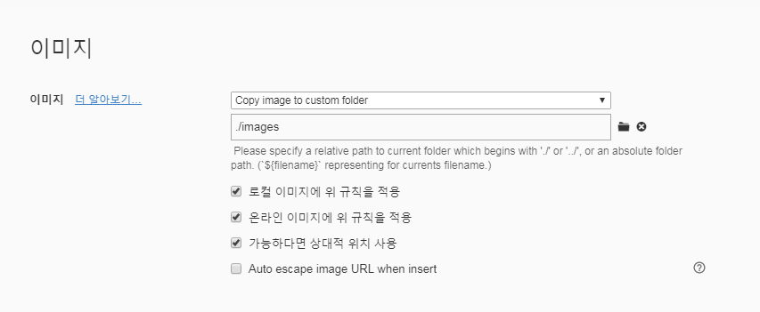

# 19.10.30(수) Django CRUD 구현

## 0. 사전작업

### 0.1 프로젝트 생성

```bash
$ cd 03_django_crud
```


```bash
$ django-admin startproject config .
```

<br>

<br>

### 0.2 애플리케이션 생성

```bash
$ python manage.py startapp articles
```

```python
# settings.py : 출생신고 까먹지말자........
INSTALLED_APPS = [
    'articles',
    ...
]
```

<br>

<br>


### 0.3 URL 분리(위임)

```python
# config/urls.py

from django.urls import path, include

urlpatterns = [
    # 요청 경로가 articles/로 시작하면 articles 앱 안에 있는 urls.py로 이동!
    path('articles/', include('articles.urls')),
    ...
]
```


```python
# articles/urls.py

from . import views

urlpatterns = [
    # articles/ 로 요청했을 경우 index 함수 실행
    path('', views.index),
]
```

<br>

<br>

### 0.4 템플릿 경로 커스터마이징 + base.html

> https://getbootstrap.com/docs/4.3/getting-started/introduction/

```html
<!-- base.html -->

<!DOCTYPE html>
<html lang="ko">
<head>
  <meta charset="UTF-8">
  <meta name="viewport" content="width=device-width, initial-scale=1.0">
  <meta http-equiv="X-UA-Compatible" content="ie=edge">
  <title>Django CRUD</title>

  <!-- Bootstrap CSS -->
  <link rel="stylesheet" href="https://stackpath.bootstrapcdn.com/bootstrap/4.3.1/css/bootstrap.min.css" integrity="sha384-ggOyR0iXCbMQv3Xipma34MD+dH/1fQ784/j6cY/iJTQUOhcWr7x9JvoRxT2MZw1T" crossorigin="anonymous">

</head>
<body>
  <div class="container">
    
    
  </div>

  <!-- Bootstrap JS -->
  <script src="https://code.jquery.com/jquery-3.3.1.slim.min.js" integrity="sha384-q8i/X+965DzO0rT7abK41JStQIAqVgRVzpbzo5smXKp4YfRvH+8abtTE1Pi6jizo" crossorigin="anonymous"></script>
  <script src="https://cdnjs.cloudflare.com/ajax/libs/popper.js/1.14.7/umd/popper.min.js" integrity="sha384-UO2eT0CpHqdSJQ6hJty5KVphtPhzWj9WO1clHTMGa3JDZwrnQq4sF86dIHNDz0W1" crossorigin="anonymous"></script>
  <script src="https://stackpath.bootstrapcdn.com/bootstrap/4.3.1/js/bootstrap.min.js" integrity="sha384-JjSmVgyd0p3pXB1rRibZUAYoIIy6OrQ6VrjIEaFf/nJGzIxFDsf4x0xIM+B07jRM" crossorigin="anonymous"></script>

</body>
</html>
```


<br>

<br>

### 0.5 데이터베이스 모델링

```python
# models.py

from django.db import models

# Create your models here.
class Article(models.Model):
  title = models.CharField(max_length=40)
  content = models.TextField()
  created_at = models.DateTimeField(auto_now_add=True)
  updated_at = models.DateTimeField(auto_now=True)

  # 객체 표시 형식 수정
  def __str__(self):
    return f'[{self.pk}] {self.title}'
```

<br>

#### `makemigrations `: 설계도 만들기

```bash
$ python manage.py makemigrations
```

```
03_django_crud/
	config/
	articles/
		migrations/
			0001_initial.py
```

<br>

#### `migrate` : 실제 DB에 반영하기

```bash
$ python manage.py migrate
```

<br>

- 추가 정보

  - `showmigrations`: makemigrations를 통해 만든 설계도가 실제 DB에 반영된 상태인지 아닌지 확인

  - `sqlmigrate`: 실제 DB에 반영하기 전 SQL 쿼리문으로 바뀐 모습 확인

    ```bash
    $ python manage.py sqlmigrate articles 0001
    ```

    


<br>

<br>

<br>

## 1. CREATE

### 1.1 기본적으로 두 개의 뷰 함수로 구성된다

- GET은 쿼리스트링에 데이터가 노출되니 POST로 구현!
- 꼭 써주기

1. 사용자에게 HTML Form을 던져줄 함수
2. HTML Form에서 데이터를 전달받아서 실제 DB에 저장하는 함수

```python
# articles/views.py

# 사용자에게 게시글 작성 폼을 보여주는 함수
def new(request):
  return render(request, 'articles/new.html')

# 사용자로부터 데이터를 받아서 DB에 저장하는 함수
def create(request):
  title = request.POST.get('title')
  content = request.POST.get('content')

  article = Article(title=title, content=content)
  article.save()
  # render는 html파일만 가져와서 띄워주는 함수
  # 경로는 create에 머물러 있다
  return render(request, 'articles/create.html')
  #return redirect('/articles/')
```

<br>

```html
<!-- base.html -->




<h1 class="text-center">NEW</h1>
<form class="text-center" action="/articles/create/" method="POST">
  
  TITLE: <input type="text" name="title"><br>
  CONTENT: <textarea name="content" cols="30" rows="10"></textarea><br>
  <input type="submit" value="등록">
</form>
<hr>
<!-- 뒤로가기 버튼 -->
<a href="/articles/">[BACK]</a>

```

<br>

```html
<!-- config/templates/articles/create.html -->



<h2>글 작성이 완료됐습니다!</h2>

```

<br>

<br>

### 1.2 등록확인

#### Admin 계정 만들어서 확인

```bash
$ python manage.py createsuperuser
```

```python
# admin.py

from django.contrib import admin
from .models import Article

# Register your models here.
class ArticleAdmin(admin.ModelAdmin):
  list_display = ('pk','title','content','created_at','updated_at',)


admin.site.register(Article, ArticleAdmin)
```


<br>

<br>

### 1.3 Redirect

- 현재는 `등록`버튼을 누르면 `create.html`로 이동하는 상태

- 등록하면 `index.html`로 이동하도록 바꾸자

  ```python
  # articles/views.py
  
  from django.shortcuts import render, redirect
  
  # render는 html파일만 가져와서 띄워주는 함수
  # 경로는 create에 머물러 있다
  #return render(request, 'articles/create.html')
  return redirect('/articles/')
  ```

  


<br>

<br><br>

## 2. READ

### 2.1 index.html 상세정보 (index 로직)

```html
<!-- index.html -->




<h1 class="text-center">Articles
<a href="/articles/new/">[NEW]</a>
</h1>
<hr>

<p>
  [{{ article.pk }}]{{ article.title }}
</p>
<a href="/articles/{{ article.pk }}">[DETAIL]</a>
<hr>



```

<br>

```python
# articles/urls.py

urlpatterns = [
  ...
  # pk번호로 접근
  path('<int:article_pk>/', views.detail), 
]
```

<br>

```python
# articles/views.py : variable Routing 이용

# 게시글 상세정보를 가져오는 함수
def detail(request, article_pk):
  article = Article.objects.get(pk=article_pk)
  context = {'article':article}
  return render(request, 'articles/detail.html',context)
```

<br>

```html
<!-- articles/detail.html -->




<h1 class="text-center">DETAIL</h1>
<p>글 번호 : {{ article.pk }}</p>
<p>글 제목 : {{ article.title }}</p>
<p>글 내용 : {{ article.content }}</p>
<p>생성 시각 : {{ article.created_at }}</p>
<p>수정 시각 : {{ article.updated_at }}</p>
<hr>
<a href="/articles/">[BACK]</a>

```

<br>

<br>

<br>


# github 이미지 업로드

- 상대경로로 설정(`./images`)




