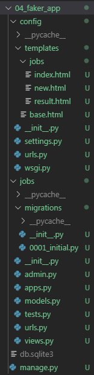
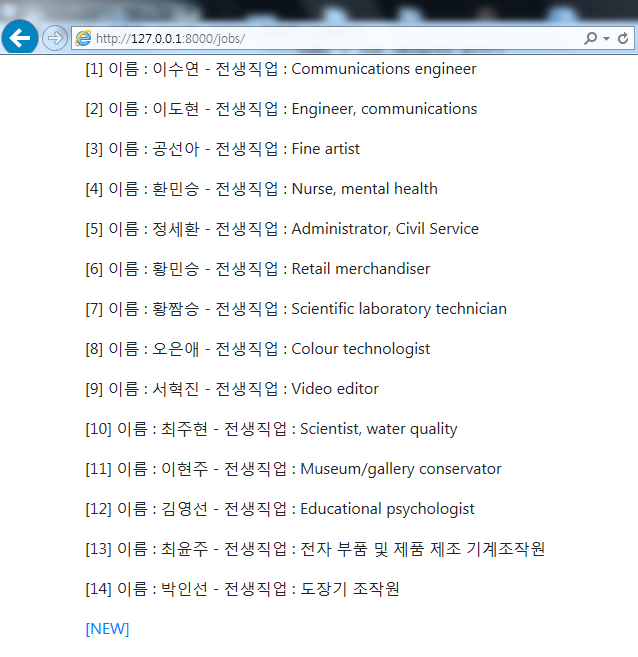
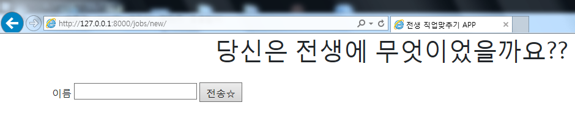
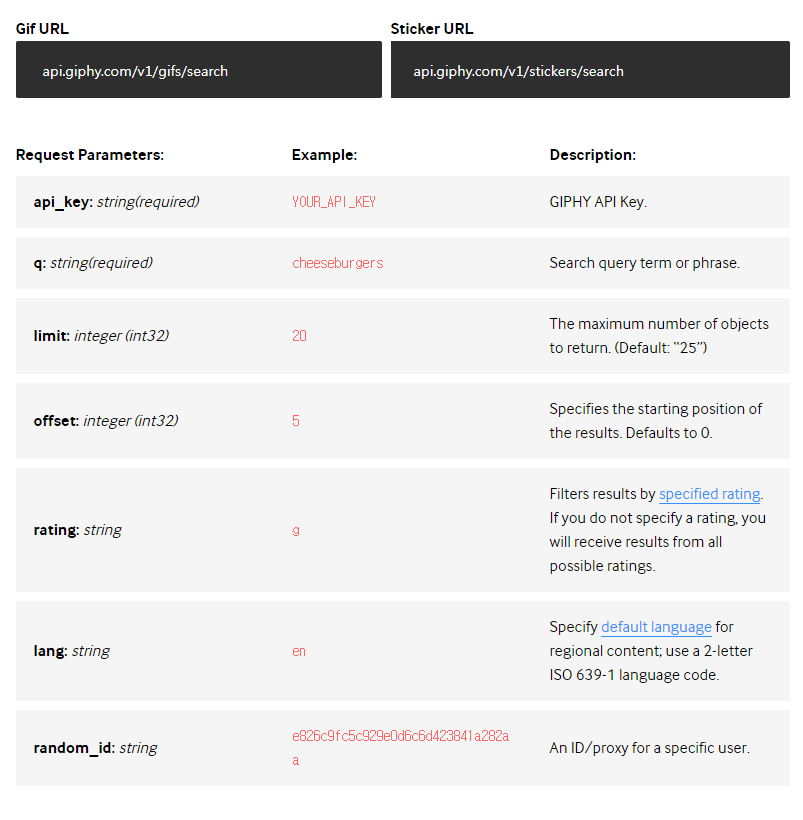
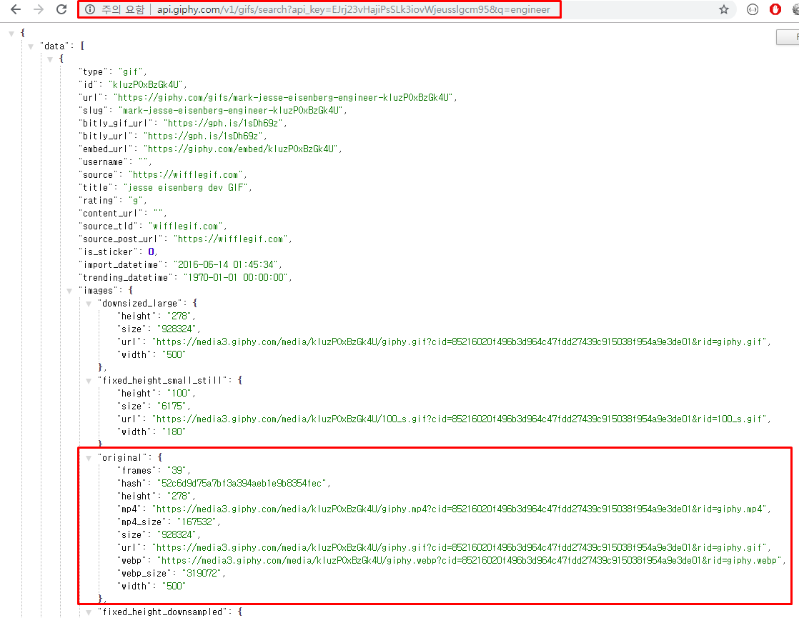
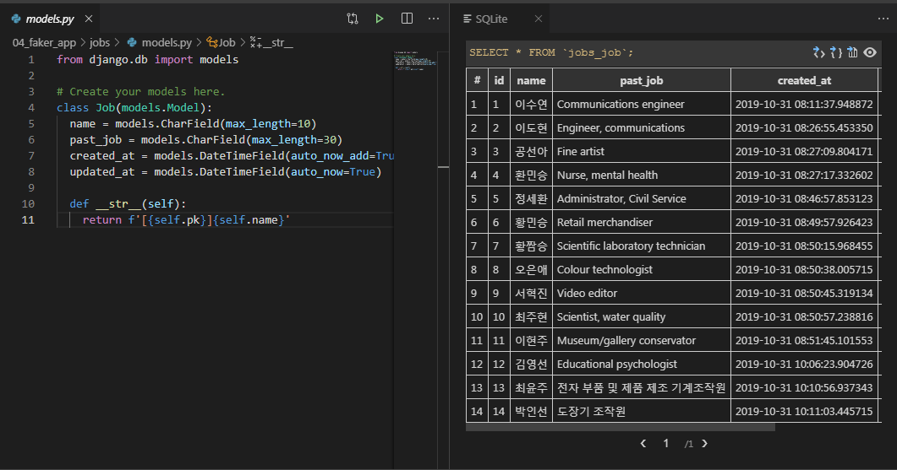

# 19.10.31(목) 전생직업 APP만들기

## 1. Django Project 환경설정

### 1.1 Django Project 생성

- `04_faker_app` : django project 생성

- `jobs` : application 생성

- `settings.py` : app 등록

- url 분리

- url 템플릿 경로 커스터마이징

  ```python
  # config/urls.py
  
  from django.contrib import admin
  from django.urls import path,include
  
  urlpatterns = [
      path('jobs/', include('jobs.urls')),
      path('admin/', admin.site.urls),
  ]
  ```

  <br>

  ```python
  # jobs/urls.py
  
  # 라우팅 역할을 해주는 lib import
  from django.urls import path, include
  # 현재 위치에 있는 모든 view들을 가져오자
  from . import views
  
  app_name = 'jobs'
  urlpatterns = [
    # 일반적으로 view함수와 똑같이 name바꿈
    path('', views.index, name='index'),    # READ Logic - Index
    path('new/', views.new, name='new'),   
    path('past_job/', views.past_job, name='past_job'),   
  ]
  ```

  <br>

  ```python
  # settings.py
  
  TEMPLATES = [
      {
  		...
          # /config/templates를 바라보도록 설정
          'DIRS': [os.path.join(BASE_DIR, 'config','templates')],
  		...
      },
  ]
  ```

  <br>

  

- 데이터베이스 모델링

  ```python
  # models.py
  
  from django.db import models
  
  # Create your models here.
  class Job(models.Model):
    name = models.CharField(max_length=10)
    past_job = models.CharField(max_length=30)
    created_at = models.DateTimeField(auto_now_add=True)
    updated_at = models.DateTimeField(auto_now=True)
  
    def __str__(self):
      return f'[{self.pk}]{self.name}'
  ```

  <br>

  ```bash
  $ python manage.py migrations
  ```

  ```bash
  $ python manage.py migrate # DB에 저장
  ```

  <br>


- `admin` 계정 생성

  ```bash
  $ python manage.py createsuperuser
  ```

  <br>

  ```python
  # admin.py
  
  from django.contrib import admin
  from .models import Job
  
  # Register your models here.
  class JobAdmin(admin.ModelAdmin):
    list_display = ('pk','name','past_job','created_at','updated_at',)
  
  
  admin.site.register(Job, JobAdmin)
  ```

  

- `django- extensions` 설치

  ```bash
  $ pip install django-extensions
  ```

  <br>

  ```python
  # settings.py
  
  INSTALLED_APPS = [
  	...
      #Third party apps
      'django_extensions',
  	...
  ]
  ```

  


<br>

<br>

<br>

## 2. Faker API

### 2.1 Faker Documents

>  https://faker.readthedocs.io/en/master/  

<br>

<br>

### 2.2 Faker 설치

```bash
$ pip install Faker
```

<br>

<br>

### 2.3 사용법

- `plus_shell`에서도 테스트 가능

```python
from faker import Faker
fake = Faker()
# fake = Faker('ko-KR') # 한글지원

fake.name()
# 'Lucy Cechtelar'

fake.address()
# '426 Jordy Lodge
#  Cartwrightshire, SC 88120-6700'

fake.text()
```

<br>

<br>

<br>


## 3. Faker 를 사용한 전생직업 알아보기 APP

### 3.0 최종 프로젝트 폴더 구조

```django
04_faker_app/
	config/
		- settings.py
		- urls.py
		- templates/
			base.html
			jobs/
				index.html
				new.html
				result.html

	jobs/
		- migrations/
			0001_initial.py
		- admin.py
		- models.py
		- urls.py
	
```


> 

### 3.1 Index Page(메인화면)

- 메인 화면

  > DB에 저장되어 있는 모든 데이터들의 `name`,` past_job `을 출력한다

  ```python
  # jobs/views.py
  
  from .models import Job
  
  def index(request):
    jobs = Job.objects.all()
    context = {'jobs':jobs}
    return render(request, 'jobs/index.html',context)
  ```

  <br>

  ```html
  
  
  
  
  <p>
    [{{ job.pk }}] 이름 : {{ job.name }} - 전생직업 : {{ job.past_job }}
  </p>
  
  <a href="">[NEW]</a>
  
  ```

  <br>

- 실행

  > 

  

<br>

<br>

### 3.2 전생직업 알아보기

- `index.html`의 `[NEW]` 버튼을 누르면 사용자의 이름을 입력받는 `Form`을 띄워준다

  ```python
  # jobs/views.py
  
  def new(requst):
    return render(requst, 'jobs/new.html')
  ```

  <br>

  ```html
  <!-- /jobs/new.html -->
  
  
  
  
  <!-- django url templete tag 사용해서 url표현 -->
  <form action="" method="POST">
    <!-- POST로 전송할 때 신원확인해주는 템플릿 태그 -->
    
    <h1 class="text-center">당신은 전생에 무엇이었을까요??</h1><br>
    <label for="name">이름</label>
    <input type="text" name="name">
    <input type="submit" value="전송☆">
  </form>
  
   
  ```

  <br>

  > 

<br>

<br>

- 사용자로부터 받은 이름을 가지고 전생직업을 알아낸다

  1. **DB에 이름이 존재하는 경우** : 필터링한 결과의 첫번째 데이터를 가져온다
  2. **DB에 이름이 없는 경우** : Faker를 이용해 **random**으로 전생직업을 생성한다

  ```python
  # jobs/views.py
  
  import requests
  from faker import Faker
  
  def past_job(request):
    name = request.POST.get('name')
    faker = Faker('ko_KR') 
    user = Job.objects.filter(name=name).first()
    
    if user:
      past_job = user.past_job
  
    else:
      #faker = Faker('ko-KR')
      faker = Faker()
      past_job = faker.job()
      job = Job(name=name, past_job=past_job)
      job.save()
  
    api_url = 'http://api.giphy.com/v1/gifs/search'
    api_key = 'EJrj23vHajiPsSLk3iovWjeusslgcm95'
  
    data = requests.get(f'{api_url}?api_key={api_key}&q={past_job}&limit=1&lang=ko').json()
    
  
    # 예외처리
    try:
      img_url = data.get('data')[0].get('images').get('original').get('url')
    except IndexError:
      img_url = None
  
    context = {
          'name': name,
          'past_job': past_job,
          'img_url': img_url,  
      }
  
    return render(request, 'jobs/result.html',context)
  ```

<br>

<br>

- ### **GIPHY**

  > GIF 제공 사이트
  >
  >https://developers.giphy.com/docs/api/endpoint#search 

  <br>

  > 

  <br>

  > 

  

  - `api_key`와 전생직업이름 `past_job`을 넘겨주면 검색결과를 `json`으로 리턴해준다

    ```python
    # jobs/views.py
    
    def past_job(request):
    ...
    
      api_url = 'http://api.giphy.com/v1/gifs/search'
      api_key = 'EJrj23vHajiPsSLk3iovWjeusslgcm95'
    
      data = requests.get(f'{api_url}?api_key={api_key}&q={past_job}&limit=1&lang=ko').json()
      
    
      # 예외처리
      try:
        img_url = data.get('data')[0].get('images').get('original').get('url')
      except IndexError:
        img_url = None
    
      context = {
            'name': name,
            'past_job': past_job,
            'img_url': img_url,  
        }
    
      return render(request, 'jobs/result.html',context)
    ```

    <br>

    ```html
    <!-- /jobs/result.html -->
    
    
    
    
    <h1 class=text-center>{{ name }}은 전생에...</h1>
    <h1 class=text-center>{{ past_job }}이었습니다!!</h1>
    
    <a href="">[HOME]</a>
    
    ```

- 실행

  > 

<br>

- `models.py `와 **SQLite**

  > 