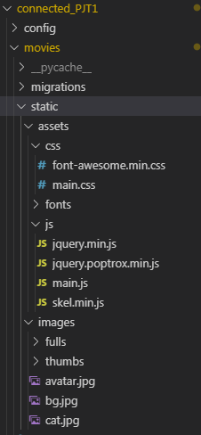
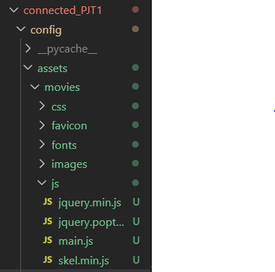
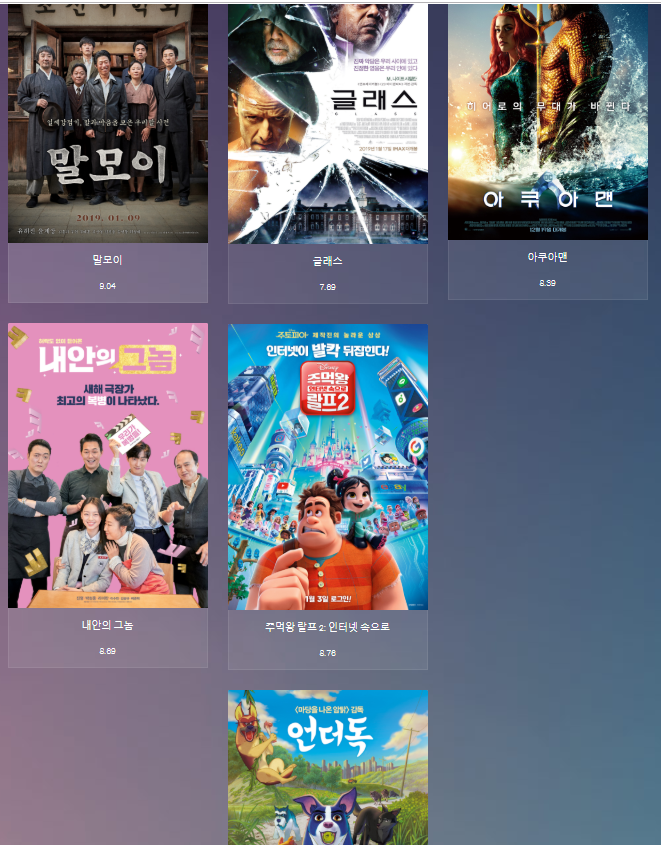

# 2019-11-01(금) Movie List 프로젝트

## 1. Pylint

### 1.1 Pylint

>  Python 코드의 오류를 검사하고 적절한 Python 코딩 패턴을 권장하며 널리 사용되는 도구

<br>

### 1.2 설치

```bash
$ pip install pylint
```

<br>

### 1.3 pylint에 django 기능 추가

```bash
$ pip install pylint-django
```

<br>

### 1.4 setting.py 수정

- `ctrl+shift+p` : Open Settings(json) 

```django
{
    "workbench.startupEditor": "newUntitledFile",
    "terminal.integrated.shell.windows": "C:\\Program Files\\Git\\bin\\bash.exe",
    "editor.tabSize": 2,
    "liveServer.settings.donotShowInfoMsg": true,
	<!-- 아래부터 추가 -->
    "python.linting.pylintArgs":[
        "--load-plugins=pylint_django",
        "--erros-only"
    ]
}
```

<br>

<br>

<br>


# MOVIE LIST 프로젝트

## 1. Django Project 생성 & 설정

## 2. Bootstrap 적용

### 2.1 다운받은 Bootstrap 프로젝트에 추가하기

- 참고 블로그

  >  https://pyrois.tistory.com/6 

<br>

#### 프로젝트 구조

- App에 static 폴더 만들고 다운받은 `assets`,` images `폴더 넣어주기

```django
connected_PJT1
	/config
	/movies
		/static
			/assets
				/css
				/fonts
				/js

			/images
```


> 

<br>

<br>

#### `settings.py` 수정

- `settings.py` 맨 아래로 가서 `STATIC_ROOT` 추가
- `STATIC_ROOT` :   static 파일들을 찾는 경로를 나타내는 `STATIC_ROOT` 라는 변수를 설정 

```python
# Static files (CSS, JavaScript, Images)
# https://docs.djangoproject.com/en/2.2/howto/static-files/

STATIC_URL = '/static/'
STATIC_ROOT = os.path.join(BASE_DIR, 'static')
```

<br>

<br>

### 2.2 Bootstrap 적용

#### `base.html`수정

- 나는 `base.html`을 다 상속받아서 쓸 것이기 때문에 `base.html`에 bootstrap에서 사용하는 CSS와 Script들을 모두 추가해주었다

  - 이미지 클릭하면 팝업뜨는 script파일은 제외함

  <br>

- ``

  - 템플릿 상단에 태그 반드시 명시!
  - staticfiles를 사용하겠다는 뜻

  <br>

- ``

  - **static templete tag**를 이용해서 해당  리소스 지정

  <br>

- `CSS`, `script`, `img` 태그의 `href`,`src` 속성 모두 수정해주기

  ```django
  
  
  <!DOCTYPE HTML>
  <!--
  	Visualize by TEMPLATED
  	templated.co @templatedco
  	Released for free under the Creative Commons Attribution 3.0 license (templated.co/license)
  -->
  <html>
  	<head>
  		<title>MOVIE LIST</title>
  		<meta charset="utf-8" />
  		<meta name="viewport" content="width=device-width, initial-scale=1" />
  		<link rel="stylesheet" href="" />
  	</head>
  	<body>
      <!-- Wrapper -->
      <div id="wrapper">
            <!-- Header -->
          <header id="header">
            <span class="avatar"><a href=""></a></span>
            
            <h1>이곳은 <strong>영화</strong>를 소개해주는 곳입니다</h1>
            <h1 class='text-center'><a href="">영화 등록</a></h1>
            <ul class="icons">
              <li><a href="#" class="icon style2 fa-twitter"><span class="label">Twitter</span></a></li>
              <li><a href="#" class="icon style2 fa-facebook"><span class="label">Facebook</span></a></li>
              <li><a href="#" class="icon style2 fa-instagram"><span class="label">Instagram</span></a></li>
              <li><a href="#" class="icon style2 fa-500px"><span class="label">500px</span></a></li>
              <li><a href="#" class="icon style2 fa-envelope-o"><span class="label">Email</span></a></li>
            </ul>
            
          </header>
    
  
    
  
      <!-- Footer -->
        <footer id="footer">
          <p>&copy; Untitled. All rights reserved. Design: <a href="http://templated.co">TEMPLATED</a>. Demo Images: <a href="http://unsplash.com">Unsplash</a>.</p>
        </footer>
  
    </div>
  
  		<!-- Scripts -->
  			<script src=""></script>
  			 <script src=""></script> 
  			<script src=""></script>
  			<script src=""></script>
  
  	</body>
  </html>
  ```

   

<br>

<br>

#### base.html을 상속받은 템플릿

- ``

  - **extends templete tag**를 통해 base.html을 상속받은 템플릿의 상단에도 반드시 ``를 써주어야 한다
  - 순서는 `` =>  `` 
  - 순서바뀌면 에러남

  ```django
  
  
  
  
      <h1>이곳은 <strong>영화</strong>를 등록해주는 곳입니다</h1>
  
  
  
  ...
  
  ```

  

<br>

<br>

## 2019/11/12(화)

1. favicon 적용

2. Static files 경로 수정

   ```python
   ### settings.py
   
   STATIC_URL = '/static/'
   STATICFILES_DIRS = [
       os.path.join(BASE_DIR, 'config', 'assets'),
   ]
   ```

   <br>

   > 

   <br>

3. Movie List 출력 수정

   - `forloop.counter`
     - 현재까지 실행한 루프카운트 (1부터 시작)
   - `forloop.counter()`
     - 현재까지 실행한 루프카운트 (0부터 시작)

   - `forloop.counter|divisibleby:3`
     - `divisibleby:<int>`  : 나뉘어지면 True 리턴

   <br>

현재 forloop.counter 적용으로 counter가 3으로 나뉘어질때마다 div를 새로 만들어 3개의 컬럼이 만들어진 상태이다. 그리고 3으로 나뉘어지지 않으면 wrapper 클래스의 마지막 요소에 div를 append하는 방식으로  movieList를 보여주고 있다. 이러면 영화가 늘어날 때 컬럼이 지속적으로 늘어나며 컬럼을 3개로만 고정시키고자 하는 나의 의도와 맞지 않다. forloop.counter()를 뒤늦게 발견했는데 루프카운트가 0부터 시작하면 divisibleby적용이 쉬워져서 컬럼을 3개로 고정시킬 수 있을것같다. 시간이 늦었으니 내일...

```django

    <!-- Thumbnails -->
      <section class="thumbnails">
      </section> 

      <script type="text/javascript">
        $(document).ready(function() { 
        
            
            var div = "";
            div += '<div class="wrapper">';
            div += '<a href="">';
            div += '';
            div += '<h3>{{ movie.title }}</h3>';
            div += '<h3>{{ movie.score }}</h3></a></div>';
            $(".thumbnails").append(div);
          
            var div = "";
            div += '<a href="">';
            div += '';
            div += '<h3>{{ movie.title }}</h3>';
            div += '<h3>{{ movie.score }}</h3></a>';
            $(".wrapper:last").append(div);
          
        
        });
```


<br>

> 

<br>

<br>

4. Django 내장 템플릿 태그 & 필터

   >- <https://himanmengit.github.io/django/2018/02/23/Built-In-Template-Filter.html>
   >
   >- <http://frontend.diffthink.kr/2019/01/book-4-django_13.html>

