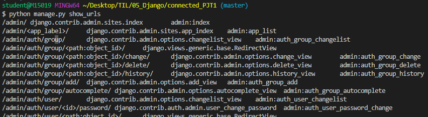

# RESTful API

### 1.1 REST 핵심 구성요소

> HTTP URI를 통해 자원(Resource)을 명시하고, HTTP Method(GET, POST, PUT, DELETE)를 통해 해당 자원에 대한 **CRUD 로직**을 적용하는 것
>
> - 혼자 개발해서 혼자 사용할 용도면
>
>   `articles/1/butterfly/show/magic`처럼 아무렇게나 개발하고 작동만 하면 된다
>
> - 하지만 다른 사람이 사용하는 것을 염두해 둔다면, `[GET요청]articles.1`과 같이 전 세계 개발자들이 사용하는 REST 아키텍처를 염두에 두고 개발해야 한다
>
> - 불필요한 행위에 대한 서술은 하지않는 것이 특징

<br>

- 자원(Resouce) : `URI`
  - URI는 자원을 표현하는데에만 중점을 둬야함
  - ex) GET /users/1/delete (X)
  -  => DELETE /users/1 (O)
- 행위(Verb) : `HTTP Method`
- 표현 : `Representations`

<br>

<br>

### 1.2 REST API 디자인 가이드

- URI는 **정보의 자원**을 표현해야 한다

  ```bash
  # URI는 자원을 표현하는데 중점을 둔다. 따라서 show, read와 같은 행위에 대한 표현이 들어가서는 안된다
  
  GET /articles/show/1 (X)
  GET /articles/1 (O)
  ```

  <br>

- 자원에 대한 행위는 **HTTP Method**로 표현한다

  ```bash
  # GET Method는 리소스 생성/삭제 등의 행위에는 어울리지 않는다
  
  GET /articles/1/update (X)
  PUT /articles/1 (O)
  ```

  <br>

- But! Django 에서는 PUT, DELETE와 같은 비공식적 요청을 default로 지원하지 않고 있기 때문에 어느정도의 절충안이 필요하다

  - GET과 POST로 구분하는것!

  ```bash
  GET /articles/2/update		# 사용자에게 수정 페이지 보여줌
  POST /articles/2/update		# 수정 작업 수행
  ```

<br>

<br>

### 1.2 REST 기본

- 슬래시(/)는 계층 관계를 나타냄

- URI에는 소문자를 사용

- 파일 확장자는 포함 안함

- 밑줄 대신 하이픈(-) 사용

- RESTful 하게 바꿔야할 url들

  ```bash
  $ python manage.py show_urls
  ```

  > 