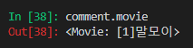

# RESTful API

### 1.1 REST 핵심 구성요소

> HTTP URI를 통해 자원(Resource)을 명시하고, HTTP Method(GET, POST, PUT, DELETE)를 통해 해당 자원에 대한 **CRUD 로직**을 적용하는 것
>
> - 혼자 개발해서 혼자 사용할 용도면
>
>   `articles/1/butterfly/show/magic`처럼 아무렇게나 개발하고 작동만 하면 된다
>
> - 하지만 다른 사람이 사용하는 것을 염두해 둔다면, `[GET요청]articles.1`과 같이 전 세계 개발자들이 사용하는 REST 아키텍처를 염두에 두고 개발해야 한다
>
> - 불필요한 행위에 대한 서술은 하지않는 것이 특징

<br>

- 자원(Resouce) : `URI`
  - URI는 자원을 표현하는데에만 중점을 둬야함
  - ex) GET /users/1/delete (X)
  -  => DELETE /users/1 (O)
- 행위(Verb) : `HTTP Method`
- 표현 : `Representations`

<br>

<br>

### 1.2 REST API 디자인 가이드

- URI는 **정보의 자원**을 표현해야 한다

  ```bash
  # URI는 자원을 표현하는데 중점을 둔다. 따라서 show, read와 같은 행위에 대한 표현이 들어가서는 안된다
  
  GET /articles/show/1 (X)
  GET /articles/1 (O)
  ```

  <br>

- 자원에 대한 행위는 **HTTP Method**로 표현한다

  ```bash
  # GET Method는 리소스 생성/삭제 등의 행위에는 어울리지 않는다
  
  GET /articles/1/update (X)
  PUT /articles/1 (O)
  ```

  <br>

- But! Django 에서는 PUT, DELETE와 같은 비공식적 요청을 default로 지원하지 않고 있기 때문에 어느정도의 절충안이 필요하다

  - GET과 POST로 구분하는것!

  ```bash
  GET /articles/2/update		# 사용자에게 수정 페이지 보여줌
  POST /articles/2/update		# 수정 작업 수행
  ```

<br>

<br>

### 1.2 REST 기본

- 슬래시(/)는 계층 관계를 나타냄

- URI에는 소문자를 사용

- 파일 확장자는 포함 안함

- 밑줄 대신 하이픈(-) 사용

- RESTful 하게 바꿔야할 url들

  ```bash
  $ python manage.py show_urls
  ```

  > 


<br>

<br>

### 1.3 기존 URL들 RESTful하게 변환

#### **request.method**

> request 요청 방법을 알 수 있다

<br>

#### new & create

> 영화정보 Form을 전달하는 `new`를 실제 DB에 정보를 저장하는 `update` view method와 합쳐서 HTTR Method(GET, POST)로 구분하겠다

- urls.py

  ```python
  # 수정 전
  path('new/', views.new, name='new'),        # CREATE Logic - form전달
  path('create/', views.create, name='create'),  # CREATE Logic - 생성
  
  # 수정 후
  path('create/', views.create, name='create'),   # GET(new) / POST(create)
  ```

  <br>

- views.py

  ```python
  # 수정 후
  
  # 영화정보 생성 Form 
  # def new(request):
  #   return render(request, 'movies/new.html')
  
  # 영화정보 생성
  def create(request):
    # POST 요청일 경우 -> 
    if request.method == 'POST':
      title = request.POST.get('title')
      title_en = request.POST.get('title_en')
      audience = request.POST.get('audience')
      open_date = request.POST.get('open_date')
      genre = request.POST.get('genre')
      watch_grade = request.POST.get('watch_grade')
      score = request.POST.get('score')
      poster_url = request.POST.get('poster_url')
      description = request.POST.get('description')
      movie = Movie(title=title, 
                    title_en=title_en, 
                    audience=audience, 
                    open_date=open_date, 
                    genre=genre, 
                    watch_grade=watch_grade, 
                    score=score,
                    poster_url=poster_url,
                    description=description)
                    
      
      movie.save()
      return redirect('movies:detail', movie.pk)
  
    # GET 요청일 경우 -> 사용자에게 Form 보여주기
    else:
      return render(request, 'movies/create.html')
  ```

  <br>

- base.html

  - new와 update 함수가 합쳐졌기 때문에 update 함수를 가리키도록 url 변경

  ```django
  <!-- 수정 전 -->
  
  <h1>이곳은 <strong>영화</strong>를 소개해주는 곳입니다</h1>
  <h1 class='text-center'><a href="">영화 등록</a></h1>
  
  
  <!-- 수정 후 -->
  
  <h1>이곳은 <strong>영화</strong>를 소개해주는 곳입니다</h1>
  <h1 class='text-center'><a href="">영화 등록</a></h1>
  ```

<br>

<br>

#### DELETE

- 보안 상 `DELETE`도 POST방식으로 바꿔주기

  ```html
  <form action="" method="POST" style="display:inline">
    
    <input type="submit" value="삭제" onClick="return confirm('정말 삭제하겠습니까?')">
  </form>
  ```

  

<br>

<br>

<br>

## 2. 1 : N Relation

#### Foreign Key(외래키)

- 참조 키의 값으로는 부모 테이블에 존재하는 키의 값만을 넣을 수 있다.

- 참조 무결성을 위해 참조 키를 사용하여 **부모 테이블의 유일한 값을 참조**한다

  (-> 부모 테이블의 기본키를 참조)

- 참조 키의 값이 부모 테이블의 기본키일 필요는 없지만 **유일**해야 한다

<br>

### 2.1 Modeling(`models.py`)

- possible values for `on_delete`

  - `CASCADE` : 부모 객체가 삭제되면 참조하는 객체도 삭제한다
  - `PROTECT` : 참조가 되어 있는 경우 오류 발생. `CASCADE`를 방어하는 역할
  - `SET_NULL` : 부모객체가 삭제되면 모든 값을 NULL로 치환(NOT NULL 조건이면 불가능!)
  - `SET_DEFAULT` : 모든 값이 DEFAULT 값으로 치환 (해당 값이 DEFAULT 값이 지정되어있어야 함)
  - `SET()` : 특정 함수 호출
  - `DO_NOTHING` : 아무것도 하지 않는다. 다만, DB필드에 대한 SQL `ON DELETE` 제한 조건이 설정되어 있어야 한다

- `comment` 모델 추가

  ```python
  class Movie(models.Model):
      ...
  	def __str__(self):
      	return f'[{self.pk}]{self.title}' 
      
      
  class Comment(models.Model):
    # 부모가 삭제되면 참조하는 객체도 삭제한다
    movie = models.ForeignKey(Movie, on_delete=models.CASCADE)
    content = models.CharField(max_length=250)
    created_at = models.DateTimeField(auto_now_add=True)
    updated_at = models.DateTimeField(auto_now=True)
  
    # Model Level Metadata 설정
    # Model Level에서 역순으로 정렬 설정해준다
    class Meta:
      ordering = ['-pk',]
  
    def __str__(self):
        return self.content
  ```

  

<br>

<br>

### 2.2 ORM 실습

- 댓글 생성 및 조회

  - `comment` 객체 생성해서 pk가 1인 `movie` 객체와 연결

  ```bash
  # shell_plus
  
  movie = Movie.objects.get(pk=1)
  # 1
  comment = Comment()
  comment.content = 'HIHI...!'
  comment.movie = movie 			# movie 객체와 연결
  comment.save()
  
  # 2
  comment = Comment(movie=movie, content='second content')
  comment.save()
  ```

  <br>

  > 

  

  <br>

  <br>

- **dir(`model`)**

  - 객체가 쓸수 있는 함수리스트들을 보여줌

  - ex) dir(model)

    ```bash
    ...
    'comment_set',
    ...
    ```

<br>


- 1:N Relation 활용하기

  - Article(1) : Comment(N) -> `comment_set` 

    - article.comment 형태로는 가져올 수 없다. 게시글에 몇 개의 댓글이 있는지 Django ORM 측에서 보장할 수가 없다

    ```bash
    comments = movie.comment_set.all()
    comment = comments.first()
    ```

    <br>

    > 

    <br>

  - Comment(N) : Movie(1) -> `movie`

    - 댓글의 경우 `comment.movie` 식으로 접근이 가능하다. 어떤 댓글이든 본인이 참조하고 있는 게시글은 반드시 있다. 따라서 이런 식으로 접근 가능하다

    > 

