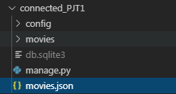
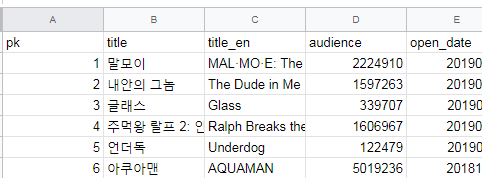
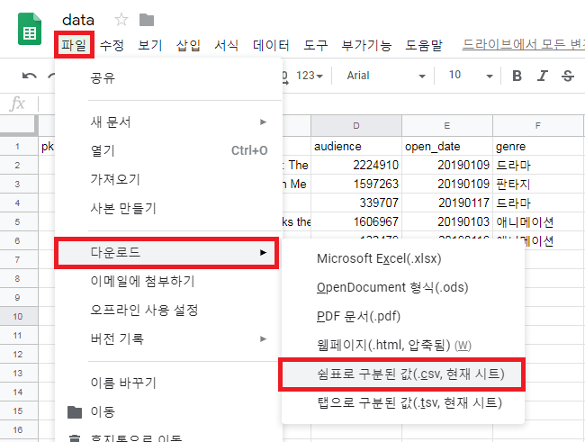
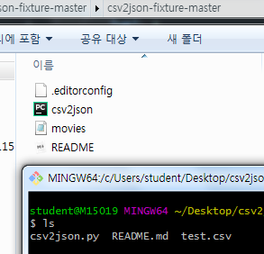
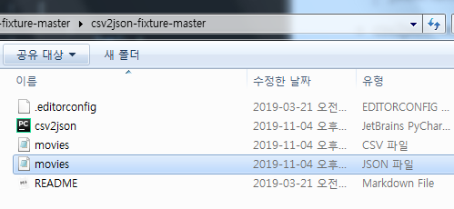

# 1. Seed Data(Initial Data) 입력하기

> 우리가 애플리케이션을 제작할 때 미리 준비해둔 데이터 혹은 애플리케이션 테스트용 데이터가 필요한 경우가 있다. 이 때, 데이터를 하드코딩으로 일일이 넣을 수도 있다. **하지만 `fixtures`라는 기능을 이용해서 준비해둔 데이터를 쉽게 데이터베이스에 넣을 수 있다**


## 1. 이미 데이터가 있을 경우

- `dumpdata` 명령어를 통해서 현재 앱(현재 DB)에서 가지고 있는 데이터를 빼낼 수 있다

  ```bash
  $ python manage.py dumpdata > movies.json
  ```

- 이전 DB가 날아가더라도 dumpdata를 통해 빼둔 데이터들을 다시 한번 활용할 수 있다

  > 




## 2. 준비해둔 fixture 데이터들을 넣고싶을 경우

- `csv`(Comma-Seperated Values)
  - 데이터들을 콤마( `,` )로 구분해서 비교적 간단한 텍스트 형태의 포맷으로 바꾼 형식
  - 스프레드시트. 엑셀에서 주로 활용한다(데이터 크기 축소)
- `fixture`는 **장고가 데이터베이스에 import할수 있는 데이터의 모음**
  - `JSON`, ` XML`, ` YAML `포맷의 fixture들을 불러올 수 있다

<br>

#### Seed Data 활용하는 방법 2가지

1. 애플리케이션의 데이터베이스를 하드코딩으로 미리 만든다. 이후 `dumpdata`명령어를 통해 fixture 데이터 형태로 만들어두고, 그 다음부턴 데이터베이스를 초기화시켜도 loaddata 명령어를 통해 다시 데이터를 불러와서 사용할 수 있다.

   - 장고에서 모델링한 데이터가 어떻게 생겼는지 확인 - `dumpdata`명령어 사용결과

     ```python
     [
         {
             "model": "movies.movie", 
             "pk": 1, 
             "fields": {
                 "title": "\ub9d0\ubaa8\uc774", 
                 "title_en": "MAL\u00b7MO\u00b7E: The Secret Mission", 
                 "audience": 2224910, 
                 "open_date": "20190109", 
                 "genre": "\ub4dc\ub77c\ub9c8", 
                 "watch_grade": "12\uc138\uc774\uc0c1\uad00\ub78c\uac00", 
                 "score": 9.04, 
                 "poster_url": "https://movie-phinf.pstatic.net/20181227_80/1545901137289EGbWK_JPEG/movie_image.jpg", 
                 "description": "\uae4c\ub9c9\ub208 \ud310\uc218,..."
             }
         },
         ...
     ]
     ```

     <br>

     <br>

2. 이미 Seed Data(pk포함된)를 제공받았을 경우, 그냥 fixtures 폴더에 넣어두고 불러와서 사용한다.

   #### 기존 csv파일(seed data)에 pk가 없을 때

   - 구글 스프레드 시트 열어서 기존 csv파일 가져오기
   - pk 열 추가한 뒤에 pk 일일이 넣어주기

   - csv 파일로 저장

     > 

     <br>

   - 저장한 csv파일을 csv2json-fixture-master 폴더로 옮기기

     >cs2json-fixture : csv 데이터를 JSON 형식의 장고 fixture 로 변환해주는 스크립트
     >
     >This script can be used to convert CSV data to [Django fixtures](https://docs.djangoproject.com/en/stable/howto/initial-data/) JSON format. 

     <br>

   - csv2json-fixture-master 폴더에서 git-bash 열기

     > 

     <br>

   - csv 파일을 fixture 파일로 변환!

     ```bash
     $ python csv2json.py movies.csv movies.Movie
     ```

     > 

     <br>

   - vscode로 돌아와 앱밑에 `fixtures`폴더 만들고 새로만든 `movies.json` 파일 넣어주기

   - DB에 데이터를 load해준다

     ```bash
     $ python manage.py loaddata movies.json
     ```

     

<br>

<br>

- 프로젝트를 진행할 때 Seed Data(Initial Data)를 제공받았을 경우, Seed Data 형식을 먼저 확인하고 형식에 맞게 모델링을 진행하자!

- `fixture`데이터 내용을 바꾸거나, 모델링해둔 내용을 바꾸고 싶으면 당연히 다시 `loaddata` 과정을 수행한다


<br>

<br>

<br>

## 3. 장고가 Fixture 파일을 찾는 방식

- 기본적으로 애플리케이션 안에 있는 `fixtures`라는 디렉토리를 탐색한다

- 환경설정에 `FIXTURE_DIRS` 옵션을 통해 장고가 바라보는 또다른 디렉토리를 정의할 수 있다

  - `loaddata` 명령어 수행할 때, 다른 경로보다 우선으로 탐색한다

  ```
  conneted_PJT1/
  	config/
  	movies/
  		fixtures/
  			movies.json
  ```

  