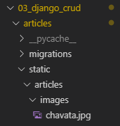
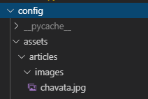
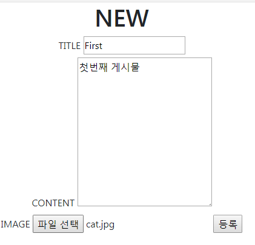
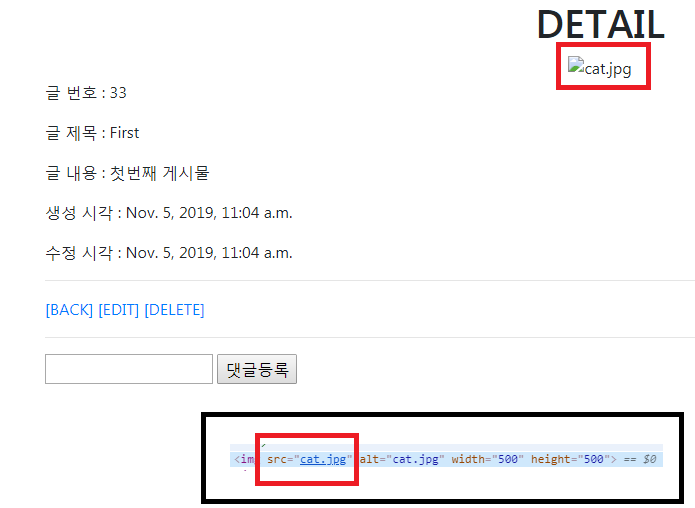
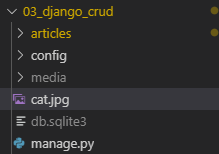
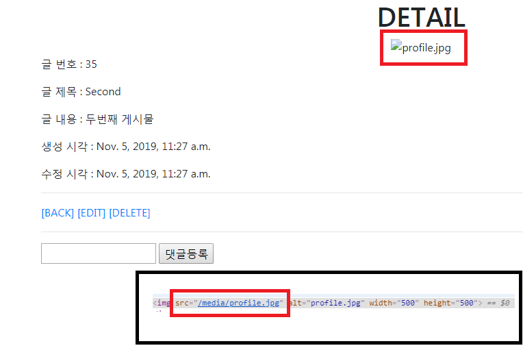
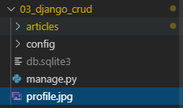
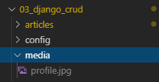
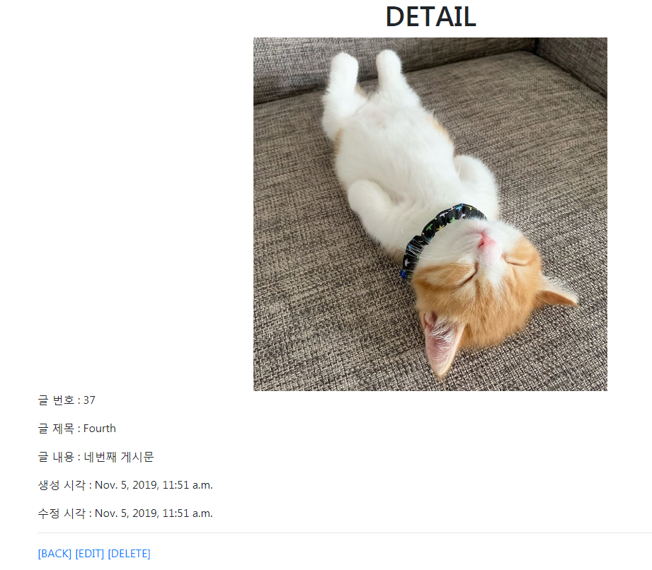

# Static files 

- Static files 기본 경로

  - 기본적으로 애플리케이션 안에 있는 static 디렉토리를 탐색해서 정적 파일을 가져온다

  - `settings.py` 아래쪽에 앱안의 static 디렉토리를 바라보도록 되어있음

    ```python
    # settings.py
    # 웹 사이트에서 사용할 정적 파일의 최상위 URL 경로
    
    STATIC_URL = '/static/'
    ```

    <br>

    > 

<br>

- ``
  - 해당 페이지에 정적 파일들을 불러와서 사용하겠다고 선언
  - 일반적으로는 HTML 문서 상단에 위치, 상속받는 `` 태그가 존재하면, 상속 태그 밑에 위치한다

<br>

- ``
  - 해당하는 경로에 있는 파일에 대해, 장고가 접근할 수 있는 절대 URL 경로를 생성한다
  - 실제 파일이 위치한 경로는 아님
  - 127.0.0.0:8000**/static/**articles/images/sample.png

<br>

<br>

<br>

# Static files 경로 커스터마이징

- 실제 정적파일이 위치한 경로 추가

- 앞으로 static 파일을 찾을 때는 `config/assets/`를 바라보도록 설정한다

  ```python
  # 웹 사이트에서 사용할 정적 파일의 최상위 URL 경로
  
  STATIC_URL = '/static/'
  
  # 실제 정적파일이 위치한 경로
  # 앞으로 static 파일을 찾을 때 아래 설정한 경로에 찾아가서 탐색한다
  # 개발 단계에서 사용 -> 실제 프로덕션 배포 단계에서는 다른 방식 사용
  STATICFILES_DIRS = [
      os.path.join(BASE_DIR, 'config', 'assets'), 
  ]
  ```

  <br>

  > 


# 사용자 이미지 업로드받기

### 1. 모델링

- `blank=True` 옵션은 '빈 문자열'을 허용한다 => 바로 `migrate`가능

  ```python
  # models.py
  
  class Article(models.Model):
    ...
    # 원래대로라면 새로운 필드를 추가하고 나면 makemigrations할때, 어떤 값을 넣을건지 Django가 물어본다. 
    # 기본적으로 blank=False이기 때문이다
    # blank = True -> '빈 문자열'이 들어가도 된다
    # 코드 상으로는 명시적으로 중간에 삽입했지만, 실제 DB 테이블을 보면 가장 뒤에 추가된다
    image = models.ImageField(blank=True) 
    ...
  ```

  

<br>

- `admin`페이지도 수정해주자

  - `image ` 추가

  ```python
  # admin.py
  
  class ArticleAdmin(admin.ModelAdmin):
    list_display = ('pk','title','content','image','created_at','updated_at',)
  ```

<br>

<br>

### 2. 첫번째 업로드

#### entype

1. application/x-www-form-urlencoded
   - (기본값) 모든 문자 인코딩
2. **multipart/form-data** 
   - 파일 형태 첨부시 필수 사용 
   - 데이터를 나누어 전송한다
3. text/plain
   - 인코딩 안함
   - 사실상 안쓰임

<br>

- `form` 속성에 `enctype="multipart/form-data`을 명시해 주면 HTTP 요청시, 덱스트 따로, 파일 따로 넘겨준다
- 따라서 view함수에서 파일 찾을 때는 `request.FILES.get('image')`로 탐색

<br>

#### 파일첨부 input 태그

- `input`의 타입은 `file`

- `accept` 속성 : 첨부하려는 파일을 특정지을 수 있다

  - 파일 확장자 지정 : .gif, ,jpg, .png와 같이 나열

    ```html
    <input type="file" accept=".gif, .jpg, .png">
    ```

  <br>

  -  `image/*` : 모든 이미지 파일을 보여준다

    ```html
    <input type="file" accept="image/*">
    ```

    <br>

    > 

  ```html
  <!-- create.html -->
  
  <form class="text-center" action="" method="POST" enctype="multipart/form-data">
    
  	...
    <label for="image">IMAGE</label>
    <input type="file" name="image" id="image" accept="image/*">
    <input type="submit" value="등록">
  </form>
  ```

  <br>

  ```python
  def create(request):
    # 실제 DB에 저장
    if request.method == 'POST':
  	...
      image = request.FILES.get('image')
  
      article = Article(title=title, content=content, image=image)
      article.save()
  ```

  <br>

- 실행화면

  > 

<br>


#### 등록 후

- 실행화면

  - 저장 경로가 제대로 잡혀있지 않음

  > 

 <br>

- 등록한 이미지 파일은 프로젝트의 `root`경로에 저장되어있다

  > 

<br>

<br>

### *=>업로드된 파일의 주소를 만들어줘야할 필요가 있다!!*


<br>

<br>

<br>

### 3. 두번째 업로드(업로드된 파일 주소 지정)

- `MEDIA_URL` : 업로드된 파일의 주소를 만들어주는 역할

  ```python
  # settings.py
  
  # Media files
  # 업로드된 파일의 주소를 만들어주는 역할
MEDIA_URL = '/media/'
  # 실제로 파일이 업로드된 다음에 어디로 배치될 것인지 경로를 정하는 설정
# 일반적으로는 media폴더에 배치
  MEDIA_ROOT = os.path.join(BASE_DIR, 'media')
```
  
<br>
  
- 업로드한 파일에 `/media/`라는 주소가 생긴것을 확인할 수 있다
  
> 
  
<br>
  
  - 여전히 파일은 `root`에 저장된다
  
  > 
  
  

<br>

<br>

- `MEDIA_ROOT` 

  - 실제로 파일이 업로드된 다음에 프로젝트의 어디로 배치될 것인지 경로를 정해주는 설정

  - 일반적으로는 `media` 폴더에 배치

  - `media` 폴더가 없으면 폴더가 만들어지고 파일이 폴더내에 저장된다

    > 

<br>

<br>

#### 하지만 여전히 업로드한 파일의 경로를 제대로 찾지 못해 이미지가 제대로 뜨지 않는다

<br>

### *=> 파일이 업로드될 때마다 URL을 정적으로 추가하도록 프로젝트의 설정을 바꿔줄 필요가 있다!!* 

<br>

<br>

<br>

### 4. 세번째 업로드(config/urls 수정)

- `config/urls.py`에서 `urlpatterns` 추가

- 앱의 `urls`파일이 아니라 프로젝트의 `urls` 임을 유의하자!

- `urlpatterns`

  -  `static(param1, param2)`

    - 첫번째 인자 : 어떤 URL을 정적으로 추가할지(Media File)

      우리는 이미 업로드된 파일의 URL에  `/media/` 가 포함되도록 주소를 설정해 놓았다

    - 두번째 인자 : 실제 해당 미디어 파일은 어디에 있는지?

      우리는 실제 업로드된 파일이 프로젝트의 `media` 폴더 내에 저장되도록 설정해 놓았다

  ```python
  # /config/urls.py
  from django.conf import settings
  from django.conf.urls.static import static
  
  urlpatterns += static(settings.MEDIA_URL,
  document_root = settings.MEDIA_ROOT)
  ```

<br>

- 실행화면

  - 파일의 저장경로를 제대로 찾아 이미지를 제대로 표시한다

  > 


<br>

<br>