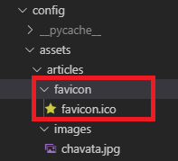
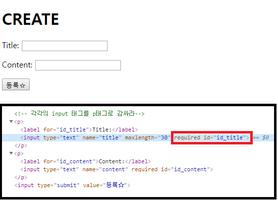
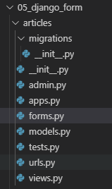
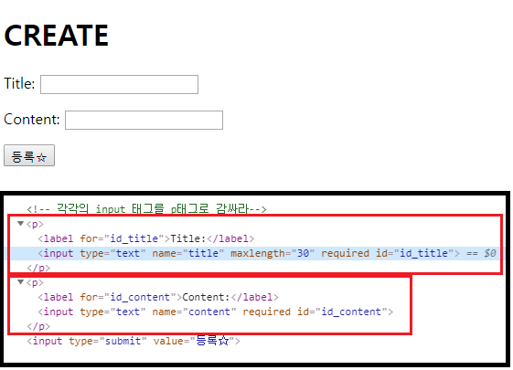
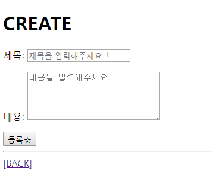
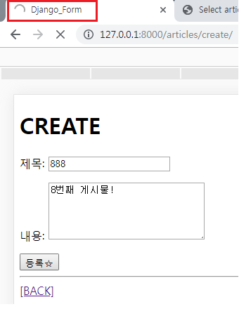
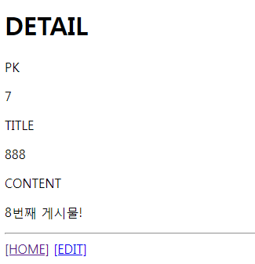

# 2019-11-06 (수)

## 1. Image Resizing

### 1.1 Python & Django 이미지 관련 라이브러리

```bash
# 설치 순서 주의! (의존성 있음)

$ pip install Pillow
$ pip install pilkit
$ pip install django-imagekit
```

<br>

- `pillow` : PIL(Python Image Library) 프로젝트에서 fork 되어서 나온 라이브러리. Python3를 지원하지 않기 때문에 Pillow를 많이 씀

- `pilkit` : Pillow를 쉽게 쓸 수 있도록 도와주는 라이브러리. 다양한 Processors 지원
  - Thumbnail
  - Resize
  - Crop...
- `django-imagekit` : 이미지 썸네일 Helper

<br>

<br>

### 1.2 INSTALLED_APPS 등록

```python
# settings.py

INSTALLED_APPS = [
	...
    'imagekit',
	...
]
```

<br>

<br>

### 1.3 모델 수정

- 현재는 `Django`에서 제공하는 `ImageField` 사용 중

- `imagekit` 에서 제공하는 `field` 쓰도록 모델 수정

  ```python
  from imagekit.models import ProcessedImageField
  from imagekit.processors import Thumbnail
  
  class Article(models.Model):
    ...
    image = ProcessedImageField(
      processors=[Thumbnail(200,300)],  	# 처리할 작업
      format='JPEG',                    	# 이미지 포맷
      options={'quality':90},           	# 각종 추가 옵션
      upload_to='articles/images',      	# 저장 위치   
      # 실제경로 -> MEDIA_ROOT/articles/images
    )
    ... 
  ```

<br>

<br>

### 1.4 Migrations

- `ProcessdImageField`의 인자로 들어가는 옵션들은 수정을 하더라도 다시 `migration ` 하지 않아도 바로바로 적용이 된다.

<br>

<br>

<br>


## 2. Favicon

### 2.1  **favicon.ico** 만들기

> Favicon Generator :  https://www.favicon-generator.org/ 

<br>

<br>

### 2.2 static 경로에 추가

- `static` 경로에 `favicon`폴더 추가

  > 

<br>

<br>

### 2.3 Template 적용

- 템플릿 상단에 `` 반드시 추가

  ```django
  
  ...
  <head>
    ...
    <title>Django CRUD</title>
    <link rel="shortcut icon" href="" type="image/x-icon">
    <link rel="icon" href="" type="image/x-icon">
    ...
  </head>
  ```

  

<br>

<br>

<br>


## 3. Django Form

> Django에서 제공하는 Form 클래스를 이용해서 편리하게 폼 정보를 관리하고 유효성 검증을 진행하고, 비유효 field에 대한 에러 메시지를 결정한다.
>
> 즉, HTML으로 Form 입력을 관리하던 것을 Django에서 제공하는 Form 클래스를 바꿔보는 작업을 해보자

<br>

### 3.1 Form의 장점( => 자동화)

- `blank=True` 와 같은 옵션을 따로 지정해주지 않아도, HTML 태그에 `required` 옵션을 자동으로 붙여준다
- 기존에 max_length 와 같은 조건을 어길 경우 에러 페이지를 출력했는데, Django Form을 써서 에러 메시지를 출력해준다

<br>

> 

<br>

<br>

### 3.2 Form Class 만들기

- 앱 밑에 `forms.py` 생성

  > 

  <br>

  ```python
  # forms.py
  
  from django import forms
  
  class ArticleForm(forms.Form):
    title = forms.CharField(max_length=30)
    # 비워둘 수 있다
    content = forms.CharField()
  ```

<br>

<br>

### 3.3 Binding

> 폼 인스턴스를 생성하고, 전달받은 데이터를 채운다
>
> 인스턴스에 데이터를 채운 후, 유효성 검증을 진행한다

<br>

####  `is_valid`

>  검증에 통과한 값을 `dictionary` type 으로 제공

- `cleaned_data` 로 `dictionary` 안 데이터를 검증한다

<br>

<br>

#### Form으로 전달받는 형태

1. GET 요청 : 비어있는 form 전달
2. 유효성 검증 실패 : 에러 메시지를 포함한채로 form 전달

<br>

<br>

#### views.py 

- 기존 `CREATE`

  ```python
  # 변경 전 views.py
  
  def create(request):
    # POST 요청 => 데이터를 받아서 DB에 저장
    if request.method == 'POST':
      title = request.POST.get('title')
      content = request.POST.get('content')
      article = Article(title=title, content=content)
      article.save()
      
      return redirect('articles:detail', article.pk)
    else:
    	return render(request, 'articles/create.html')
  ```

  <br>

- 수정한 `CREATE`

  ```python
  def create(request):
    # POST 요청 => 데이터를 받아서 DB에 저장
    if request.method == 'POST':
      # Binding 과정
      form = ArticleForm(request.POST)
      # 검증해서 valid=True 이면
      if form.is_valid():
        # cleaned_data를 통해 form이 dictionary 형태로 바뀌어져서 들어옴
        # cleaned_data를 통해 디셔너리 안 데이터를 검증한다
        title = form.cleaned_data.get('title')
        content = form.cleaned_data.get('content')
        article = Article.objects.create(title=title, content=content)
      return redirect('articles:detail', article.pk)
    else:
      form = ArticleForm()
    
    # form으로 전달받는 형태가 2가지
    # 1. GET요청 -> 비어있는 폼 전달
    # 2. 유효성 검증 실패 -> 에러 메시지를 포함한 채로 폼 전달
    context = {'form':form }
    return render(request, 'articles/create.html', context)
  ```

<br>

-  `FORM` 초기화

  - `ArticleForm(initial={ })`

  ```python
  def update(request, article_pk):
    article= get_object_or_404(Article, pk=article_pk)
    if request.method == 'POST':
      ...
    else:
      form = ArticleForm(initial={
        'title':article.title,
        'content':article.content
      })
      context = {'form':form}
      #return render(request, 'articles/create.html', context)
      return render(request, 'articles/home.html', context)
  ```

<br>

<br>

### 3.4 템플릿에서 전달받은 Form 출력

- `{{ form.as_p }}`
  - `as_p` : 각각의 `input` 요소를 p태그로 감싸라는 뜻
  - `as_table` 등 여러 태그가 가능하다 

- #### create.html

  ```html
  <!-- 수정 전 create.html -->
  
  <form action="" method="POST">
  
  <label for="title">TITLE</label>
  <input type="text" name="title" max_length="300"><br><br>
  <label for="content">CONTENT</label><br>
  <textarea name="content" cols="80" rows="10"></textarea>
  <hr>
  <input type="submit" value="등록☆">
  </form>
  ```

  <br>

  ```html
  <!-- 수정 후 create.html -->
  
  <form action="" method="POST">
  
  <!-- 각각의 input 요소를 p태그로 감싸라-->
  {{ form.as_p }}
  <input type="submit" value="등록☆">
  </form>
  ```

<br>

- 실행화면

  - 전달받은 `form` 의 `input`을 `p` 태그로 감싼것을 확인할 수 있다

  > 

<br>

<br>

### 3.5 Form Class를 HTML tag처럼 사용하기

- `From Class` 속성을 추가해서 `HTML tag` 처럼 사용할 수 있다

- `Widget` : Input Type 지정

  ```python
  # articles/forms.py
  
  from django import forms
  
  class ArticleForm(forms.Form):
    title = forms.CharField(
      # HTML tag 와 동일
      max_length=30,
      label='제목',
      widget=forms.TextInput(
        attrs={
          'class':'title',
          'placeholder':'제목을 입력해주세요..!',
        }
      )
    )
    # 비워둘 수 있다
    content = forms.CharField(
      label='내용',
      # widget : Input Type 지정 -> Textarea / 알맞은 속성값 부여
      widget=forms.Textarea(
        attrs={
          'class':'content',
          'placeholder':'내용을 입력해주세요',
          'rows':5,
          'cols':30,
        }
      )
    )
  ```

<br>

- 실행화면

  - `label` 도 바뀌고 `placeholder` 등 속성이 변경된 것을 확인할 수 있다

  > 


<br>

<br>

<br>

## 4. Embed 

> Python으로 코드를 디버깅하는 방법
>
> 프로그램/스크립트가 embed()문에 도달하면 IPython Shell에 빠지게 된다

<br>

- `embed()`를 통해 `IPython Shell` 에  직접 엑세스

  ```python
  # views.py
  
  from IPython import embed
  
  def create(request):
    # POST 요청 => 데이터를 받아서 DB에 저장
    if request.method == 'POST':
      form = ArticleForm(request.POST)
      embed()
      # 검증해서 valid=True이면
      if form.is_valid():  
        # cleaned_data를 통해 form이 dictionary 형태로 바뀌어져서 들어옴
        # cleaned_data를 통해 딕셔너리 안 데이터를 검증한다
        title = form.cleaned_data.get('title')
        content = form.cleaned_data.get('content')
        article = Article.objects.create(title=title, content=content)
      return redirect('articles:detail', article.pk)
    else:
      form = ArticleForm()
    
    # form으로 전달받는 형태가 2가지
    # 1. GET요청 -> 비어있는 폼 전달
    # 2. 유효성 검증 실패 -> 에러 메시지를 포함한 채로 폼 전달
    context = {'form':form }
    return render(request, 'articles/create.html', context)
  ```

  <br>

- 실행화면

  - `embed()` 코드에 걸려서 `IPython Shell` 에 들어간 상태가 된다

  > 

<br>

```bash
In [1]: form
Out[1]: <ArticleForm bound=True, valid=Unknown, fields=(title;content)>

In [2]: request.POST
Out[2]: <QueryDict: {'csrfmiddlewaretoken':['gxCjOxEektFeWAuWsdLGB0ivimT9Vnf4a3nEvy2hqYIaxLMSgpL94WvkyLW7Lool'], 'title': ['888'], 'content': ['8번째 게시물!']}>


In [3]: type(form)
Out[3]: articles.forms.ArticleForm

# form을 검증하겠다
In [4]: form.is_valid()
Out[4]: True

# 맨 처음 form을 입력했을 때와는 달리 form이 검증된 상태이다
In [5]: form
Out[5]: <ArticleForm bound=True, valid=True, fields=(title;content)>

# cleaned_data를 통해 딕셔너리 안 데이터를 검증한다
In [6]: form.cleaned_data
Out[6]: {'title': '888', 'content': '8번째 게시물!'}

In [7]: form.cleaned_data.get('title')
Out[7]: '888'

In [8]: exit()
```

<br>

- `exit()` 로 `IPython Shell` 종료

  - `DETAIL` 페이지로 넘어간다

  > 


<br>

<br>

<br>

## 5. Django ModelForm

### 5.1 개념

- Django의 큰 특징 중 하나
- Model 클래스 정의와 비슷하게 Form 클래스를 선언할 수 있다

<br>

<br>

### 5.2 역할

1. HTML 입력 폼 생성 : `as_p()`, `as_table()`
2. 유효성 검증 : `is_valid()`
3. 검증 통과한 값 딕셔너리로 제공 : `cleaned_data`

#### *=> 대부분의 기능을 모두 제공해서 코드도 간결해지고 개발자가 할일을 줄여준다!!*

<br>

<br>

### 5.3 Form vs modelForm

```python
# forms.py

# Django Form
class ArticleForm(forms.Form):
    title = forms.CharField()
    content = forms.CharField()
    
# Django ModelForm
# Django가 건네받은 모델을 기준으로 폼 양식에 필요한 대부분을 전부 만들어준다
from .models import Article

class ArticleForm(forms.ModelForm):
    class Meta:
        model = Article
        # fields = '__all__'
    	fields = ('title','content',)
```

<br>

#### MetaData

> 데이터의 데이터
>
> ex ) 사진 한장 (촬영장비이름, 촬영환경 등)

<br>

- 메타데이터로 Model 정보를 건네주면, `ModelForm` 이 자동으로 `input`태그를 생성해준다

  ```python
  class Meta:
      model = Article
      # fields = '__all__'
      fields = ('title','content',)
  ```

  

<br>

<br>

### 5.4 ModelForm 사용방법

- `ModelForm`은 설정해준 `model`형태로 들어와 따로 검증을 할 필요가 없다

  ```python
  # views.py : create
  
  #1. Form Class
  	...
      if form.is_valid():
          title = form.cleaned_data.get('title')
          content = form.cleaned_data.get('content')
          article = Article.objects.create(title=title, content=content)
      ...
      
  
  
  # 2. Model Form Class
  	...
      if form.is_valid():
          article = form.save()
      ...
      
  ```

<br>

<br>

### 5.5 ModelForm 초기화

```python
# views.py : update

def update(request, article_pk):
  article= get_object_or_404(Article, pk=article_pk)
  if request.method == 'POST':
    form = ArticleForm(request.POST, instance=article)
    if form.is_valid():
      article = form.save()
      return redirect('articles:detail', article.pk)
  else:
    form = ArticleForm(instance=article)
    context = {'form':form}
    #return render(request, 'articles/create.html', context)
    # form의 형태가 같아 create 템플릿을 여러곳에서 사용하기 때문에 create.html -> form.html으로 rename해 공용 템플릿으로 이용한다 
    return render(request, 'articles/form.html', context)
```

<br>

<br>

### 5.6 create.html => form.html

- `form`의 형태가 같아 `create` 템플릿을 여러곳에서 사용하기 때문에 `create` 템플릿을 `form` 으로 변경해 공용템플릿으로 이용한다.

<br>

<br>

<br>

## 6. get_object_or_404

### 6.1 500에러

> 500에러는 내부 서버 오류로, '서버에 오류가 발생하여 요청을 처리할 수 없다'는 의미다

- ex) articles/356775 와 같이 존재하지 않는 상세정보 페이지를 요청하면 500에러가 발생한다

<br>

<br>

### 6.2 404에러

>  사용자의 요청이 잘못된 경우 '서버에 존재하지 않는 페이지에 대한 요청' 이라는 의미를 가진 404에러를 리턴

- 500에러를 리턴하면 "선생님, 깃헙 폭파됐는데요?"라는 말이 나올거고, 404에러를 리턴하면 "아, 선생님이 주소를 잘못 줬거나 내가 잘못 쳤구나..."라는 말이 나올 것

  <br>

  ```python
  def detail(request, article_pk):
    #article = Article.objects.get(pk=article_pk)
    article = get_object_or_404(Article, pk=article_pk)
    context = {
      'article':article,
    }
    return render(request, 'articles/detail.html', context)
  ```

