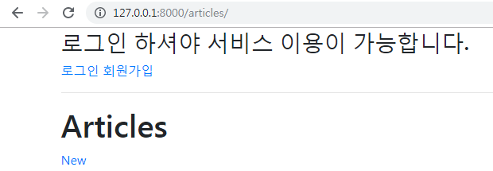
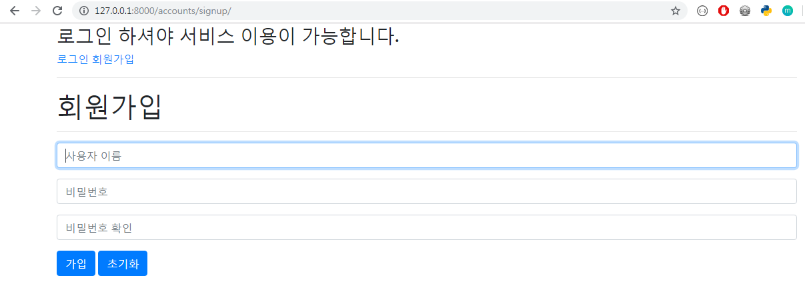
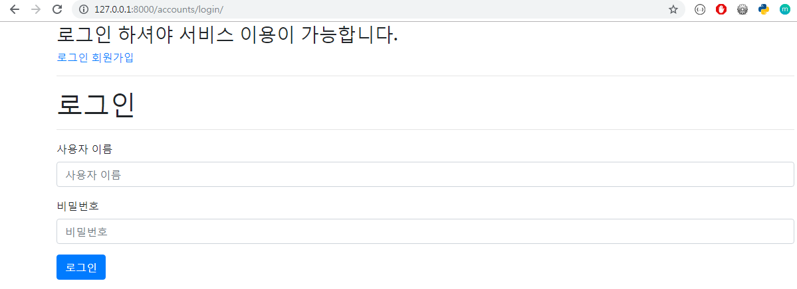
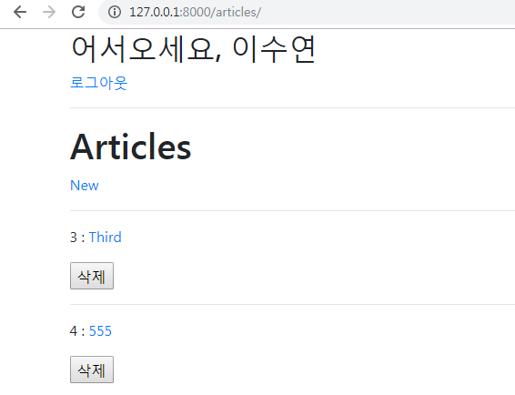

# 1. Authentication(인증)

> 장고에서 이미 Auth 관련 기능을 만들어두었고, 우리는 자연스럽게 사용하고 있었다. `createsuperuser`를 통해 관리자 계정도 만들었고, Admin 페이지에서 로그인 기능도 사용하고 있었다.

<br>

## 1.1 Accounts 앱 추가

- 기존 앱에서 구현해도 되지만, 장고에서는 기능 단위로 애플리케이션을 나누는 것이 일반적이므로 `accounts` 라는 새로운 앱을 만들어보자
- `accounts` 앱 생성 / 등록
- URL 분리

<br>

<br>

## 1.2 UserCreationForm

> django에서는 새로운 사용자를 위한 회원가입 form을 제공하고 있다

<br>

- Authentication (인증) : 신원 확인
  - 자신이 누구라고 주장하는 사람의 신원을 확인하는 것이다.

<br>

<br>

### 회원가입

- 로그인/회원가입을 하고, 로그인한 사용자의 정보를 나타내도록 `base` 템플릿 수정

  ```html
  
  
  <!DOCTYPE html>
  <html lang="ko">
  <head>
    <meta charset="UTF-8">
    <meta name="viewport" content="width=device-width, initial-scale=1.0">
    <meta http-equiv="X-UA-Compatible" content="ie=edge">
    <title>Django_Form</title>
    
  </head>
  <body> 
    <div class="container">
    
      <h2>어서오세요, {{ user.username }}</h2>
      <a href="">로그아웃</a>
    
      <h3>로그인 하셔야 서비스 이용이 가능합니다.</h3>
      <a href=""> 로그인</a>
      <a href="">회원가입</a>
    
    <hr>
      
      
    </div>
  
    
  </body>
  </html>
  ```

  <br>

  > 

<br>

<br>


- Django에서는 `UserCreationForm` 이라는 회원가입을 위한 form을 제공해준다

- Django에서는 사용자가 session을 몰라도 기능을 사용할 수 있도록 `AuthenticationForm` 을 제공한다

- `request,user.is_authenticated` 

  - 이미 login 되어있는 사용자는 회원가입을 또 할 필요가 없으므로 `index` 로 redirect
  - 회원가입을 하면 form data를 DB에 저장하고 바로 user 객체를 만들어 `auto_login`을 시킨 뒤 바로 `index` 로 redirect

  ```python
  # views.py
  
  from django.contrib.auth import login as auth_login
  from django.contrib.auth.forms import UserCreationForm, AuthenticationForm
  
  # Auth CRUD : CREATE
  def signup(request):
    if request.user.is_authenticated:
      return redirect('articles:index')
  
    if request.method == 'POST':
      form = UserCreationForm(request.POST)
      if form.is_valid():
        user = form.save()
        auth_login(request, user)
        return redirect('articles:index')
  
    else:
      form = UserCreationForm()
  
    context = {'form':form}
    return render(request, 'accounts/signup.html', context)
  ```

  <br>

  ```django
  <!-- signup.html -->
  
  
  
  
  
  <h1>회원가입</h1>
  <hr>
  <form action="" method="POST">
    
  <!-- {{ form.as_p }} -->  
    
    
    
  </form>
   
  ```

  <br>

  > 

<br>

<br>

### 로그인

- 이미 login 되어있는 사용자가 다시 로그인 시도할 때는 바로 `index` 로 redirect

- login은 session 정보가 있기 때문에 인증폼(AuthenticationForm)에 `index` 객체를 넘겨줘야한다

  - 만약 form이 검증되었으면 사용자 정보를 들고오고, 그 정보로 `login` 을 해준뒤 `index` 로 redirect

  ```python
  # views.py
  
  def login(request):
    # 이미 login되어있는 사용자가 다시 로그인 시도할때
    if request.user.is_authenticated:
      return redirect('articles:index')
   
    if request.method == 'POST':
      # login은 session 정보가 있기때문에 request 넘겨줘야함
      form = AuthenticationForm(request, request.POST)
      if form.is_valid():
        # AuthenticationForm이 들고잇는 사용자 정보를 들고온다
        auth_login(request, form.get_user())
        return redirect('articles:index')
    else:
      form = AuthenticationForm()
    
    context = { 'form':form }
    return render(request, 'accounts/login.html', context)
  ```

  <br>

  ```django
  <!-- login.html -->
  
  
  
  
  
  <h1>로그인</h1>
  <hr>
  <form action="" method="POST">
    
    
    
    
  </form>
  
   
  ```

  <br>

  > 

  <br>

  > 

<br>

<br>

### 로그아웃

- 현재 서버에서 보고 있는 session에서 login 정보를 지워버린다

  ```python
  # views.py
  
  from django.contrib.auth import logout as auth_logout
  
  def logout(request):
    auth_logout(request)
    return redirect('articles:index')
  ```

  