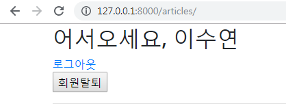
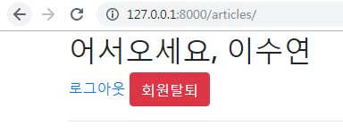
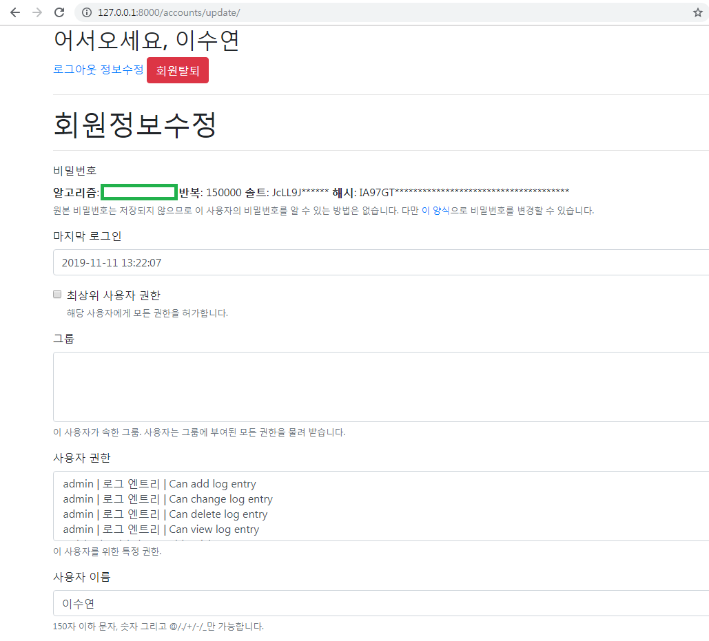
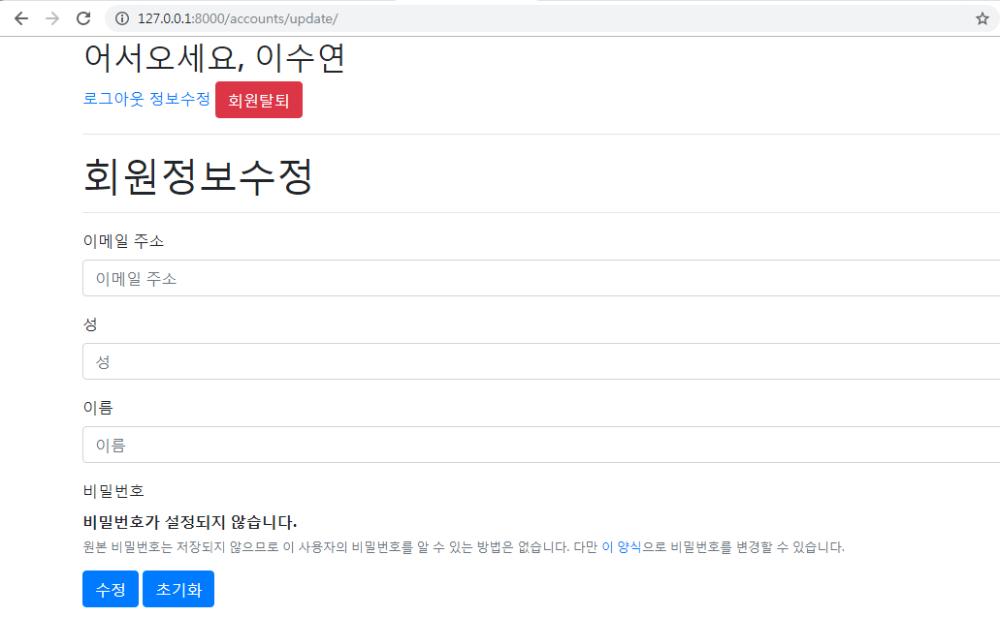
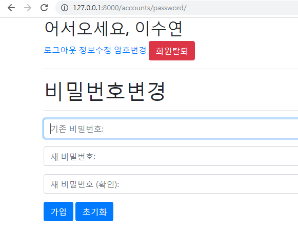

# 1. Authentication(인증)

> 장고에서 이미 Auth 관련 기능을 만들어두었고, 우리는 자연스럽게 사용하고 있었다. `createsuperuser`를 통해 관리자 계정도 만들었고, Admin 페이지에서 로그인 기능도 사용하고 있었다.

<br>

## 1.0 세션(Session)

- 클라이언트가 서버에 접속하면, 서버가 특정한 sessiong_id를 발급한다. 클라이언트는 session_id를 쿠키를 사용해 저장한다
- 클라이언트가 서버측 여러 페이지에 이동할 때마다, 해당 쿠키(session_id)를 이용해서 서버에 session_id를 전달한다
- 따라서 서버는 페이지가 바뀌더라도 같은 사용자임을 인지할 수 있다

<br>

- 쿠키 vs 세션
  - 쿠키 : 클라이언트 로컬에 파일로 저장
  - 세션 : 서버에 저장(session_id는 쿠키 형태로 클라이언트 로컬에 저장됨)

- embed로 확인해보기
  - request.session._session


<br>

## 1.1 Accounts 앱 추가

- 기존 앱에서 구현해도 되지만, 장고에서는 기능 단위로 애플리케이션을 나누는 것이 일반적이므로 `accounts` 라는 새로운 앱을 만들어보자
- `accounts` 앱 생성 / 등록
- URL 분리

<br>

<br>

## 1.2 UserCreationForm

> django에서는 새로운 사용자를 위한 회원가입 form을 제공하고 있다

<br>

- Authentication (인증) : 신원 확인
  - 자신이 누구라고 주장하는 사람의 신원을 확인하는 것이다.

<br>

<br>

##  1.3 SignUp

- 회원가입 로직은 CRUD 중에 'CREATE'에 가깝다
- `class User`는 이미 장고가 만들어 두었고, User 클래스와 연동되는 ModelForm인 `UserCreationForm` 도 장고가 이미 준비해두었다

- 로그인/회원가입을 하고, 로그인한 사용자의 정보를 나타내도록 `base` 템플릿 수정

  ```html
  
  
  <!DOCTYPE html>
  <html lang="ko">
  <head>
    <meta charset="UTF-8">
    <meta name="viewport" content="width=device-width, initial-scale=1.0">
    <meta http-equiv="X-UA-Compatible" content="ie=edge">
    <title>Django_Form</title>
    
  </head>
  <body> 
    <div class="container">
    
      <h2>어서오세요, {{ user.username }}</h2>
      <a href="">로그아웃</a>
    
      <h3>로그인 하셔야 서비스 이용이 가능합니다.</h3>
      <a href=""> 로그인</a>
      <a href="">회원가입</a>
    
    <hr>
      
      
    </div>
  
    
  </body>
  </html>
  ```

  <br>

  > 

<br>

<br>


- Django에서는 `UserCreationForm` 이라는 회원가입을 위한 form을 제공해준다

- Django에서는 사용자가 session을 몰라도 기능을 사용할 수 있도록 `AuthenticationForm` 을 제공한다

- `request.user.is_authenticated` 

  - 이미 login 되어있는 사용자는 회원가입을 또 할 필요가 없으므로 `index` 로 redirect
  - 회원가입을 하면 form data를 DB에 저장하고 바로 user 객체를 만들어 `auto_login`을 시킨 뒤 바로 `index` 로 redirect

  ```python
  # views.py
  
  from django.contrib.auth import login as auth_login
  from django.contrib.auth.forms import UserCreationForm, AuthenticationForm
  
  # Auth CRUD : CREATE
  def signup(request):
    if request.user.is_authenticated:
      return redirect('articles:index')
  
    if request.method == 'POST':
      form = UserCreationForm(request.POST)
      if form.is_valid():
        user = form.save()
        auth_login(request, user)
        return redirect('articles:index')
  
    else:
      form = UserCreationForm()
  
    context = {'form':form}
    return render(request, 'accounts/signup.html', context)
  ```

  <br>

  ```django
  <!-- signup.html -->
  
  
  
  
  
  <h1>회원가입</h1>
  <hr>
  <form action="" method="POST">
    
  <!-- {{ form.as_p }} -->  
    
    
    
  </form>
   
  ```

  <br>

  > 

<br>

<br>

## 1.4 Login

- 장고에서 로그인하는 것은 session을 create하는 것과 같다
  - 장고는 session에 대한 매커니즘을 생각하지 않아도 쉽게 사용할 수 있다
  - session 사용자가 로그인을 하면, 사용자가 로그아웃을 하거나 정해진 일정한 시간이 지나기 전까지는 계속 유지됨
- User를 인증하는 ModelForm : `AuthenticationForm`
  - `AuthenticationForm(request, request.POST)`

- 이미 login 되어있는 사용자가 다시 로그인 시도할 때는 바로 `index` 로 redirect

- login은 session 정보가 있기 때문에 인증폼(AuthenticationForm)에 `index` 객체를 넘겨줘야한다

  - 만약 form이 검증되었으면 사용자 정보를 들고오고, 그 정보로 `login` 을 해준뒤 `index` 로 redirect

  ```python
  # views.py
  
  def login(request):
    # 이미 login되어있는 사용자가 다시 로그인 시도할때
    if request.user.is_authenticated:
      return redirect('articles:index')
   
    if request.method == 'POST':
      # login은 session 정보가 있기때문에 request 넘겨줘야함
      form = AuthenticationForm(request, request.POST)
      if form.is_valid():
        # AuthenticationForm이 들고잇는 사용자 정보를 들고온다
        auth_login(request, form.get_user())
        return redirect('articles:index')
    else:
      form = AuthenticationForm()
    
    context = { 'form':form }
    return render(request, 'accounts/login.html', context)
  ```

  <br>

  ```django
  <!-- login.html -->
  
  
  
  
  
  <h1>로그인</h1>
  <hr>
  <form action="" method="POST">
    
    
    
    
  </form>
  
   
  ```

  <br>

  > 

  <br>

  > 

<br>

<br>

## 1.5 Logout

- `auth_logout(request)`

  - 현재 유지하고 있는 session을 서버에서 DELETE하는 로직

  ```python
  # views.py
  
  from django.contrib.auth import logout as auth_logout
  
  def logout(request):
    auth_logout(request)
    return redirect('articles:index')
  ```

  

<br>

<br>

<br>

## 1.6 `login_required` 데코레이터

- 로그인하지 않은 사용자의 경우 `settings.LOGIN_URL`에 설정된 절대 경로로 리다이렉트 된다

  - 장고에서 설정한 `LOGIN_URL` 의 기본 경로는 `/accounts/login/` 이다

  - 우리가 앱 이름을 `accounts`라고 했던 이유들 중 하나

  - login_required 경로 커스터마이징

    - 기본값은 '/accounts/login/'

    - ```python
      # settings.py
      
      LOGIN_URL = '/members/login/'
      ```

      

- login_required를 사용했을 경우, 주소창에 특이한 쿼리스트링이 붙는다

- **"`next`" 쿼리 스트링 파라미터**

  - `@login_required`는 기본적으로 성공한 뒤에 사용자를 어디로 보낼지(리다이렉트)에 대한 경로를 next라는 파라미터에 저장한다
  - 사용자가 접근했던 페이지가 반드시 로그인이 필요한 페이지였기 때문에, 일단 로그인 페이지로 강제로 보낸 다음에 로그인을 끝내고 나면 **원래 요청했던 주소로 보내주기 위해 경로를 keep** 해둔다
  - 문제점 : 우리가 따로 설정해주지 않으면, view에 설정해둔 redirect경로로 이동한다. next에 담긴 경로로 이동시키기 위해 코드를 바꾸어야 한다

- 새 article 생성시 비로그인 상태면 로그인창으로 이동

  - articles/views.py

    ```python
    from django.views.decorators.http import require_POST
    # 장고가 기본적으로 accounts로 설정함
    from django.contrib.auth.decorators import login_required
    
    @login_required
    def create(request):
      # POST 요청 => 데이터를 받아서 DB에 저장
      if request.method == 'POST':
        form = ArticleForm(request.POST)
        if form.is_valid():
          article = form.save()
        return redirect('articles:detail', article.pk)
      else:
        form = ArticleForm()
        
      context = {'form':form }
      return render(request, 'articles/form.html', context)
    ```

  - accounts/views.py

    ```python
    def login(request):
      # 이미 login되어있는 사용자가 다시 로그인 시도할때
      if request.user.is_authenticated:
        return redirect('articles:index')
     
      if request.method == 'POST':
        # login은 session 정보가 있기때문에 request 넘겨줘야함
        form = AuthenticationForm(request, request.POST)
        #embed()
        if form.is_valid():
          # AuthenticationForm이 들고잇는 사용자 정보를 들고온다
          auth_login(request, form.get_user())
          #return redirect('articles:index')
          return redirect(request.GET.get('next') or 'articles:index')
      else:
        form = AuthenticationForm()
      
      context = { 'form':form }
      return render(request, 'accounts/login.html', context)
    ```

    

<br><br>

<br>

## 1.7 SignOut(회원탈퇴)

- CRUD 로직에서 User 테이블에서 User 레코드 하나를 삭제시키는 DELETE로직과 흡사하다

- 로그인 된 상태에서만 회원 탈퇴 링크를 만들어서 접근할 수 있도록 한다

  ```python
  # accounts/views.py
  
  from django.views.decorators.http import require_POST
  
  @require_POST
  def delete(request):
    # 지금 접속하고 있는 user 바로 삭제
    request.user.delete()
    return redirect('articles:index')
  ```

  <br>

  ```django
  <!-- base.html -->
  
  <!-- 로그인했을 경우 -->
    
      <h2>어서오세요, {{ user.username }}</h2>
      <a href="">로그아웃</a>
      <form action="" method="POST">
        
        <input type="submit" value="회원탈퇴">
      </form>
  ```

  > 

  <br>

  - bootstrap 적용

  ```django
  <!-- base.html -->
  
  <!-- 로그인했을 경우 -->
    
      <h2>어서오세요, {{ user.username }}</h2>
      <a href="">로그아웃</a>
      <form action="" method="POST" style="display:inline;">
        
        <input type="submit" value="회원탈퇴" class="btn btn-danger">
      </form>
  ```

  > 

<br>

<br>

<br>

## 1.8 Update(회원정보수정)

- `UserChangeForm`

  -  User를 수정하는 ModelForm

  ```python
  # accounts/views.py
  
  # 회원정보 수정
  def update(request):
    if request.method == 'POST':
  	pass
    else:
      form = UserChangeForm(instance=request.user)
    context = {'form':form}
    return render(request, 'accounts/update.html', context)
  ```

  <br>

  ```django
  <!-- accounts/update.html -->
  
  
  
  
  
  <h1>회원정보수정</h1>
  <hr>
  <form action="" method="POST">
    
    
    
    
  </form>
  
  ```

  <br>

  ```html
  <!-- base.html -->
  
  <!-- 로그인했을 경우 -->
  
  <h2>어서오세요, {{ user.username }}</h2>
  <a href="">로그아웃</a>
  <a href="">정보수정</a>
  ```

  <br>

  - 수정해선 안될 정보들이 너무 많이 뜬다..

  > 

<br>

<br>

- `CustomUserChangeForm`

  - 수정할 수 있는 `fields`를 설정하기 위해 UserChangeForm을 customizing 하겠다

  - `accounts`앱 내에 `forms.py` 생성

    - UserChangeForm => User클래스 => AbstractUser 클래스

    - User클래스를 바로 가져와서 사용하는 것이 아니라 get_user_model()을 사용해서 User 클래스를 참조
    - Django공식문서 :  https://github.com/django/django/blob/master/django/contrib/auth/models.py 

    ```python
    from django import forms
    from django.contrib.auth import get_user_model
    from django.contrib.auth.forms import UserChangeForm
    
    # UserChangeForm상속받아서 customizing
    class CustomUserChangeForm(UserChangeForm):
      class Meta:
        model = get_user_model()
        # 이정도만 사용자가 수정할 수 있도록 변경
        fields = ('email', 'last_name', 'first_name',)
    ```

    <br>

  ```python
  # accounts/views.py
  
  from .forms import CustomUserChangeForm
  from django.contrib.auth.decorators import login_required
  
  @login_required
  def update(request):
    if request.method == 'POST':
      form = CustomUserChangeForm(request.POST, instance=request.user)
      if form.is_valid():
        form.save()
        return redirect('articles:index')
    else:
      # 넘겨줄 form에 맞는 정보가 이미 존재할 때 instance에 넘겨줌
      form = CustomUserChangeForm(instance=request.user)
    context = {'form':form}
    return render(request, 'accounts/update.html', context)
  ```

  <br>

  > 

<br>

<br>

<br>

## 1.9 비밀번호 변경

- `PasswordChangeForm`

  - 사용자의 비밀번호를 변경할 수 있는 ModelForm

  ```python
  # accounts/views.py
  
  from django.contrib.auth.forms import UserCreationForm, AuthenticationForm, PasswordChangeForm
  
  @login_required
  def change_password(request):
    if request.method == 'POST':
      form = PasswordChangeForm(request.user, request.POST)
      if form.is_valid():
        user = form.save()
        return redirect('articles:index')
    else:
      form = PasswordChangeForm(request.user)
    context = {'form':form}
    return render(request, 'accounts/change_password.html', context)
  ```

  <br>

  ```django
  <!-- change_password.html -->
  
  
  
  
  
  <h1>암호변경</h1>
  <form action="" method="POST">
    
    
    
    
  </form>
  
  
  ```

  <br>

  ```django
  <!-- base.html -->
  
  <!-- 로그인했을 경우 -->
  
  <h2>어서오세요, {{ user.username }}</h2>
  <a href="">로그아웃</a>
  <a href="">정보수정</a>
  <a href="">암호변경</a>
  ```

  <br>

  > 

  

### 문제점

- 비밀번호 변경은 잘 되는데, 변경이 끝나면 로그인이 풀려버린다
- 자동으로 로그아웃이 돼버린 이유는 비밀번호가 변경되면서 기존 세션과의 회원 인증 정보가 일치하지 않게 되었기 때문이다

### *=> update_session_auth_hash 를 사용*

```python
# accounts/views.py

from django.contrib.auth import update_session_auth_hash

@login_required
def change_password(request):
  if request.method == 'POST':
    form = PasswordChangeForm(request.user, request.POST)
    if form.is_valid():
      user = form.save()
      ######### save한 뒤에 user넘겨주기 #############
      update_session_auth_hash(request,user)
      return redirect('articles:index')
  else:
    form = PasswordChangeForm(request.user)
  context = {'form':form}
  return render(request, 'accounts/auth_form.html', context)
```


<br>

<br>

<br>

# 2. Auth Form 합치기

<br>

-------------------------------------------------------------------------------------------------------------------------------------------

#### accounts 템플릿 폴더내의 `create`, `login`, `update` 의 템플릿 파일들이 거의 동일하다 

### *=> `auth_form` 으로 통합! (create.html 변경)*

-------------------------------------------------------------------------------------------------------------------------------------------

<br>

- `auth_form.html`

  ```django
  <!-- auth_form.html -->
  
  
  
  
  
  
    <h1>회원가입</h1>
  
    <h1>로그인</h1>
  
    <h1>회원정보수정</h1>
  
    <h1>비밀번호변경</h1>
  
  <hr>
  ...
   
  ```

<br>

- view 함수에서 `create`, `login`, `update` form을 render하는 함수들 모두 `auth_form` render하도록 수정

  ```python
  # accounts/views.py
  
  # 회원가입
  def signup(request):
    ...
    context = {'form':form}
    return render(request, 'accounts/auth_form.html', context) 
  
  
  # 로그인
  def login(request):
    ...
    context = { 'form':form }
    return render(request, 'accounts/auth_form.html', context) 
  
  
  # 회원정보 수정
  @login_required
  def update(request):
    ...
    context = {'form':form}
    return render(request, 'accounts/auth_form.html', context)
  ```

   