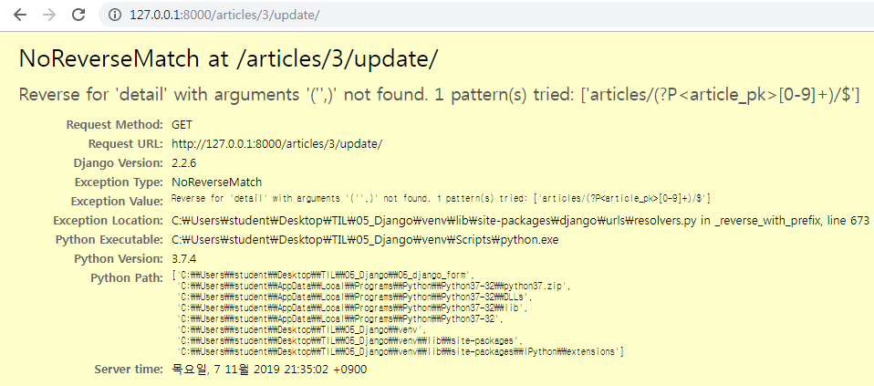
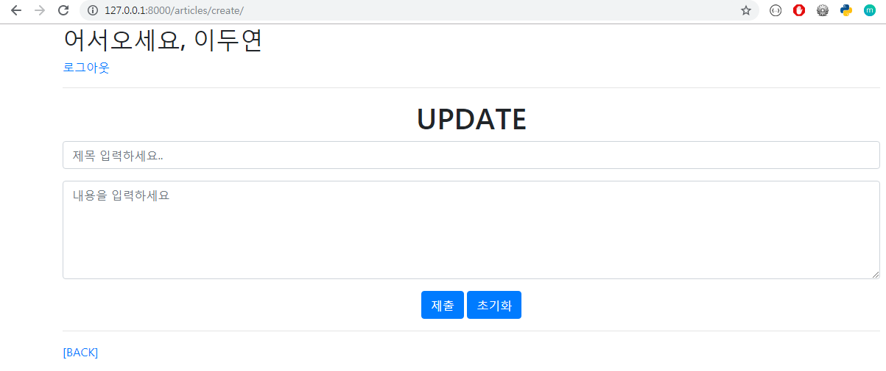
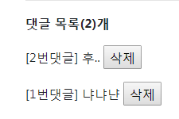

# 19.11.07 Django Form 마무리

## 1. URL Resolver

- 현재 문제점 
  - CREATE 로직과 UPDATE 로직이 같은 form.html을 공유하고 있는데, 둘 다 `<h1>CREATE</h1>` 라는 헤더가 출력되고 있다.

<br>

- URL Resolver는 사용자가 요청한 URL과 장고 내부로 들어오는 URL 사이에서 번역 역할을 해준다

  ```python
  # form.html
  
  
  
  
  
    <h1 class="text-center">CREATE</h1>
  
    <h1 class="text-center">UPDATE</h1>
  
  <form action="" method="POST">
    
  <!-- 각각의 input 태그를 p태그로 감싸라-->  
    {{ form.as_p }} 
    <input type="submit" value="등록☆">
  </form>
  <hr>
  
    <a href="">[BACK]</a>
  
    <a href="">[BACK]</a>
  
  
  
  ```

  <br>

  - 수정상태에서 `뒤로가기`를 누르면 `detail`  페이지로 돌아가야하고 `article` 객체가 필요한데 현재 `update` 함수에서 form 띄울 때 보내주는 `article`객체가 없는 상태

    > 

    <br>

  - 따라서 `update` 뷰 함수에서 context에 `article` 객체 포함해서 보내도록 수정

    ```python
    def update(request, article_pk):
      article= get_object_or_404(Article, pk=article_pk)
      if request.method == 'POST':
    	...
      else:
        form = ArticleForm(instance=article)
        context = {
          'form':form, 
          'article':article 
        }
        #return render(request, 'articles/create.html', context)
        return render(request, 'articles/form.html', context)
    ```

<br>

<br>

- `dir(A)` : 파이썬의 내장함수

  -  `dir()` 내장 함수는 어떤 객체를 인자로 넣어주면 해당 객체가 어떤 변수와 메소드(method)를 가지고 있는지 나열해준다

  - `request.resolver_match.url_name`로 해당 request의 요청이 구분 가능하다

    ```bash
    In [1]: request
    Out[1]: <WSGIRequest: POST '/articles/create/'>
    
    In [2]: dir(request)
    Out[2]:
    ['COOKIES',
     'FILES',
     'GET',
     'META',
     'POST',
     ...
     'resolver_match',
     ...]
    
    In [3]: request.resolver_match
    Out[3]: ResolverMatch(func=articles.views.create, args=(), kwargs={}, url_name=create, app_names=['articles'], namespaces=['articles'], route=articles/create/)
    
    In [4]: request.resolver_match.url_name
    Out[4]: 'create'
    ```

<br>

<br>

<br>

## 2. Django Bootstrap

### 2.1 Bootstrap 설치

- Django Bootstrap4 공식문서 

  > Django Bootstrap4 공식문서 :  https://django-bootstrap4.readthedocs.io/en/latest/ 

  <br>

- 설치

  ```bash
  $ pip install django-bootstrap4
  ```

<br>

<br>

### 2.2 Bootstrap 적용

- QuickStart 참조

  > Django Bootstrap4 QuickStart : https://django-bootstrap4.readthedocs.io/en/latest/ 

  <br>

- `` : 템플릿 상단에 위치

  ```django
  <!-- form.html -->
  
  
  ...
  <form action="" method="POST">
    
    
  
    <div class="text-center">
      
      
    </div>
  </form>
  ```

  <br>

- 실행화면

  > 

<br>

<br>

<br>

## 3. View Decorators

> Django가 제공하는 decorator 활용하기

<br>

### 3.1 require_POST

- view 함수가 POST메서드 요청만 승인하도록 하는 데코레이터

  - 요청이 POST 요청인지 앞으로 확인안해도 된다 

- 일치하지 않는 요청이면 `405 Method Not Allowed` 에러 발생시킴

- `@require_POST`

  - POST 메서드 요청만 들어오는 view 함수에만 적용해야한다

- `views.py`

  - http 관련한 decorators를 import 한다

  ```python
  # 수정 전 views.py
  
  def delete(request, article_pk):
    article = get_object_or_404(Article, pk=article_pk)
    if request.method == 'POST':
      article.delete()
      return redirect('articles:index')
    else:
      return redirect('articles:detail', article.pk)
  ```

  <br>

  ```python
  # 수정 후 views.py
  
  from django.views.decorators.http import require_POST
  
  @require_POST
  def delete(request, article_pk):
    article = get_object_or_404(Article, pk=article_pk)
    article.delete()
    return redirect('articles:index')
  
  ----------------------# COMMENT 함수 추가#------------------------
  
  @require_POST
  def comments_create(request, article_pk):
    article = get_object_or_404(Article, pk=article_pk)
    comment_form = CommentForm(request.POST)
    if comment_form.is_valid():
      comment = comment_form.save(commit=False)
      comment.article = article
      comment.save()
      return redirect('articles:detail', article.pk)
  
  
  @require_POST
  def comments_delete(request, article_pk, comment_pk):
    comment = get_object_or_404(Comment, pk=comment_pk)
    comment.delete()
    return redirect('articles:detail', article_pk)
  ```

  

<br>

<br>

<br>

## 4. Comment - ModelForm

### 4.1 Comment Model 생성

- `Model.py`

  ```python
  class Comment(models.Model):
    article = models.ForeignKey(Article, on_delete=models.CASCADE)
    content = models.CharField(max_length=200)
    created_at = models.DateTimeField(auto_now_add=True)
    updated_at = models.DateTimeField(auto_now=True)
  
    # Model Level에서 메타데이터 옵션 설정 -> 정렬 가능
    class Meta:
      ordering = ['-pk',]
  
    def __str__(self):
      return f'[{self.pk}] {self.content}'
  ```

<br>

<br>

### 4.2 Comment ModelForm 생성

- `forms.py`

  ```python
  class CommentForm(forms.ModelForm):
      
    class Meta:
      model = Comment
      # article 까지 넣어주면 사용자가 선택해서 바꿀수도 있음. 로직의 논리에 맞지 않는다!
      fields = ('content',)
  ```

<br>

<br>

### 4.3 admin.py 등록

- `admin.py`

  ```python
  from .models import Article, Comment
  
  class commentAdmin(admin.ModelAdmin):
    list_display = ('pk','article','content','created_at','updated_at')
  
  admin.site.register(Comment, commentAdmin)
  ```

<br>

<br>

### 4.5 상세보기에 댓글 기능 추가

- `detail` 템플릿에 댓글달기 기능을 추가한다

  ```python
  # views.py
  
  from .models import Article, Comment
  from .forms import ArticleForm, CommentForm
  
  def detail(request, article_pk):
    article = get_object_or_404(Article, pk=article_pk)
    comment_form = CommentForm()
    comments = article.comment_set.all()
    context = {
      'article':article,
      'comment_form':comment_form,
      'comments':comments,
    }
    return render(request, 'articles/detail.html', context)
  ```

   <br>

  ```django
  <form action="" method="POST">
    
    {{ comment_form }}
    <input type="submit" value="댓글작성">
  </form>
  ```

<br>

<br>

### 4.4 Comment Create

- Comment 생성

  ```django
  <!-- detail.html -->
  
  <form action="" method="POST">
    
    {{ comment_form }}
    <input type="submit" value="댓글작성">
  </form>
  ```

  <br>

- Comment 객체는 `article` 정보가 필요하다. 

- 현재 `comments_create` 로 넘어온 `form` 에는 `article`  정보가 없는 상태이다. 따라서 바로 DB에 저장하기 전에 `article_pk`로  `article` 의 정보를 구해 `comment` 객체를 만든 뒤 DB에 저장해야 한다.

  - save(commit=True) : default 값. DB에 바로 저장한다
  - save(commit=False) : DB에 바로 저장되는 것을 막아줌. 객체 하나만 만든 상태

  ```python
  # views.py
  
  @require_POST
  def comments_create(request, article_pk):
    article = get_object_or_404(Article, pk=article_pk)
    comment_form = CommentForm(request.POST)
    if comment_form.is_valid():
      # save() 메서드 -> 선택 인자 : (기본값) commit=True
      # comment의 article정보를 넣어줘야 하는데 정보가 없다면 일단 막아줘야한다
      # commit=False 하면 DB에 바로 저장되는 것을 막아준다. 객체 하나만 만들어진 상태
      comment = comment_form.save(commit=False)
      comment.article = article
      comment.save()
      return redirect('articles:detail', article.pk)
  ```

<br>

<br>

### 4.5 Comment 목록 출력 & DELETE

- 댓글 목록 출력

  - `pk` 값을 사용하면 댓글을 삭제했을 경우 번호의 순서가 빠진채로 출력된다

    > 

    <br>

  - `forloop.counter` : for문 순서대로 순서 출력

  - `forloop.counter` : 역순 출력

    ```html
    <!-- detail.html -->
    
    ...
    <p><b>댓글 목록({{ comments|length }})개</b></p>
    
    <!-- forloop.counter : for문 순서, forloop.revcounter : 역순 -->
      <p style="display:inline">[{{ forloop.revcounter }}번댓글] {{ comment.content }}
      <form style="display:inline" action="" method="POST">
        
        <input type="submit" value="삭제" onClick="return confirm('정말 삭제하겠습니까?')">
      </form>  
      </p>
    
    ...
    ```

    <br>

    > 

<br>

<br>

- DELETE

  ```python
  # views.py
  
  @require_POST
  def comments_delete(request, article_pk, comment_pk):
    comment = get_object_or_404(Comment, pk=comment_pk)
    comment.delete()
    return redirect('articles:detail', article_pk)
  ```

  