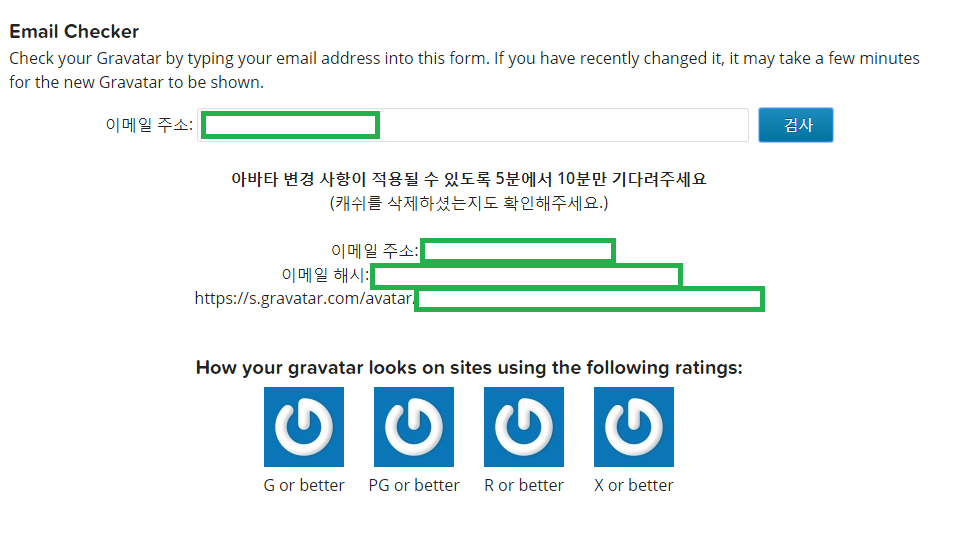
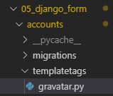
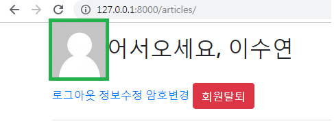

# 1. Gravatar - 프로필 이미지 만들기

- 이메일을 활용해서 프로필 사진을 만들어주는 서비스

- 한번 등록하면, 이를 지원하는 사이트에서는 모두 해당 프로필 이미지를 사용할 수 있다

- 이메일 체크

  >  https://ko.gravatar.com/site/check 

  > 

<br>

<br>

- 이메일 주소를 해시(MD5)로 바꾸고 URL으로 접속하면 이미지가 뜬다(`?s=80` 으로 사이즈 조절 가능)

- Python으로 Hash  만들기

  - md5 hash 생성
    - `import hashlib`

  - 혹시 모를 공백, 대문자 등을 방지하기 위한 파이썬 문법들
    - `.strip(), lower()`

<br>

<br>

### 1.1 Python Shell 에서 Test

1. 실행창에 python 치고 IDLE(python shell) 실행

2. ```python
   import hashlib
   ```

3. ```python
   hashlib.md5('[email]').hexdigest()
   
   ### error : encode해줘야 함
   Traceback (most recent call last):
     File "<pyshell#1>", line 1, in <module>
       hashlib.md5('[email]').hexdigest()
   TypeError: Unicode-objects must be encoded before hashing
   ```

4. encode 적용

   ```python
   hashlib.md5('[email]'.encode('utf-8')).hexdigest()
   ```

5. 공백제거 & 대소문자

   ```python
   hashlib.md5('[email]'.encode('utf-8').lower().strip()).hexdigest()
   ```

6. img_url

   ```python
   img_url = hashlib.md5('[email]'.encode('utf-8').lower().strip()).hexdigest()
   ```

7. 실제 url

   ```python
   url = f'https://s.gravatar.com/avatar/{img_url}?s=80'
   ```

<br>

<br>

### 1.2 Index 함수에서 gravatar 이미지 보여주기

```python
# articles/views.py

import hashlib

def index(request):
  #embed()
  if request.user.is_authenticated:
    gravatar_url = hashlib.md5(request.user.email.encode('utf-8').lower().strip()).hexdigest()
  else:
    gravatar_url = None

  articles = Article.objects.all()
  context = {
    'articles':articles,
    'gravatar_url':gravatar_url,
  }
  return render(request, 'articles/index.html',context)
```

<br>

```django
<!-- 로그인했을 경우 -->
  
    <h2>어서오세요, {{ user.username }}</h2>
```


# 2. Custom Template Tags & filters

<br>

-----------------------------------------------------------------------------------------------------------------------------------------------------------

#### gravatar 이미지가 필요할 때마다 일일이 context에 담아서 넘기기는 귀찮다!

### *=> filter에 함수를 등록하고 Custom Template Tags로 사용*

-----------------------------------------------------------------------------------------------------------------------------------------------------------

<br>

## 2.1 filter 등록

1. accounts 앱 안에 `templatetags` 폴더 생성

2. `gravatar.py` 생성

   > 

<br>

3. `gravatar.py`

   - `makemd5` 라는 함수를 필터로 등록한다

   ```python
   import hashlib
   from django import template
   
   # 기존 템플릿 라이브러리에 새로운 템플릿 추가
   register = template.Library()
   
   # 아래 함수를 필터로 등록
   @register.filter
   def makemd5(email):
     return hashlib.md5(email.encode('utf-8').lower().strip()).hexdigest()
   ```

<br>

4. `views.py` 수정

   ```python
   def index(request):
     articles = Article.objects.all()
     context = {
       'articles':articles,
     }
     return render(request, 'articles/index.html',context)
   ```

<br>

5. `base.html` 수정

   - d=mp : 기본 이미지

   ```django
   <!-- 로그인했을 경우 -->
   
   <h2>어서오세요, {{ user.username }}</h2>
   ```

<br>

> 

