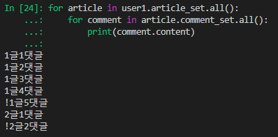
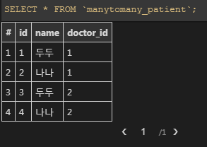
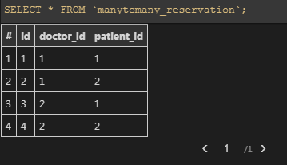
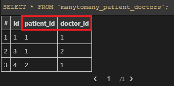
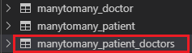

# Model Relationships

- 현재 User와 Article의 관계는 `User : Article = 1 : N` 이다
  - [참조] `article.user` : article입장에서 user 1은 보장
  - [역참조] `user.article_set` : user입장에서 article은 없을수도 있다
- 관점을 조금 바꿔서 `User : Article `


- 쿼리 실습

  - 실습데이터

    ```python
    user1 = User.objects.create(name='Kim')
    user2 = User.objects.create(name='Lee')
    article1 = Article.objects.create(title='1글', user=user1)
    article2 = Article.objects.create(title='2글', user=user1)
    article3 = Article.objects.create(title='3글', user=user2)
    c1 = Comment.objects.create(content='1글1댓글', user=user1, article=article1)
    c2 = Comment.objects.create(content='1글2댓글', user=user2, article=article1)
    c3 = Comment.objects.create(content='1글3댓글', user=user1, article=article1)
    c4 = Comment.objects.create(content='1글4댓글', user=user2, article=article1)
    c5 = Comment.objects.create(content='2글1댓글', user=user1, article=article2)
    c6 = Comment.objects.create(content='!1글5댓글', user=user2, article=article1)
    c7 = Comment.objects.create(content='!2글2댓글', user=user2, article=article2)
    ```

    

  1. 1번 사람이 작성한 게시글을 다 가져오기

     ```python
     user1.article_set.all()
     ```

     <br>

  2. 1번 사람이 작성한 모든 게시글에 달린 댓글 가져오기

     ```python
     for article in user1.article_set.all():
         for comment in article.comment_set.all():
             print(comment.content)
     ```

     <br>

     > 

     <br>

  3. 2번 댓글을 작성한 사람

     ```python
     c2.user
     ```

     <br>

  4. 2번 댓글을 작성한 사람의 모든 게시글은?

     ```python
     c2.user.article_set.all()
     ```

     <br>

  5. 두번째부터 네번째 댓글 가져오기

     ```python
     article1.comment_set.all()[1:4]
     Out[42]: <QuerySet [<Comment: 1글2댓글>, <Comment: 1글3댓글>, <Comment: 1글4댓글>]>
     
     In [43]: article1.comment_set.all()[1:4].query
     Out[43]: <django.db.models.sql.query.Query at 0x5003630>
     
     In [44]: print(article1.comment_set.all()[1:4].query)
     SELECT "manytoone_comment"."id", "manytoone_comment"."content", "manytoone_comment"."article_id", "manytoone_comment"."user_id" FROM "manytoone_comment" WHERE "manytoone_comment"."article_id" = 1  LIMIT 3 OFFSET 1
     ```

     <br>

  6. 1번글의 두번째 댓글을 작성한 사람의 첫번째 게시물의 작성자의 이름은?

     ```python
     article1.comment_set.all()[1].user.article_set.first().user.name
     ```

     <br>

  7. 1번 댓글의 user 정보만 가져오면

     ```python
     In [49]: Comment.objects.values('user').get(pk=1)
     Out[49]: {'user': 1}
     ```

     <br>

  8. 2번 사람이 작성한 댓글은 pk 내림차순으로 가져오면?

     ```python
     In [54]: user2.comment_set.order_by('-pk')
     Out[54]: <QuerySet [<Comment: !2글2댓글>, <Comment: !1글5댓글>, <Comment: 1글4댓글>, <Comment: 1글2댓글>]>
     ```

     <br>

  9. 제목이 '1글'이라는 게시글을 전부 가져오면?

     - get : 아예 없거나 2개 이상이면 에러 - 유일한 값을 구분할 때 사용
     - filter : 없거나 여러개 있을 때 사용

     ```python
     In [55]: Article.objects.get(title='1글')
     Out[55]: <Article: 1글>
             
     In [56]: Article.objects.filter(title='1글')
     Out[56]: <QuerySet [<Article: 1글>]>
     ```

     

<br>

<br>

<br>

# Many to Many

## 0. 기존 모델 (1:N 의 한계)

> 한명의 의사는 여러명의 환자를 가질 수 있고, 한명의 환자 역시 여러명의 의사를 가질 수 있다. 
>
> 따라서 의사와 환자 간에는 M : N 관계가 성립한다.

<br>

<br>

## 1. manytomany APP 생성

- `INSTALLED_APPS` 추가하기!

- Doctor, Patient 모델 생성

  ```python
  # models.py
  
  from django.db import models
  
  # Create your models here.
  class Doctor(models.Model):
    name = models.TextField()
  
    def __str__(self):
        return f'{self.pk}번 의사 {self.name}'
  
  
  class Patient(models.Model):
    name = models.TextField()
    doctor = models.ForeignKey(Doctor, on_delete=models.CASCADE)
    
    def __str__(self):
        return f'{self.pk}번 환자 {self.name}'
  ```

<br>

<br>

- 환자는 여러 의사에게 진료를 받을 수도 있다. 

  하지만 현재는 다른 의사에게 진료를 받을 경우 `patient` 테이블에 새로운 환자로 추가되어 Doctor와 Patient 관계를 파악하기 어렵다.

  또한 의사가 담당하는 환자의 내역을 구하기 위해 `patient_set` 형태로 가져오는 방법은 불편하다

  <br>

  ```python
  In [1]: doctor1 = Doctor.objects.create(name='수연')
  In [2]: doctor2 = Doctor.objects.create(name='선아')
  In [3]: patient1 = Patient.objects.create(name='두두', doctor=doctor1)
  In [4]: patient2 = Patient.objects.create(name='나나', doctor=doctor1)
  In [6]: dir(doctor1)
  Out[6]: 
  [ ...
   'patient_set',
    ...]
  
  In [7]: doctor1.patient_set.all()
  Out[7]: <QuerySet [<Patient: 1번 환자 두두>, <Patient: 2번 환자 나나>]>
    
  # 환자가 다른 의사한테 진료받을 경우 추가
  In [8]: patient1 = Patient.objects.create(name='두두', doctor=doctor2)
  In [9]: patient2 = Patient.objects.create(name='나나', doctor=doctor2)
      
  In [14]: patient1.doctor
  Out[14]: <Doctor: 2번 의사 선아>
  ```

  <br>

- **Patient** 테이블

  > 


<br>

<br>

<br>

## 2. 중개 모델 생성

- 1:N으로만 구현하려니 예약 정보 시스템을 표현하기 어렵다

  - 예를 들어, Patient가 다른 Doctor에게 진료를 받고자 할 때, 기존 기록을 지우지 않으려면 **새로운 Patient 인스턴스를 생성**해야 한다

  <br>

- **중개모델(class Reservation)**을 만들어서 Doctor와 Patient를 이어주는 예약 정보를 담아보자

  - Doctor와 Patient를 Reservation으로만 중개!
    - Patient class의 외래키를 삭제해주자!
  - sqlite3와 migrations 파일들 삭제해주기

  <br>

  ```python
  # models.py
  
  class Patient(models.Model):
    name = models.TextField()
    
    def __str__(self):
        return f'{self.pk}번 환자 {self.name}'
    
  
  # 중개모델
  class Reservation(models.Model):
    doctor = models.ForeignKey(Doctor, on_delete=models.CASCADE)
    patient = models.ForeignKey(Patient, on_delete=models.CASCADE)
  
    def __str__(self):
        return f'{self.doctor.id}번 의사의 {self.patient.id}번 환자'
  ```

  <br>

  ```python
  In [1]: doctor1 = Doctor.objects.create(name='수연')
  In [2]: doctor2 = Doctor.objects.create(name='선아')
  In [4]: patient1 = Patient.objects.create(name='두두')
  In [5]: patient2 = Patient.objects.create(name='나나')
  
  In [7]: reservation1 = Reservation.objects.create(doctor=doctor1, patient=patient1)
  In [8]: reservation2 = Reservation.objects.create(doctor=doctor1, patient=patient2)
  In [9]: reservation3 = Reservation.objects.create(doctor=doctor2, patient=patient1)
  In [10]: reservation4 = Reservation.objects.create(doctor=doctor2, patient=patient2)
      
  --------------------------------------------------------------------------------------
  
  In [16]: doctor1.reservation_set.all()
  Out[16]: <QuerySet [<Reservation: 1번 의사의 1번 환자>, <Reservation: 1번 의사의 2번 환자>]>
  
  In [17]: patient1.reservation_set.all()
  Out[17]: <QuerySet [<Reservation: 1번 의사의 1번 환자>, <Reservation: 2번 의사의 1번 환자>]>
  ```

  <br>

- **Reservation**

  > 


<br>

<br>

<br>

## 3. through 옵션

- patient 입장에서 중개 모델을 거쳐서 `reservation_set` 형태로 예약정보를 가져오는 것은 너무 불편하다

  - 마찬가지로 Doctor도 `reservation_set `형태로 예약 정보를 먼저 불러온 뒤에 Patient 정보를 빼내 올 수 있다

  <br>

- through 옵션을 통해 Doctor 정보를 중개 모델을 거치지 않고, 다이렉트로 가져와보자

  ```python
  # models.py
  
  class Patient(models.Model):
    name = models.TextField()
    doctors = models.ManyToManyField(Doctor, through='Reservation')
    
    def __str__(self):
        return f'{self.pk}번 환자 {self.name}'
    
  
  # 중개모델
  class Reservation(models.Model):
    doctor = models.ForeignKey(Doctor, on_delete=models.CASCADE)
    patient = models.ForeignKey(Patient, on_delete=models.CASCADE)
  
    def __str__(self):
        return f'{self.doctor.id}번 의사의 {self.patient.id}번 환자'
  ```

  <br>

  - patient는 **through** 옵션을 통해 Doctor 정보를 중개모델을 거치지 않고 바로 가져올 수 있다
  - 하지만 doctor는 옵션적용이 되어있지 않으므로 `patient_set` 형태로 patient정보에 접근가능하다

  ```python
  In [1]: doctor1 = Doctor.objects.create(name='수연')
  In [2]: doctor2 = Doctor.objects.create(name='선아')
  In [4]: patient1 = Patient.objects.create(name='두두')
  In [5]: patient2 = Patient.objects.create(name='나나')
  
  In [7]: reservation1 = Reservation.objects.create(doctor=doctor1, patient=patient1)
  In [8]: reservation2 = Reservation.objects.create(doctor=doctor1, patient=patient2)
  In [9]: reservation3 = Reservation.objects.create(doctor=doctor2, patient=patient1)
  In [10]: reservation4 = Reservation.objects.create(doctor=doctor2, patient=patient2)
      
  --------------------------------------------------------------------------------------
  
  In [12]: patient1.doctors.all()
  Out[12]: <QuerySet [<Doctor: 1번 의사 수연>, <Doctor: 2번 의사 선아>]>
  
  In [13]: patient2.doctors.all()
  Out[13]: <QuerySet [<Doctor: 1번 의사 수연>, <Doctor: 2번 의사 선아>]>
      
  In [15]: doctor1.patients.all()
  	...에러 뿜뿜	
  AttributeError: 'Doctor' object has no attribute 'patients'    
  
  In [16]: doctor1.patient_set.all()
  Out[16]: <QuerySet [<Patient: 1번 환자 두두>, <Patient: 2번 환자 나나>]>
  ```

<br>

<br>

<br>

## 4. related_name

- 이제 Patient입장에서는 `patient.doctors.all()`과 같은 형태로 쉽게 Doctor 정보를 가져올 수 있다
- 마찬가지로 Doctor 입장에서도 `doctor.patients.all()`과 같은 형태로 Patient 정보를 가져올 수 있게끔, `related_name` 옵션을 사용해보자 (**역참조**가 가능하도록 수정!)

<br>

- ### **related_name**

  - through 옵션이 필요없으므로 `class Reservation` 삭제!

  ```python
  # models.py
  
  class Patient(models.Model):
    name = models.TextField()
    doctors = models.ManyToManyField(Doctor, related_name='patients')
    
    def __str__(self):
        return f'{self.pk}번 환자 {self.name}'
  ```

  <br>

  - 서로 참조와 역참조가 가능하며, Django가 만들어준 중개테이블에 `list` 처럼 `add`와 `remove` 로 예약을 추가, 삭제하듯이 동작한다

  ```python
  In [1]: doctor1 = Doctor.objects.create(name='수연')
  In [2]: doctor2 = Doctor.objects.create(name='선아')
  In [4]: patient1 = Patient.objects.create(name='두두')
  In [5]: patient2 = Patient.objects.create(name='나나')
  
  In [7]: reservation1 = Reservation.objects.create(doctor=doctor1, patient=patient1)
  In [8]: reservation2 = Reservation.objects.create(doctor=doctor1, patient=patient2)
  In [9]: reservation3 = Reservation.objects.create(doctor=doctor2, patient=patient1)
  In [10]: reservation4 = Reservation.objects.create(doctor=doctor2, patient=patient2)
     
  --------------------------------------------------------------------------------------
  
  In [7]: doctor1.patients.add(patient1)
  In [8]: doctor1.patients.add(patient2)
  In [9]: patient1.doctors.add(doctor1)
  In [10]: patient1.doctors.add(doctor2)
  In [11]: doctor1.patiens.remove(patient2)
  ```

  <br>

  > 

  <br>

  <br>

- ### ManyToManyField

  - 중개모델 안만들어도 `ManyToManyField` 를 사용하면 Django가 알아서 중개 테이블을 만들어준다

  ```python
  db.sqlite3
  manytomany_doctor
  manytomany_patient
  manytomany_patient_doctors
  	- id
      - doctor_id
      - patient_id
  
  ```

  <br>

  > 


<br>

<br>

<br>

## 5. Many To Many 

- 단순히 Doctor와 Patient를 이어줄 생각이라면, 굳이 **중개 모델**이 필요없다.

  `ManyToManyField` 만 사용하면 장고가 자동으로 **중개 테이블**을 만들어준다.

  <br>

- #### 하지만, 시간 예약, 특이 사항 등 부가적인 정보가 필요하거나 상황에 따라 중개 모델이 필요한 경우가 있고, 상황에 따라 어떻게 사용할지 결정하면 된다.

