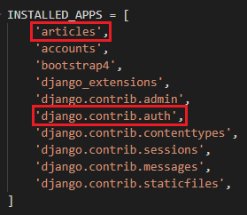
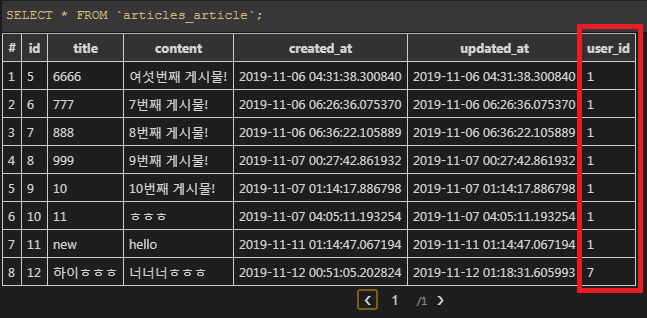
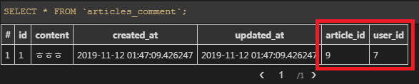
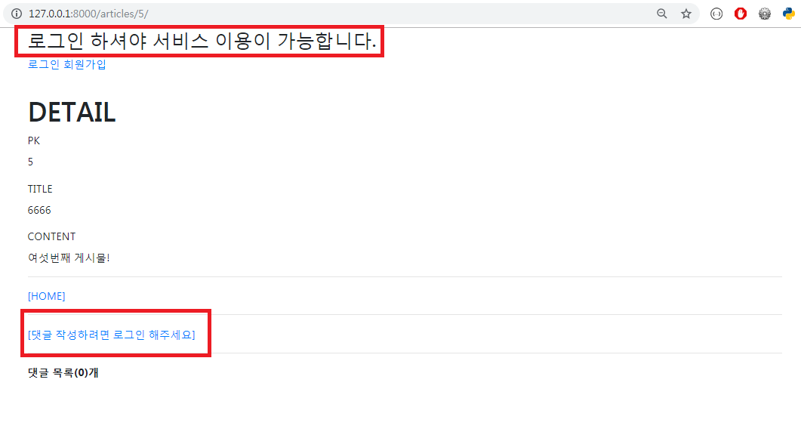
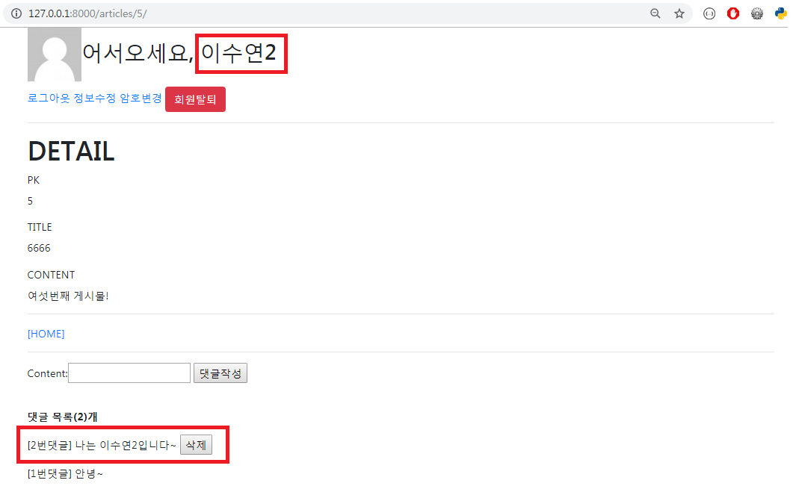

# User - Article & Comment

- User 클래스를 가져오는 법

  - `settings.AUTH_USER_MODEL`

    - return str

    - `models.py` 에서 모델 정의할 때만 사용

      ```python
      from django.conf import settings
      settings.AUTH_USER_MODEL
      ```

      <br>

  - `get_user_model()`

    - return class

    - `models.py` 제외한 모든 곳

      ```python
      from django.contrib.auth import get_user_model
      get_user_model()
      ```

  <br>

### Django의 실행순서

```markdown
Django가 처음 프로젝트를 실행시키면 settings.py의 INSTALLED_APPS 에 있는 클래스를 다 가져오고 APP하나하나의 models.py에 있는 모델들을 import 시킨다. 따라서 view 함수 등에서 클래스를 사용하려면 import 된 후에 사용 가능하다. 예를 들어 아래 사진과 같이 User Class를 더 위에 있는 articles APP에서 get_user_model()로 가져오려고 하면 아직 User Class가 import 되기 전이기 때문에 에러가 뜬다. 만약 APP의 등록 순서와 상관없이 클래스를 참조하고 싶으면 settings.AUTH_USER_MODEL을 사용하자!
```

<br>

> 

<br>

<br>

## 1. User - Article

### 1.1 Article 모델 클래스 수정

```python
# articles/models.py

from django.conf import settings

# Article 모델에 추가
user = models.ForeignKey(settings.AUTH_USER_MODEL, on_delete=models.CASCADE)
```

- makemigrations
- migrate

> 

<br>

<br>

### 1.2 Create 로직 수정

- form 받아서 바로 저장하지 말고 user 넣어주기

  ```python
  # articles/views.py
  
  @login_required
  def create(request):
    # POST 요청 => 데이터를 받아서 DB에 저장
    if request.method == 'POST':
      form = ArticleForm(request.POST)
      if form.is_valid():
        article = form.save(commit=False)
        article.user = request.user
        article.save()
      return redirect('articles:detail', article.pk)
    else:
      form = ArticleForm()
  ```

  

<br>

<br>

### 1.3 Update 로직 수정

- 현재 로그인한 사용자와 게시물 작성자가 같으면 'POST' 검사하고 저장, 다르면 index 페이지로 redirect 시키자!

  ```python
  # articles/views.py
  
  @login_required
  def update(request, article_pk):
    article= get_object_or_404(Article, pk=article_pk)
    if request.user == article.user:
      if request.method == 'POST':
        form = ArticleForm(request.POST, instance=article)
        if form.is_valid():
          article = form.save()
          return redirect('articles:detail', article.pk)
      else:
        form = ArticleForm(instance=article)
    else:
      return redirect('articles:index')
  
    context = {
      'form':form, 
      'article':article 
    }
    return render(request, 'articles/form.html', context)
  ```

  <br>

- 상세보기에서도 로그인한 사용자와 게시물 작성자가 다르면 수정과 삭제 버튼을 가리자!

  ```django
  <!-- articles/detail.html -->
  
  <a href="">[HOME]</a>
  
    <a href="">[EDIT]</a>
    <a href="">[DELETE]</a>
  
  ```

  

<br>

<br>

### 1.4 Delete 로직 수정

- 사용자가 로그인 되어있는 상태이고, 로그인한 사용자와 게시물 작성자가 같으면 삭제 가능!

  다르면 상세보기 페이지로 redirect 시켜주자!

  ```python
  # articles/views.py
  
  @require_POST
  def delete(request, article_pk):
    if request.user.is_authenticated:
      article = get_object_or_404(Article, pk=article_pk)
      if request.user == article.user:
        article.delete()
      else:
        return redirect('articles:detail', article.pk)
    return redirect('articles:index')
  ```

  

<br>

<br>

<br>

## 2. User - Comment

### 2.1 Comment 모델 클래스 수정

```python
# articles/models.py

from django.conf import settings

# Comment 모델에 추가
user = models.ForeignKey(settings.AUTH_USER_MODEL, on_delete=models.CASCADE)
```

- makemigrations
- migrate


<br>

<br>

### 2.2 Comment Create 로직 수정

- DB에 저장하기 전에 `comment.article` 에 article 인스턴스를 넣어준다

  ```python
  # articles/views.py
  
  @require_POST
  def comments_create(request, article_pk):
    if request.user.is_authenticated:
      article = get_object_or_404(Article, pk=article_pk)
      comment_form = CommentForm(request.POST)
      if comment_form.is_valid():
        comment = comment_form.save(commit=False)
        comment.user = request.user
        comment.article = article
        comment.save()
    return redirect('articles:detail', article.pk)
  ```

  <br>

- DB에 외래키 값을 저장하는 방법은 두 가지가 있다

  1. 인스턴스를 저장
  2. **Django가 만든 DB형식에 맞추어 넣어주기**

  <br>

  - Django가 만들어준 DB형식에 맞추어 저장하면 article 객체를 구할 필요가 없다 

  ​	=> `get_object_or_404`삭제

  - redirect 할 때도 `comments_create` 인자를 바로 넘겨주면 된다

  ```python
  # articles/views.py
  
  @require_POST
  def comments_create(request, article_pk):
    if request.user.is_authenticated:
      comment_form = CommentForm(request.POST)
      if comment_form.is_valid():
        comment = comment_form.save(commit=False)
        comment.user = request.user
        # django가 만든 db형식에 맞추어 넣어주기
        comment.article_id = article_pk
        comment.save()
    return redirect('articles:detail', article_pk)
  ```

  <br>

  > 

<br>

<br>

### 2.3 Comment Delete 로직 수정

- 로그인한 사용자와 댓글 작성자가 같은 경우에만 삭제

  ```python
  # articles/views.py
  
  @require_POST
  def comments_delete(request, article_pk, comment_pk):
    # 1. 로그인 여부 확인
    if request.user.is_authenticated:
      comment = get_object_or_404(Comment, pk=comment_pk)
      # 2. 로그인한 사용자와 댓글 작성자가 같은 경우
      if request.user == comment.user:
        comment.delete()
    return redirect('articles:detail', article_pk)
  ```

  

<br>

<br>

### 2.4 로그인한 사용자만 댓글들 볼 수 있도록 템플릿 수정

- 로그인 안 한 사용자는 댓글 form을 볼 수 없고, url을 통해 login 페이지로 갈 수 있다!

  ```django
  <!-- articles/detail.html -->
  
  
    <form action="" method="POST">
      
      {{ comment_form }}
      <input type="submit" value="댓글작성">
    </form>
  
    <a href="">[댓글 작성하려면 로그인 해주세요]</a>
  
  ```

  <br>

  > 

<br>

<br>

### 2.5 댓글 작성자만 댓글 삭제 버튼 보이도록 템플릿 수정

- 댓글 작성자만 댓글 삭제 버튼이 보이도록 템플릿을 수정해준다

- `` 로 검사

  ```html
  <!-- articles/views.py -->
  
  <p><b>댓글 목록({{ comments|length }})개</b></p>
  
    <p style="display:inline">[{{ forloop.revcounter }}번댓글] {{ comment.content }}
    
      <form style="display:inline" action="" method="POST">
        
        <input type="submit" value="삭제" onClick="return confirm('정말 삭제하겠습니까?')">
      </form>  
    
    </p>
  
  ```

  <br>

  > 