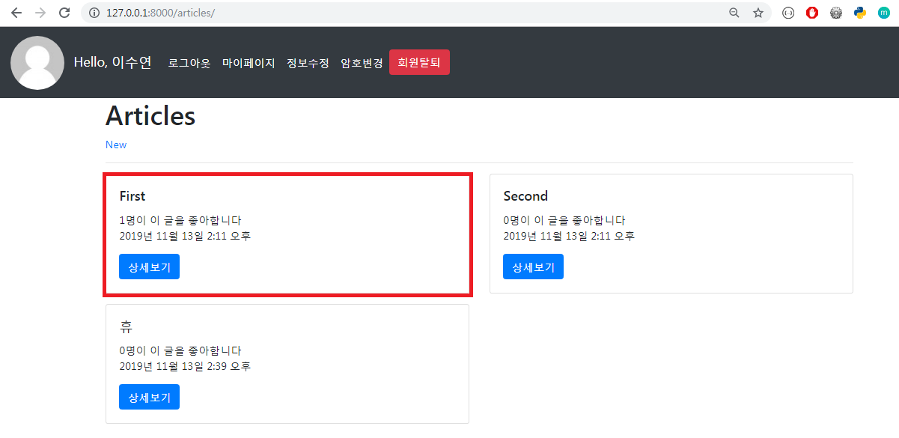
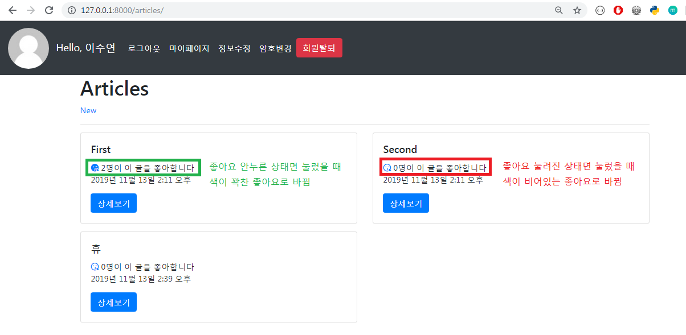
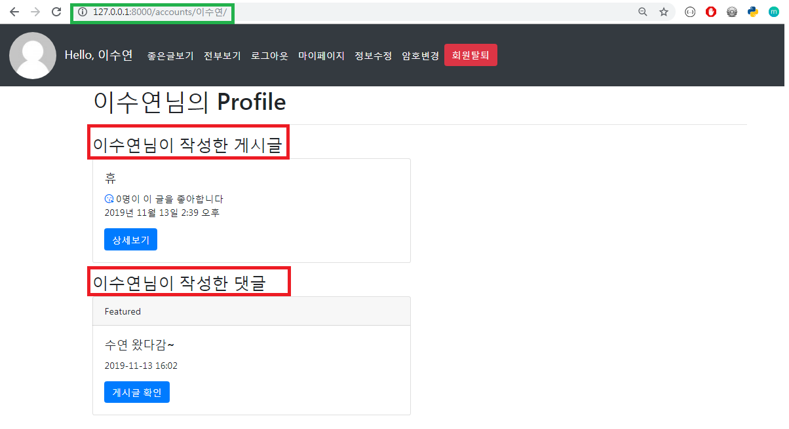
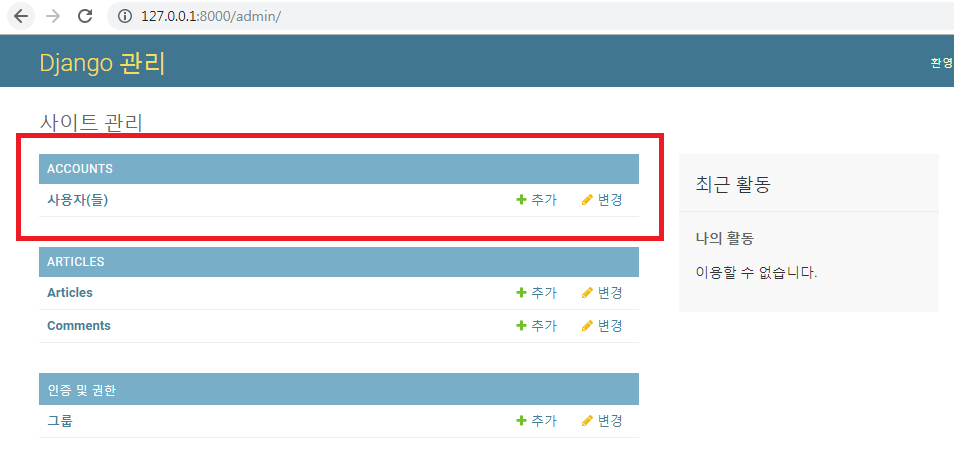
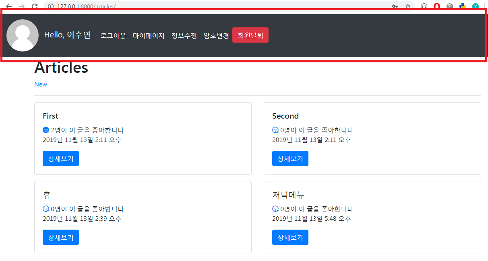
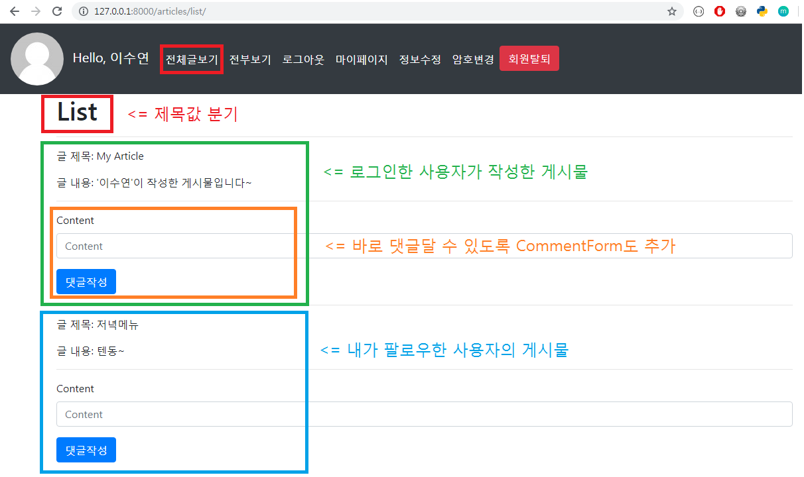

 # Like / Profile / Follow

## 1. Like

> User는 여러 개의 Article에 좋아요 표시를 할 수 있고, 
>
> Article은 여러 명의 User에게 좋아요를 받을 수 있다.

<br>

### 1.1 Model 설정

- `blank=True`

  - 최초 작성되는 글에는 좋아요가 없고, 글이 작성되더라도 좋아요를 받지 못할 수도 있다
  - 이 옵션을 줘서 유효성 검사를 통과한다
  - 실제 데이터베이스는 null이 들어가는게아니라 빈 스트링`('')` 형태로 들어간다

  ```python
  # articles/models.py
  
  from django.conf import settings
  
  class Article(models.Model):
      ...
    like_users = models.ManyToManyField(settings.AUTH_USER_MODEL, related_name='like_articles', blank=True)
  ```

<br>

- 현재 상황에서 `related_name`  설정은 필수

  - `like_users` 필드에 related_name을 쓰지 않으면, User 입장에서 article_set을 사용할 경우 user필드를 갖고올지 like_users 필드를 갖고올지 인식하지 못한다
  - related_name 설정과 함께 해당 필드는 article_set과 같은 방식으로 호출하지 못하고, like_users 방식으로 호출해야한다.

  <br>

- **사용할 수 있는 ORM 기능(명령어)**

  - `user.article_set.all()` : 유저가 작성한 게시글 전부 - 1 : N
  - `user.like_articles.all()` : 유저가 좋아요 누른 게시물 전부 - M : N
  - `article.user` : 게시글 작성한 유저 - 1 : N
  - `article.like_users` : 게시글 좋아요 누른 유저 전부 - M : N

<br>

<br>

### 1.2 View & URL

- `exists()` & `filter()`

  - `filter()` : 특정한 조건에 맞는 레코드들을 가져온다
  - `exists()` : 최소한 하나의 레코드가 존재하는지 여부를 말해준다

  <br>

- `get()` vs `filter()` => 데이터가 없는 경우 에러 여부

  - `get()` : 데이터가 없거나 2개 이상이면 에러

  ```python
  # articles/views.py
  
  @login_required
  def like(request, article_pk):  
    # 좋아요 누를 게시글 가져오기
    article = get_object_or_404(Article, pk=article_pk)
    # 현재 접속하고 있는 유저
    user = request.user
    # 현재 게시글을 좋아요 누를 사람 목록에 현재 접속한
    # 유저가 있을 경우 => 좋아요 취소
    if article.like_users.filter(pk=user.pk).exists():
      article.like_users.remove(user)
    # 목록에 없을 경우 => 좋아요 누르기
    else:
      article.like_users.add(user)
    return redirect('articles:index')
  ```

  

<br>

<br>

### 1.3 Template

#### 1.3.1 Template 분리 (_`article.html`)

- 모듈화한 템플릿을 제목 앞에 언더스코어`(_)` 붙여주는 것이 코딩 컨벤션!

  ```python
  articles/
  	templates/
      	articles/
          	_article.html
              index.html
              ...
  ```

<br>

- Bootstrap Card 컴포넌트를 사용해서 예쁘게 꾸며보자

  - Bootstrap  공식 홈페이지 -> Documentation -> Cards
  - Cards는 grid가 적용되어 있는데 기본적으로 `container > row` 순으로 클래스 안에 있어야한다!

  ```django
  <!-- articles/index.html -->
  
  ...
  <!-- base.html 에 container 클래스 안에잇음 -->
  <div class="row">
    
      <!-- 모듈화 시켜둔 article 템플릿 가져오기 -->
      
    <hr>
    
  </div>
  ...
  ```

  <br>

  ```django
  <!-- articles/_article.html -->
  
  <div class="col-12 col-md-6 mb-3">
    <div class="card">
      <div class="card-body">
        <h5 class="card-title">{{ article.title }}</h5>
        <p class="card-text">
          {{ article.like_users.all|length }}명이 이 글을 좋아합니다 <br>
          {{ article.created_at }}
        </p>
        <a href="" class="btn btn-primary">상세보기</a>
      </div>
    </div>
  </div>
  ```

  <br>

  > 

<br>

<br>

#### 1.3.2 Font Awesome

> Font Awesome 홈페이지 가입 후 Kits로 돌아가서 코드 복사

- 좋아요 버튼 추가!

  ```django
  <!-- articles/_article.html -->
  
  <div class="col-12 col-md-6 mb-3">
    <div class="card">
      <div class="card-body">
        <h5 class="card-title">{{ article.title }}</h5>
        <p class="card-text">
          <a href="">
            <!-- 사용자가 좋아요 안누른 상태 -> 빈 하트 -->
            
            <i class="fas fa-kiss-wink-heart"></i>
            <!-- python list in -->
            <!-- 누른 상태 -> 꽉찬 하트 -->
            
            <i class="far fa-kiss-wink-heart"></i>
            
          </a>
          {{ article.like_users.all|length }}명이 이 글을 좋아합니다 <br>
          {{ article.created_at }}
        </p>
        <a href="" class="btn btn-primary">상세보기</a>
      </div>
    </div>
  </div>
  ```

  <br>

  ```django
  <!-- base.html -->
  
  ...
    <!-- Bootstrap -->
    
    <!-- FontAwesome -->
    <script src="https://kit.fontawesome.com/7c49c03442.js" crossorigin="anonymous"></script>
  ...
  ```

  

  <br>

  > 

  

<br>

<br>

<br>

## 2. Profile 페이지

> 각 유저마다 프로필 페이지를 만들어주자

- User에 대해서 CRUD 로직을 구현한다고 생각하면, READ(Detail)에 속한다

<br>

### 2.1 View & URL

- User에 대한 CRUD 로직 대부분을 accounts 앱에서 구현했으므로, Profile 페이지 역시 accounts 앱에 구현해보자

  ```python
  # accounts/views.py
  
  from django.shortcuts import render, redirect, get_object_or_404
  from django.contrib.auth import get_user_model
  
  def profile(request, username):
    person = get_object_or_404(get_user_model(), username=username)
    context = {'person':person}
    return render(request, 'accounts/profile.html', context)
  ```

<br>

- 이름으로 접근

  ```python
  # accounts/urls.py
  
  urlpatterns = [
      ...
      path('<str:username>/', views.profile, name='profile'),
  ] 
  ```

<br>

<br>

### 2.2 Template

- profile

  ```django
  <!-- accounts/profile.html -->
  
  
  
  
  <h1>{{ person.username }}님의 Profile</h1>
  <hr>
  <h3>{{ person.username }}님이 작성한 게시글</h3>
  <div class="row">
    
      <div class="col-12 col-md-6 mb-3">
        <div class="card">
          <div class="card-body">
            <h5 class="card-title">{{ article.title }}</h5>
            <p class="card-text">
            <a href="">
              <!-- 사용자가 좋아요 안누른 상태 -> 빈 하트 -->
              
                <i class="fas fa-kiss-wink-heart"></i>
              <!-- python list in -->
              <!-- 누른 상태 -> 꽉찬 하트 -->
              
                <i class="far fa-kiss-wink-heart"></i>
              
            </a>
              {{ article.like_users.all|length }}명이 이 글을 좋아합니다 <br>
              {{ article.created_at }}
            </p>
            <a href="" class="btn btn-primary">상세보기</a>
          </div>
        </div>  
      </div>
    
  </div>
  <h3>{{ person.username }}님이 작성한 댓글</h3>
  <div class="row">
    
      <div class="col-12 col-md-6">
        <div class="card">
          <div class="card-header">
            Featured
          </div>
          <div class="card-body">
            <h5 class="card-title">
              {{ comment.content }}
            </h5>
            <p class="card-text">
              {{ comment.created_at|date:"SHORT_DATETIME_FORMAT" }}
            </p>
            <a href="" class="btn btn-primary">게시글 확인</a>
          </div>
        </div>
      </div>
    
  </div>
  
  ```

  <br>

  > 


<br>

## 3. Follow

> 상세보기 화면에서 글 작성자의 정보(이름, 팔로워수, 팔로잉수)를 보여주고 follow, unfollow가 가능한 버튼을 만들어보자

<br>

- Follow는 User와 User의 M:N 관계다
- 장고가 제공하고 있는 User 모델을 대체해서 사용한다. 처음부터 User 모델을 만드는게 아니라, 장고가 개발자들이 자신만의 User 모델을 만들 수 있도록 제공해준다
  - `AbstractUser`

<br>

<br>

### 3.1 User 모델 대체하기

- `AbstractUser`모델을 상속받아서 `ManyToManyField` 로 User간 관계를 설정해준다

  ```python
  # accounts/models.py
  
  from django.db import models
  from django.conf import settings
  from django.contrib.auth.models import AbstractUser
  
  # Create your models here.
  class User(AbstractUser):
    followers = models.ManyToManyField(settings.AUTH_USER_MODEL, related_name='followings')
  ```

  <br>

- 기존 User로 등록된 데이터들이 존재하므로 DB관련 데이터들을 모두 지우고 모델을 새로 `migrate`해준다

  - `db.sqlite3` 삭제
  - `accounts` > `migrations` 안에 있는 숫자붙은 migration파일들 모두 삭제
  - makemigrations
  - migrate

  <br>

- 새롭게 정의한 User 모델을 바라보도록 settings.py 수정

  - 기본값 : `auth.User`

  ```python
  # settings.py
  
  # 맨 아래에 추가
  AUTH_USER_MODEL = 'accounts.User'
  ```

<br>

<br>

### 3.2 Admin

- Admin 페이지에서 users목록을 보여주기 위해 `admin.py` 에서 모델을 등록해준다

- django에서 `UserAdmin class`를 제공하기 때문에 그대로 import해서 사용하면 된다

  ```python
  # accounts/admin
  
  from django.contrib import admin
  # 장고가 미리 admin class 만들어놓음
  from django.contrib.auth.admin import UserAdmin
  from .models import User
  
  # Register your models here.
  admin.site.register(User, UserAdmin)
  ```

  <br>

  > 

<br>

<br>

### 3.3 View & URL

- **get_obejct_or_404** 

  - 첫번째 인자 :  어떤 클래스에서 객체를 가져올지
  - 두번째 인자 : 클래스의 몇 번째 객체인지( `pk`) , pk는 각 객체를 구분해주는 역할을 한다

  <br>

- 게시글 작성자의 팔로워 명단에 접속중인 **유저가 있는 경우** - Unfollow

  게시글 작성자의 팔로워 명단에 접속중인 **유저가 없는 경우** - Follow

  ```python
  # articles/views.py
  
  from django.contrib.auth import get_user_model
  from django.shortcuts import render, redirect, get_object_or_404
  
  @login_required
  def follow(request, article_pk, user_pk):
    # 게시글 작성한 유저
    person = get_object_or_404(get_user_model(), pk=user_pk)
    # 지금 접속하고 있는 유저
    user = request.user
  
    if person != user:
      # 게시글 작성 유저 팔로워 명단에 접속 중인 유저가 있을 경우
      # -> Unfollow
      if user in person.followers.all():
        person.followers.remove(user)
  
      # 명단에 없으면
      # -> Follow
      else:
        person.followers.add(user)
  
    # 게시글 상세정보로 redirect
    return redirect('articles:detail', article_pk)
  ```

  <br>

- `게시물번호/follow/게시물작성자` 형식으로 접근

  ```python
  # articles/urls.py
  
  urlpatterns = [
  	..
      path('<int:article_pk>/follow/<int:user_pk>', views.follow, name='follow'),
  ]
  ```

  

<br>

<br>

### 3.4 Template 분리

> 상세보기 화면에서 상단에 게시물 작성자의 정보를 표시하는 템플릿을 `_follow.html`으로 분리할 것이다

<br>

- bootstrap의 **jumbotron** 사용

  ```django
  <!-- articles/detail.html -->
  
  
  
  
  
  
  <h1>DETAIL</h1>
  ...
  ```

  <br>

  ```django
  <!-- articles/_follow.html -->
  
  <div class="jumbotron">
    <h1 class="display-4">{{ person.username }}</h1>
    <p class="lead">
      팔로워: {{ person.followers.all|length }}명 | 팔로잉: {{ person.followings.all|length }}명
    </p>
    <h1>팔로워 다 나와라</h1>
    
      {{ follower.username }}
    
      팔로워가 없어요..
    
    <hr class="my-4">
    
      <a class="btn btn-primary btn-lg" href="" role="button">
        
          UnFollow
        
          Follow
        
      </a>
    
  </div>
  ```

<br>

<br>

<br>

## 4. Navbar

> 현재 base 템플릿에 로그아웃, 마이페이지, 암호변경, 회원탈퇴 등 모든 기능들이 다 나와있어서 지저분해보인다. bootstrap의 Navbar을 이용해서 템플릿상단을 깔끔하게 만들어보자!

<br>

- bootstrap **Navbar** 사용

  ```django
  <!-- articles/_nav.html -->
  
  
  <nav class="navbar navbar-expand-lg navbar-dark bg-dark">
    <a class="navbar-brand" href="">
      
      Hello, {{ user.username }}
    </a>
    <button class="navbar-toggler" type="button" data-toggle="collapse" data-target="#navbarNav" aria-controls="navbarNav" aria-expanded="false" aria-label="Toggle navigation">
      <span class="navbar-toggler-icon"></span>
    </button>
    <div class="collapse navbar-collapse" id="navbarNav">
      <ul class="navbar-nav">
        
          <li class="nav-item active">
            <a class="nav-link" href="">로그아웃</a>
          </li>
          <li class="nav-item active">
            <a class="nav-link" href="">마이페이지</a>
          </li>
          <li class="nav-item active">
            <a class="nav-link" href="">정보수정</a>
          </li>
          <li class="nav-item active">
            <a class="nav-link" href="">암호변경</a>
          </li>
          <form action="" method="POST" style="display: inline;">
            
            <input type="submit" value="회원탈퇴" class="btn btn-danger">
          </form>
        <!-- 비회원일 경우 -->
        
          <li class="nav-item active">
            <a class="nav-link" href="">로그인</a>
          </li>
          <li class="nav-item active">
            <a class="nav-link" href="">회원가입</span></a>
          </li>
        
      </ul>
    </div>
  </nav>
  ```

  <br>

  ```django
  <!-- base.html -->
  
  ...
  <body> 
    
    <div class="container">
      
      
    </div>
  
    
  </body>
  ...
  ```

  <br>

  > 

<br>

<br>

<br>

## 5. 좋은글보기

> 내가 팔로우하는 사람의 article + 내가 작성한 article 목록 보여주기

<br>

### 5.1 View & URL

#### 5.1.1 View

- `chain` 

  -  `itertools` 모듈의 함수이며 iterable한 객체들을 인수로 받아 하나의 iterator로 반환함

  - `request.user`를 iterable한 객체로 변환시켜주기 위해 list형태로 바꿔주기

    안바꾸면 `'User' object is not iterable` 에러남

    ```python
    followings = chain(followings, [request.user])
    ```

  <br>

- `__in` 

  -  인자로 받은 리스트 안에 존재하는 자료 검색
  - **[찾고자하는 자료명]__in = [데이터를 찾을 리스트]** 

  <br>

- 보여줄 게시물에 바로 댓글을 달 수 있도록 `CommentForm` 도 context에 담아준다

  <br>

  ```python
  # articles/views.py
  
  from itertools import chain
  
  # 내가 팔로우 하는 사람의 글 + 내가 작성한 글
  def list(request):
    # 내가 팔로우하고 있는 사람들
    followings = request.user.followings.all()
    # 내가 팔로우하고 있는 사람들 + 나 => 합치기
    followings = chain(followings, [request.user])
    # 위 명단 사람들 게시글 가져오기
    # __in : 주어진 리스트 안에 존재하는 자료 검색
    articles = Article.objects.filter(user__in=followings).order_by('-pk').all()
    
    comment_form = CommentForm()
  
    context = {
      'articles':articles,
      'comment_form':comment_form,
    }
    return render(request, 'articles/article_list.html', context)
  ```

<br>

<br>

#### 5.1.2 URL

- url 열어주기

  ```python
  # articles/urls.py
  
  urlpatterns = [
  	...
      path('list/', views.list, name='list'),
  ]
  ```

<br>

<br>

### 5.2 Template

- 모든 사용자의 게시물을 보여줄 `explore` 와 같은 형식의 템플릿을 사용할 것이기 때문에 **URL Resolver** 를 사용해서 제목값만 분기해준다

  ``` django
  <!-- articles/article_list.html -->
  
  
  
  
  
    <!-- URL Resolver를 사용해서 제목값 분기 -->
    
      <h1>List</h1>
    
      <h1>Explore</h1>
    
    <hr>
    
      <p>글 제목: {{ article.title }}</p>
      <p>글 내용: {{ article.content }}</p>
      <hr>
      <form action="" method="POST">
        
        
        
      </form>
      <hr>
    
  
  ```

  <br>

  ```django
  <!-- articles/_nav.html -->
  
  ...
  <li class="nav-item active">
      <a class="nav-link" href="">좋은글보기</a>
  </li>
  <li class="nav-item active">
      <a class="nav-link" href="">전부보기</a>
  </li>
  ...
  ```

  

<br>

<br>

### 5.3 실행화면

- 현재 글 제목이 'My Article'인 게시물은 '이수연'이 작성한 게시물이고, 글 제목이 '저녁메뉴'인 게시물은 '이수연'이 팔로우한 사용자의 게시물이다

  > 


<br>

<br>

<br>

## 6. 전체글보기

> 모든 게시물의 목록을 보여주자

