# Hashtag & SocialLogin

## 1. Hashtag

> Article과 Hashtag는 M:N 관계이다. 그리고 Hashtag는 고유한 값이어야 한다(`unique=True`)

<br>

<br>

### 1.1 Model

- Article 클래스에서 Hashtag 모델을 사용하기 때문에 Hashtag 클래스를 Article 클래스보다 위에다 작성

- `unique=True`

  - True인 경우, 필드는 테이블이 전체에서 고유한 값이어야 한다

  - 유효성 검사 단계에서 실행되며, 중복 값이 있는 모델을 저장하려고 하면 `.save()` 메서드로 인해서 에러가 발생한다

    ```python
    # articles/models.py
    
    # Create your models here.
    class Hashtag(models.Model):
      content = models.TextField(unique=True)
    
    class Article(models.Model):
      ...
      hashtags = models.ManyToManyField(Hashtag, blank=True)
    ```

  <br>

- 수정한 모델 `migration` 해주기!

  > 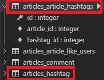

<br>

- Admin 도 수정해준다

  ```python
  # articles/admin.py
  
  from .models import Article, Comment, Hashtag
  
  # Register your models here.
  ...
  class hashtagAdmin(admin.ModelAdmin):
      list_display = ('content',)
  
  admin.site.register(Hashtag, hashtagAdmin)
  ```

<br>

<br>

### 1.2 CREATE

#### 1.2.1 로직 설계하기

```
1. 사용자가 업로드한 content
"오늘은 수능날!" #행복 #감성 #추억

2. .split()메소드로 리스트 형식으로 변환
['오늘은', '수능날!', '행복', '감성', '추억']

3. 리스트 반복문 돌리기 : 앞자리가 '#'으로 시작하는 단어를 해시태그 등록
- 같은 해시태그가 오면 unique=True 옵션으로 인해 에러 발생. 이를 방지하기 위해 get_or_create()사용

4. 동시에 해당 게시글 해시태그 목록에 추가해줌
-> article.hashtags.add(word)
```

<br>

<br>

#### 1.2.2 `get_or_create()`

- word와 같은 해쉬태그를 찾고있으면 기존 객체 반환, 없으면 새로운 객체 생성

- `split()` : 띄어쓰기로 나눠줌

- `hashtag, created = Hashtag.objects.get_or_create(content=word)`
  
  - 새로운 객체 생성되면 created = True
  
  - 기존 객체 반환되면 created = False
  
    ```python
    # articles/views.py
    
    @login_required
    def create(request):
      # POST 요청 => 데이터를 받아서 DB에 저장
      if request.method == 'POST':
        form = ArticleForm(request.POST)
        if form.is_valid():
          article = form.save(commit=False)
          article.user = request.user
          article.save()
          # hashtag
          # 게시글 내용을 split해서 리스트로 만듦
          for word in article.content.split():
            # word가'#'으로 시작할 경우 해시태그 등록
            if word.startswith('#'):
              hashtag, created = Hashtag.objects.get_or_create(content=word)
              article.hashtags.add(hashtag)
        return redirect('articles:detail', article.pk)
      else:
        ...
    ```

<br>

<br>

#### 1.2.3 실행화면

- 해쉬태그를 중복해서 입력하면,  `get_or_create` 가 중복제거해서 DB에 저장한다

  > 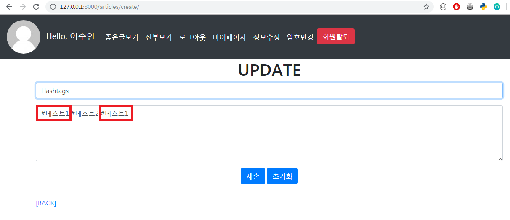

  <br>

  > 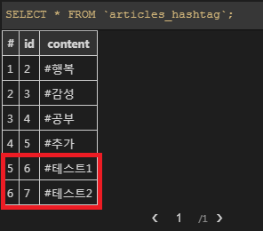

<br>

<br>

### 1.3 UPDATE

- `CREATE` 와 로직이 똑같다. 

- 하지만 이미 article에 등록된 hashtag가 있으므로 `clear()`로 hashtag를 초기화해주고 새롭게 등록을 해보자

  ```python
  # articles/views.py
  
  @login_required
  def update(request, article_pk):
    article= get_object_or_404(Article, pk=article_pk)
    if request.user == article.user:
      if request.method == 'POST':
        form = ArticleForm(request.POST, instance=article)
        if form.is_valid():
          article = form.save()
          # hashtag 초기화
          article.hashtags.clear()
          for word in article.content.split():
            # word가'#'으로 시작할 경우 해시태그 등록
            if word.startswith('#'):
              hashtag, created = Hashtag.objects.get_or_create(content=word)
              article.hashtags.add(hashtag)
  
          return redirect('articles:detail', article.pk)
      ...
  ```

<br>

<br>

### 1.4 Hashtag 게시글 모아보기

#### 1.4.1 View & URL

- View

  - Article과 Hashtag는 M:N 관계이지만 내가 변수명을 따로 커스터마이징을 하지 않았기 때문에 `hashtag.article_set` 으로 hashtag를 참조하는 article들을 query_set으로 받아온다

    ```python
    # articles/views.py
    
    # Hashtag 글 모아보기
    def hashtag(request, hash_pk):
      # 해시태그 가져오기
      hashtag = get_object_or_404(Hashtag, pk=hash_pk)
      # 해당 해시태그를 참조하는 게시글들 가져오기
      articles = hashtag.article_set.order_by('-pk')
      context = {
        'hashtag':hashtag,
        'articles':articles,
      }
    
      return render(request, 'articles/hashtag.html', context)
    ```

  

  <br>

  <br>

- URL

  - `hash_pk/hashtag` 로 접근

    ```python
    urlpatterns = [
    	...
        path('<int:hash_pk>/hashtag/', views.hashtag, name='hashtag'),
    ]
    ```

<bR>

<br>

#### 1.4.2 Template

- 해당 hashtag를 참조하는 게시물들 모아서 보여주기

  ```django
  <!-- accounts/hashtag.html -->
  
  
  
  <h1>{{ hashtag.content }} 게시글 모아보기</h1>
  <h4>{{ articles|length }}개의 글이 있습니다</h4>
  <hr>
  
    <p>글 제목 : {{ article.title }}</p>
    <p>글 내용 : {{ article.content }}</p>
    <!-- article과 comment는 1:N 관계 -->
    <p>{{ article.comment_set.all|length }}개의 댓글이 있습니다.</p>
    <!-- article과 like_users는 M:N 관계, user_set을 like_users로 커스터마이징해준것 -->
    <p>{{ article.like_users.all|length }}명이 이 글을 좋아합니다</p>
  
  
  ```

<br>

- 실행화면

  > 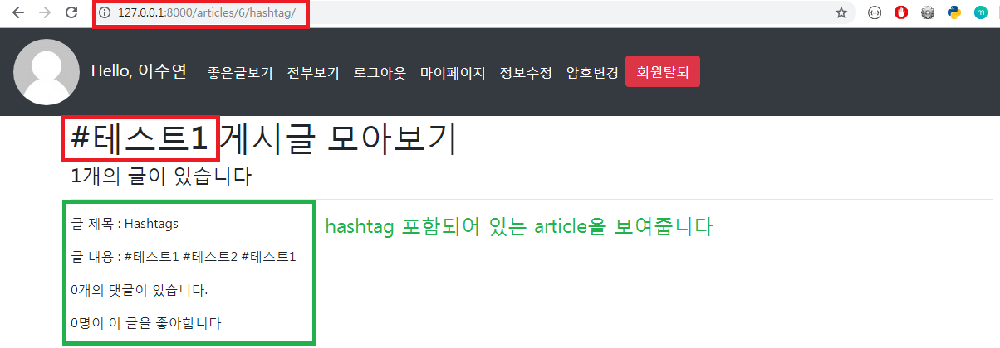

<br>

<br>

### 1.5 Hashtag에 link를 달기

> 상세보기에서 hashtag를 누르면 해당 hashtag를 참조하는 모든 게시물을 보여주는 `hashtag.html`로 이동하도록 template tag를 등록해주자

<br>

#### 1.5.1 Custom Template Tag

- APP > **templatetags** > make_link.py

- 앱 내에 templatetags 라는 폴더안에 만들어줄 것! 

- content

  ```python
  # articles/templatetags/make_link.py
  
  # 우리가 만든 template tag
  from django import template
  
  register = template.Library()
  
  @register.filter
  def hashtag_link(article):
    content = article.content + ' '
    hashtags = article.hashtags.all()
  
    for hashtag in hashtags:
      # replace(바꿀거, 넣어줄거)
      # 마지막에 공백 안넣어주면 hashtag로 인식을 못함
      content = content.replace(
        hashtag.content+' ',
        f'<a href="/articles/{hashtag.pk}/hashtag/">{hashtag.content}</a> '
      )
  
    return content
  ```

  <br>

  ```django
  <!-- articles/detail.html -->
  
  
  
  
  
  
  
  <h1>DETAIL</h1>
  <label for="pk">PK</label>
  <p>{{ article.pk }}</p>
  <label for="title">TITLE</label>
  <p>{{ article.title }}</p>
  <label for="content">CONTENT</label>
  <!-- <p>{{ article.content }}</p> -->
  <!-- tag 적용되도록 escape을 방지해주는 django template tag -->
  <!-- https://docs.djangoproject.com/en/2.2/ref/templates/builtins/ -->
  <p>{{ article|hashtag_link|safe }}</p>
  <hr>
  <a href="">[HOME]</a>
  
    <form action="" method="GET">
      <input type="submit" value="[EDIT]">
    </form>
    <form action="" method="POST">
      
      <input type="submit" value="[DELETE]">
    </form>
  
  
  <hr>
  
    <form action="" method="POST">
      
      {{ comment_form }}
      <input type="submit" value="댓글작성">
    </form>
  
    <a href="">[댓글 작성하려면 로그인 해주세요]</a>
  
  <hr>
  <p><b>댓글 목록({{ comments|length }})개</b></p>
  
  <!-- forloop.counter : for문 순서, forloop.revcounter : 역순 -->
    <p style="display:inline">[{{ forloop.revcounter }}번댓글] {{ comment.content }}
    
      <form style="display:inline" action="" method="POST">
        
        <input type="submit" value="삭제" onClick="return confirm('정말 삭제하겠습니까?')">
      </form>  
    
    </p>
  
  
  ```

<br>

<br>

<br>

## 2. Social Login

> 인증, 계정, 등록 등을 다루는 여러가지 방법이 존재하는데, 우리는 **`django-allauth` 라는 라이브러리를 사용해서 손쉽게 Social Login 을 구현해보자**
>
> 대부분의 소셜 로그인을 지원하고 회원가입 시킬 수 있다

**<br>**

### 2.1 사전준비

> 공식문서 :  https://django-allauth.readthedocs.io/en/latest/installation.html 

<br>

#### 2.1.1 설치

```bash
$ pip install django-allauth
```

<br>

<br>

#### 2.1.2 settings.py 수정

- **AUTHENTICATION_BACKENDS** 추가 & **INSTALLED_APPS** 수정 

  ```python
  # settings.py
  
  AUTHENTICATION_BACKENDS = [
      # Needed to login by username in Django admin, regardless of `allauth`
      'django.contrib.auth.backends.ModelBackend',
  ]
  
  
  INSTALLED_APPS = [
      ...
      'django.contrib.sites',
      'allauth',
      'allauth.account',
      'allauth.socialaccount',
      'allauth.socialaccount.providers.kakao',
      ...
  ]
  SITE_ID = 1
  ```

  <br>

  <br>

#### 2.1.3 urls.py

 - **config**/urls.py 수정

   ```python
   # config/urls.py
   
   urlpatterns = [
       path('articles/', include('articles.urls')),
       path('accounts/', include('accounts.urls')),
       path('accounts/', include('allauth.urls')),
       path('admin/', admin.site.urls),
   ] 
   ```

<br>

	- 수정된 부분이 많으니 migration 다시 해주자!

<br>

<br>

#### 2.1.4 설치 확인

- ` http://127.0.0.1:8000/accounts/` 로 접속하면 새로운 URL이 등록된것을 확인할 수 있다

- Login의 경우 현재는 우리가 만든 URL에 먼저 걸리고 있지만 앞으로 Social Login에서는 kakao Login 에 걸리게 할 것이다

  > 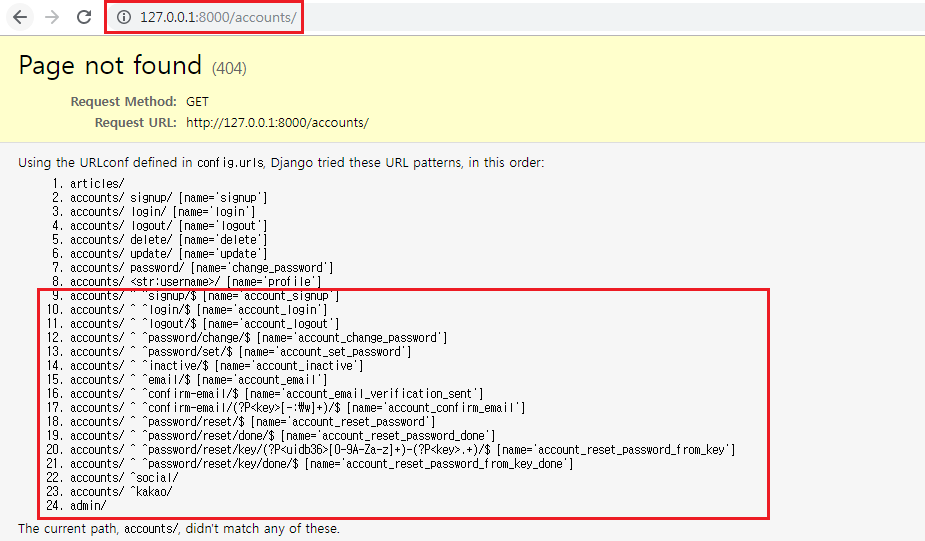

  <br>

  > 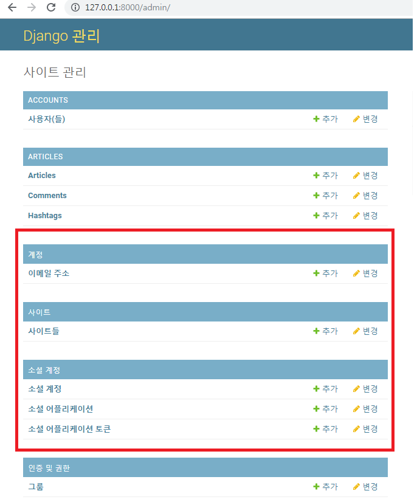

<br>

<br>

### 2.2 Kakao Developers `OAuth`  등록

#### 2.2.1 Kakao Developers에서 APP 추가 & 세팅

> Kakao Deveoloper :  https://developers.kakao.com/ 

<br>

- APP 추가
  - 내 애플리케이션 > 앱 만들기
    - 앱 이름 : django-blog 로 설정

<br>

- 사용자 관리 활성화

  - 설정 > 사용자 관리 > `ON`

    > 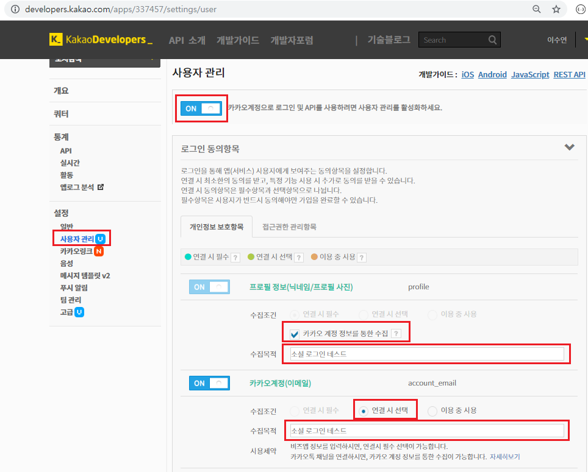

<br>

- 플랫폼추가

  - 설정 > 일반 > 플랫폼추가(웹, 사이트 도메인 2개)

    > 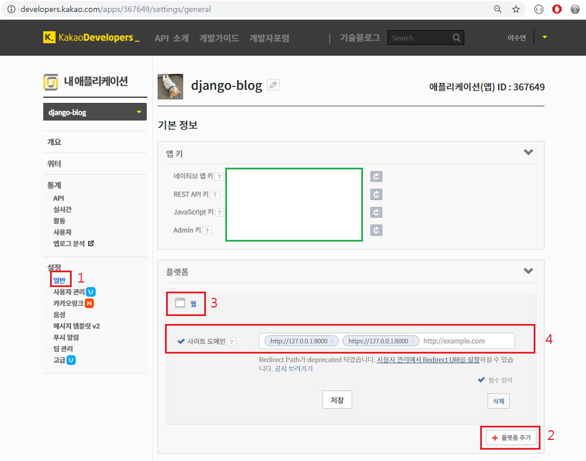

<br>

- 로그인 Redirect URI

  - 설정 > 사용자관리 > 로그인 Redirect URI

  - http://127.0.0.1:8000/accounts/kakao/login/callback/ 만 등록

    > 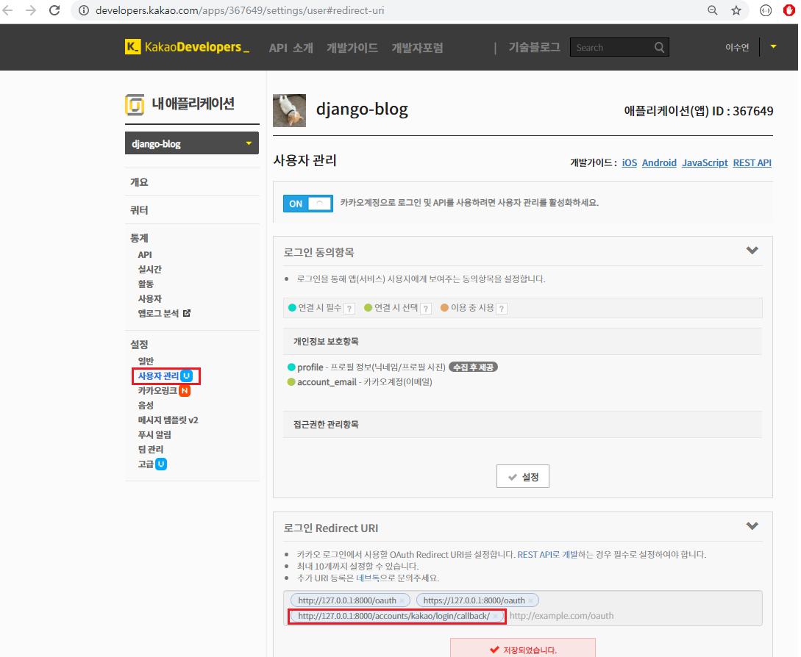

  

<br>

<br>

#### 2.2.2 Django 관리페이지에서 Social Login 추가

- admin으로 login > 소셜 어플리케이션 > **소셜 어플리케이션 추가**

  > 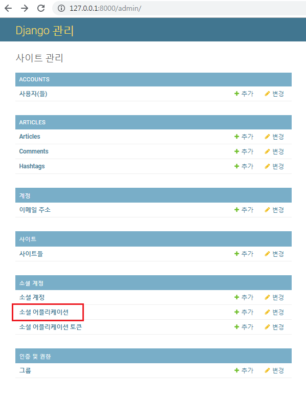

  <br>

- CLIENT SECRET 키 발급 > 상태 ON > 적용

  > 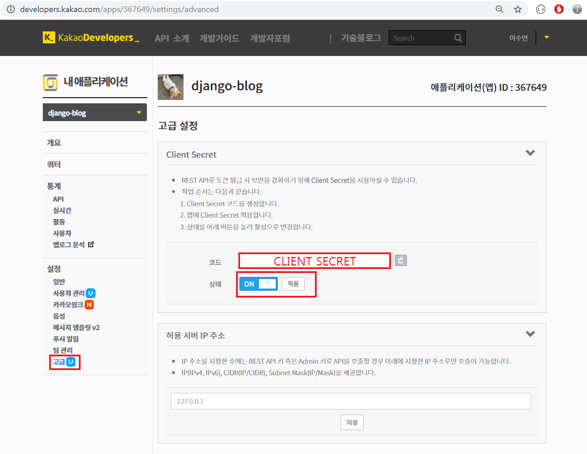

  <br>

- 어플리케이션 셋팅 후 저장

  > 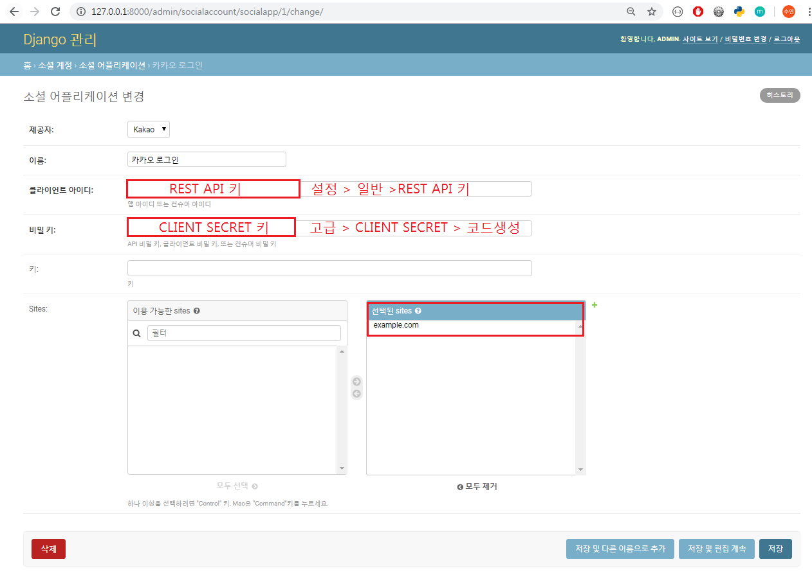

<br>

<br>

<br>

### 2.2.3 Django 프로젝트에 Kakao Login 적용

- 로그인 기능만 있는 login 템플릿 생성

  ```django
  <!-- accounts/login.html -->
  
  
  
  
  
  
  
  <form action="" method="POST">
    
  <!-- {{ form.as_p }} -->  
    
    
    
    <a href="" class="btn btn-warning">카카오 로그인</a>
  </form>
   
  ```

<br>

- 새로 만든 login 템플릿으로 리턴(`auth_form.html` => `login.html` )

  ```python
  # accounts/views.py
  
  
  def login(request):
    ...
    
    context = { 'form':form }
    return render(request, 'accounts/login.html', context)
  ```

<br>

- 로그인 후 Redirect 경로 설정

  - 로그인 후에 index 페이지로 보내기

  ```python
  # settings.py
  
  LOGIN_REDIRECT_URL = 'articles:index'
  ```


<br>

<br>

#### 2.2.4 Kakao Login 실행

- 로컬 로그인기능 말고 kakao를 통해 로그인 하고 싶으면 바로 `kakao login`을 누른다

  > 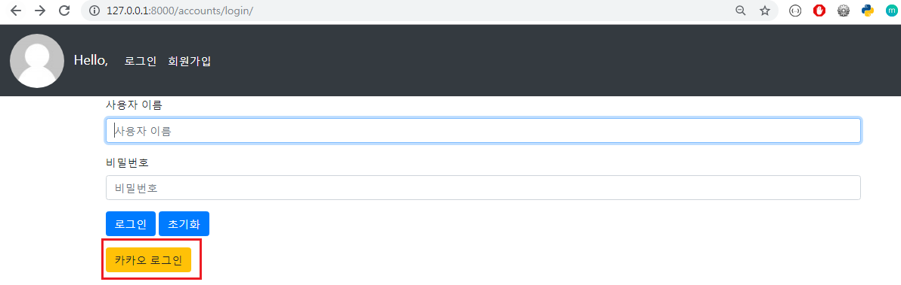

<br>

- 실제 카카오 계정으로 로그인

  > 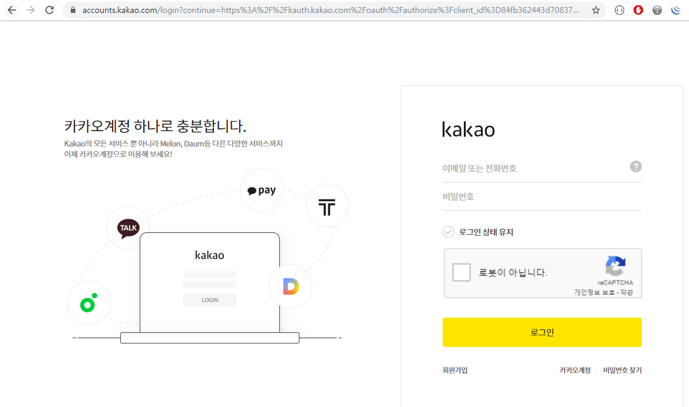

<br>

- Redirect 경로 설정한대로 로그인 후 index페이지로 이동

  > 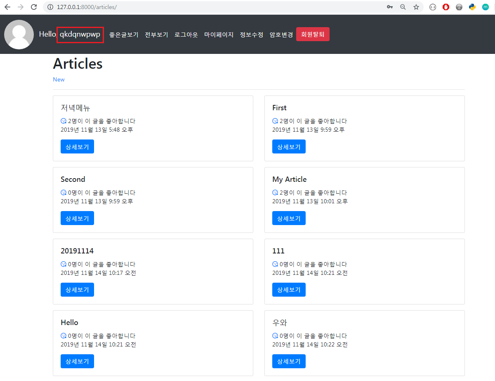