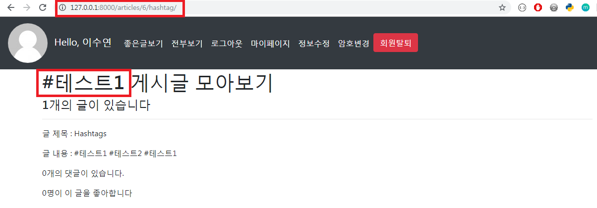

# Hashtag & SocialLogin

## 1. Hashtag

> Article과 Hashtag는 M:N 관계이다. 그리고 Hashtag는 고유한 값이어야 한다(`unique=True`)

<br>

<br>

### 1.1 Model

- Article 클래스에서 Hashtag 모델을 사용하기 때문에 Hashtag 클래스를 Article 클래스보다 위에다 작성

- `unique=True`

  - True인 경우, 필드는 테이블이 전체에서 고유한 값이어야 한다

  - 유효성 검사 단계에서 실행되며, 중복 값이 있는 모델을 저장하려고 하면 `.save()` 메서드로 인해서 에러가 발생한다

    ```python
    # articles/models.py
    
    # Create your models here.
    class Hashtag(models.Model):
      content = models.TextField(unique=True)
    
    class Article(models.Model):
      ...
      hashtags = models.ManyToManyField(Hashtag, blank=True)
    ```

  <br>

- 수정한 모델 `migration` 해주기!

  > 

<br>

- Admin 도 수정해준다

  ```python
  # articles/admin.py
  
  from .models import Article, Comment, Hashtag
  
  # Register your models here.
  ...
  class hashtagAdmin(admin.ModelAdmin):
      list_display = ('content',)
  
  admin.site.register(Hashtag, hashtagAdmin)
  ```

<br>

<br>

### 1.2 CREATE

#### 1.2.1 로직 설계하기

```
1. 사용자가 업로드한 content
"오늘은 수능날!" #행복 #감성 #추억

2. .split()메소드로 리스트 형식으로 변환
['오늘은', '수능날!', '행복', '감성', '추억']

3. 리스트 반복문 돌리기 : 앞자리가 '#'으로 시작하는 단어를 해시태그 등록
- 같은 해시태그가 오면 unique=True 옵션으로 인해 에러 발생. 이를 방지하기 위해 get_or_create()사용

4. 동시에 해당 게시글 해시태그 목록에 추가해줌
-> article.hashtags.add(word)
```

<br>

<br>

#### 1.2.2 `get_or_create()`

- word와 같은 해쉬태그를 찾고있으면 기존 객체 반환, 없으면 새로운 객체 생성

- `split()` : 띄어쓰기로 나눠줌

- `hashtag, created = Hashtag.objects.get_or_create(content=word)`
  
  - 새로운 객체 생성되면 created = True
  
  - 기존 객체 반환되면 created = False
  
    ```python
    # articles/views.py
    
    @login_required
    def create(request):
      # POST 요청 => 데이터를 받아서 DB에 저장
      if request.method == 'POST':
        form = ArticleForm(request.POST)
        if form.is_valid():
          article = form.save(commit=False)
          article.user = request.user
          article.save()
          # hashtag
          # 게시글 내용을 split해서 리스트로 만듦
          for word in article.content.split():
            # word가'#'으로 시작할 경우 해시태그 등록
            if word.startswith('#'):
              hashtag, created = Hashtag.objects.get_or_create(content=word)
              article.hashtags.add(hashtag)
        return redirect('articles:detail', article.pk)
      else:
        ...
    ```

<br>

<br>

#### 1.2.3 실행화면

- 해쉬태그를 중복해서 입력하면,  `get_or_create` 가 중복제거해서 DB에 저장한다

  > 

  <br>

  > 

<br>

<br>

### 1.3. UPDATE

- `CREATE` 와 로직이 똑같다. 

- 하지만 이미 article에 등록된 hashtag가 있으므로 `clear()`로 hashtag를 초기화해주고 새롭게 등록을 해보자

  ```python
  # articles/views.py
  
  @login_required
  def update(request, article_pk):
    article= get_object_or_404(Article, pk=article_pk)
    if request.user == article.user:
      if request.method == 'POST':
        form = ArticleForm(request.POST, instance=article)
        if form.is_valid():
          article = form.save()
          # hashtag 초기화
          article.hashtags.clear()
          for word in article.content.split():
            # word가'#'으로 시작할 경우 해시태그 등록
            if word.startswith('#'):
              hashtag, created = Hashtag.objects.get_or_create(content=word)
              article.hashtags.add(hashtag)
  
          return redirect('articles:detail', article.pk)
      ...
  ```

<br>

<br>

### 1.4. Hashtag 게시글 모아보기

#### 1.4.1 View & URL

- View

  - Article과 Hashtag는 M:N 관계이지만 내가 변수명을 따로 커스터마이징을 하지 않았기 때문에 `hashtag.article_set` 으로 hashtag를 참조하는 article들을 query_set으로 받아온다

    ```python
    # articles/views.py
    
    # Hashtag 글 모아보기
    def hashtag(request, hash_pk):
      # 해시태그 가져오기
      hashtag = get_object_or_404(Hashtag, pk=hash_pk)
      # 해당 해시태그를 참조하는 게시글들 가져오기
      articles = hashtag.article_set.order_by('-pk')
      context = {
        'hashtag':hashtag,
        'articles':articles,
      }
    
      return render(request, 'articles/hashtag.html', context)
    ```

  

  <br>

  <br>

- URL

  - `hash_pk/hashtag` 로 접근

    ```python
    urlpatterns = [
    	...
        path('<int:hash_pk>/hashtag/', views.hashtag, name='hashtag'),
    ]
    ```

<bR>

<br>

#### 1.4.2 Template

- 해당 hashtag를 참조하는 게시물들 모아서 보여주기

  ```django
  <!-- accounts/hashtag.html -->
  
  
  
  <h1>{{ hashtag.content }} 게시글 모아보기</h1>
  <h4>{{ articles|length }}개의 글이 있습니다</h4>
  <hr>
  
    <p>글 제목 : {{ article.title }}</p>
    <p>글 내용 : {{ article.content }}</p>
    <!-- article과 comment는 1:N 관계 -->
    <p>{{ article.comment_set.all|length }}개의 댓글이 있습니다.</p>
    <!-- article과 like_users는 M:N 관계, user_set을 like_users로 커스터마이징해준것 -->
    <p>{{ article.like_users.all|length }}명이 이 글을 좋아합니다</p>
  
  
  ```

<br>

- 실행화면

  > 

<br>

<br>


