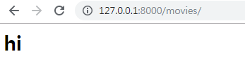

# 영화 평점 Project

## 1. 프로젝트 & APP 생성

- 프로젝트 생성

  ```bash
  $ mkdir connected_PJT2
  $ cd connected_PJT2
  $ django-admin startproject config .
  ```

  <br>

- application 생성

  ```bash
  $ python manage.py startapp movies
  ```

  <br>

- settings.py에 app 등록, 시간도 바꿔주기

  ```python
  # settings.py
  
  INSTALLED_APPS = [
      'movies',
  	...
  ]
  
  LANGUAGE_CODE = 'ko-KR'
  TIME_ZONE = 'Asia/Seoul'
  ```

  <br>

- 잘 만들어졌는지 index 페이지 만들어서 확인하기

  - view 

    ```python
    # movies/views.py
    
    from django.shortcuts import render
    
    def index(request):
        return render(request,'index.html')
    ```

    <br>

  - template

    ```django
    <!-- movies/templates/index.html -->
    
    <h1>hi</h1>
    ```

    <br>

  - url 열어주기

    ```python
    # config/urls.py
    
    # movies app에서 view함수들을 가져온다
    # 어떤 url로 들어오면 어떤 view함수로 맵핑해줄건지 정해줄거임
    from movies import views
    
    urlpatterns = [
        path('', views.index),
        path('admin/', admin.site.urls),
    ]
    ```

    <br>

  - 실행화면

    >  http://127.0.0.1:8000/  들어가서 hi 잘 뜨는지 확인

<br>

<br>

## 2. URL 분리

> 나중에 application을 더 만들 경우를 대비해서 미리 URL을 분리해놓겠다. 현재는 `config/urls.py` 에서 모든 URL은 관리해주는 상황이다. 하지만 앞으로는 각 APP마다 `urls.py` 를 만들어 URL들을 분리해 관리하겠다 

<br>

- movies앱에 urls.py 생성

  > 

  <br>

- URL이 `movies/` 로 들어오면 `movies` 앱의 urls.py로 보내주도록 `config/urls.py` 수정

  ```python
  # config/urls.py
  
  from django.urls import path, include
  
  urlpatterns = [
      path('movies/', include('movies.urls')),
      path('admin/', admin.site.urls),
  ]
  
  ```

  <br>

- `config/urls.py` 에서 `movies/urls.py` 로 왔을 때 URL과 `movies` 앱의 view함수 맵핑

  - `app_name` 

    - 앞으로는 뷰함수를 찾을 때 긴 URL을 다 써줄 필요가 없다. `app_name`과 `name` 만으로 원하는 앱의 view함수에 접근 가능하다

      <br>

      ```python
      # movies/urls.py
      
      from . import views
      
      app_name = 'movies'
      
      urlpatterns = [
          path('', views.index, name='index')
      ]
      ```

      <br>

    - `127.0.0.1:8000/movies/` 로 접근 시 movies앱의 index 템플릿이 뜨는것을 확인할 수 있다

      

<br>

<br>

<br>

## 3. 이름공간(NameSpace)

> Django는 기본적으로 템플릿 파일을 탐색할 때, settings.py의 `INSTALLED_APPS` 에 등록된 application 의 템플릿 폴더를 전부 모아놓고 순서대로 탐색한다. 따라서 application 간에 중복되는 이름의 템플릿이 존재하면 `INSTALLED_APPS` 상위에 있는 application의 템플릿이 렌더링된다. 따라서 템플릿 경로앞에 application의 이름공간을 추가해 템플릿을 구분할 수 있도록 바꿔주자
>
> 앞으로는 config아래에 templates폴더를 만들고 이 폴더내에서 각 application의 이름공간으로 템플릿을 구분할 것이다.

<br>

- `config` 아래에 `templates` 폴더 만들기

  > 

  <br>

- settings.py 에서 템플릿 바라보는 기본경로를 `config/templates` 로 설정

  ```python
  # settings.py
  
  TEMPLATES = [
      {
          ...
          'DIRS': [os.path.join(BASE_DIR, 'config','templates')],
          ...
      },
  ]
  ```

  <br>

- view함수에서 render 메소드가 템플릿을 렌더링할 때 이름공간을 이용해서 찾도록 설정

  ```python
  # movies/views.py
  
  def index(request):
    return render(request, 'movies/index.html')
  ```


<br>

<br>

<br>

## 4. Modeling

- poster은 이미지로 받지 말고 일단 `TextField` 로 모델링

- python & Django 이미지 관련 라이브러리 설치

  ```bash
  $ pip install Pillow
  $ pip install pilkit
  $ pip install django-imagekit
  ```

  <br>

- `INSTALLED_APPS` 등록

  ```python
  # settings.py
  
  INSTALLED_APPS = [
  	...
      'imagekit',
  	...
  ]
  
  # Media files
  # 업로드된 파일의 주소를 만들어주는 역할
  MEDIA_URL = '/media/'
  # 실제로 파일이 업로드된 다음에 어디로 배치될 것인지 경로를 정하는 설정
  # 일반적으로는 media폴더에 배치
  MEDIA_ROOT = os.path.join(BASE_DIR, 'media')
  ```

  <br>

- 모델링

  ```python
  # models.py
  
  from imagekit.models import ProcessedImageField
  from imagekit.processors import Thumbnail
  
  class Article(models.Model):
    ...
    image = ProcessedImageField(
      processors=[Thumbnail(200,300)],  	# 처리할 작업
      format='JPEG',                    	# 이미지 포맷
      options={'quality':90},           	# 각종 추가 옵션
      upload_to='articles/images',      	# 저장 위치   
      # 실제경로 -> MEDIA_ROOT/articles/images
    )
    ... 
  ```

  

## 5. Admin 등록

- `Movies`, `Ratings` 보여주기

  ```python
  # movies/admin.py
  
  from django.contrib import admin
  from .models import Movie, Rating
  
  # Register your models here.
  class MovieAdmin(admin.ModelAdmin):
    list_display = ('pk', 'title', 'created_at', 'updated_at')
  
  class RatingAdmin(admin.ModelAdmin):
    list_display = ('pk', 'score', 'content', 'created_at', 'updated_at', 'user')
  
  
  admin.site.register(Movie, MovieAdmin)
  admin.site.register(Rating, RatingAdmin)
  ```

  <br>

- `admin` 계정 만들기

  ```bash
  $ python manage.py createsuperuser
  ```

<br>

<br>

## 6. CRUD 구현

- RESTful 하게 구현

  

<br>

<br>

## 7. 이미지 업로드 받기

#### 7.1 모델링

- 빈 문자열 허용

  ```python
  # movies/models.py
  
  # Create your models here.
  class Movie(models.Model):
    ...
    #poster = models.TextField()
    poster = models.ImageField(blank=True)
    ...
  ```

  <br>

  <br>

### 7.2 Admin 페이지 수정

- poster 추가

<br>

<br>

### 7.3 Upload될 파일 주소 지정

- `MEDIA_URL` : 업로드된 파일의 주소를 만들어주는 역할(URL상에서)

- `MEDIA_ROOT` : 실제로 파일이 업로드된 다음에 프로젝트의 어디로 배치될 것인지 경로를 설정

  - 일반적으로는 `media` 폴더에 배치

  - `media` 폴더가 없으면 폴더가 만들어지고 파일이 폴더내에 저장된다

    <br>

    ```python
    # settings.py
    
    MEDIA_URL = '/media/'
    MEDIA_ROOT = os.path.join(BASE_DIR, 'media')
    ```

<br>

<br>

### 7.4 파일이 Upload될 때마다 URL을 정적으로 추가하도록 `urlpatterns` 추가

> 파일은 제대로 저장되었으나 서버가 URL을 제대로 찾지 못하기 때문에 파일이 업로드될 때마다 URL을 정적으로 추가하도록 프로젝트의 설정을 바꿔준다

<br>

- `config/urls.py` 에서 `urlpatterns` 추가

- `urlpatterns`

  - `static(param1, param2)`

  - 첫번째 인자 : 어떤 URL을 정적으로 추가할지(Media File)

  - 두번째 인자 : 실제 해당 미디어 파일은 어디있는지

    <br>

    ```python
    from django.conf import settings
    from django.conf.urls.static import static
    
    urlpatterns = [
        path('movies/', include('movies.urls')),
        path('admin/', admin.site.urls),
    ]
    
    urlpatterns += static(settings.MEDIA_URL, document_root=settings.MEDIA_ROOT)
    ```

<br>

<br>

### 7.5 Template

#### CREATE

- form 속성에 인코딩타입 명시

  - `enctype="multipart/form-data"` 

    <br>

- 파일첨부 `input` 태그의 타입은 `file`

  <br>

- `accept ` 속성 : 첨부하려는 파일 설정

  - `image/*`  : 모든 이미지 파일을 보여줌

    <br>

    ```django
    <!-- movies/create.py -->
    
    
    
    
    Movie 정보 등록
    <form class="text-center" action="" method="POST" enctype="multipart/form-data">
      
      ...
      <!-- <input type="text" name="poster"> -->
      <input type="file" name="poster" id="poster" accept="image/*">
      <br>
      <input type="submit" value="등록">
    </form>
    
    ```

    <br>

    <br>

#### READ

- 읽을때는 `poster.url` 로 읽어야 파일앞에 `/media/` 를 붙여 정확한 경로에서 이미지를 찾아옴

  ```django
  <!-- movies/detail.html -->
  
  
  
  
  <h1>DETAIL</h1>
  
  ...
  
  ...
  
  ```

<br>

<br>

### 7.6 View

- `request.FILES` 로 파일 받기

  ```python
  # movies/views.py
  
  def create(request):
    if request.method == 'POST':
      title = request.POST.get('title')
      description = request.POST.get('description')
      poster = request.FILES.get('poster')  
  
      movie = Movie(title=title, description=description, poster=poster)
      movie.save()
  
      return redirect('movies:detail', movie.pk)
    else:
      return render(request, 'movies/create.html')
  ```

<br>

<br>

### 7.7 UPDATE 도 수정

<br>

<br>

## 8. 템플릿 상속

> bootstrap, jquery 등 템플릿의 뼈대가 되는 base.html 을 만들어놓고 상속받아서 코드의 재사용성을 높여보자

<br>


