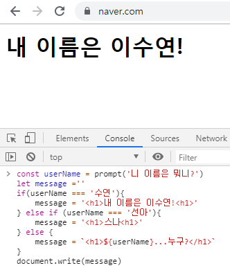
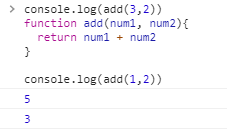

# 0. 사전준비

## 0.1 `Node.js` 설치

- node.js : javascript를 백엔드에서도 활용할 수 있게 만든것
- Node.js 발표와 동시에 JavaScript가 브라우저 종속적인 언어가 아니라 서버 구축까지 가능해지면서 핫한 언어로 급부상
- Express.js(서버), React.js(프론트), Vue.js(프론트) 등 JavaScript 기반의 수많은 프레임워크, 라이브러리들이 현대 웹 개발 트렌드를 주도하고 있음

- [node.js 공식 홈페이지](https://nodejs.org/ko/)

  - **LTS** Version(안정적)
  - **Windows installer(.msi) 64bit**

- 설치 확인

  ```bash
  $ node -v
  v12.13.0
  ```

<br>

<br>

## 0.2 VSCode Python & JavaScript 인덴팅 설정

- 설정에서 바꿔준 설정속성들이 settings파일에 반영됨

- Preference : Open Settings(JSON)

  ```python
  {
      ...
      "editor.tabSize":2,
      "[python]":{
          "editor.tabSize":4,
      },
      ...
  }
  ```


<br>

<br>

## 0.3 Naming convention

- `lowerCamelCase`
  - 단봉낙타 표기법
  - JavaScript의 기본 표기법
- `UpperCamelCase`
  - 쌍봉낙타 표기법
- `snake_case`
- `kebob-case`


<br>

<br>

## 0.4 Extensions(추천)

- `auto close tag` : 태그를 자동으로 닫아줌
- `rainbow brackets` : 괄호의 색을 mapping
- `indent-rainbow` : 들여쓰기를 색으로 표시

<br>

<br>

<br>

## 1. Variable

### 1.0 var

- hoisting 문제때문에 안씀

<br>

<br>

### 1.1 let(변수)

- 값을 재할당 할 수 있는 변수를 선언하는 키워드

- 변수 선언은 한 번만 할 수 있다

  - 하지만. 할당은 여러번 할 수 있다

    ```javascript
    let x = 1
    x = 3   //재할당 가능
    console.log(x)
    
    =>3
    ```

- 블록 유효 범위(`Block Scope`)를 갖는 지역 변수

  - `if` 문만큼의 유효범위

    ```javascript
    let x = 1
    if (x === 1){
      // if문 만큼의 유효범위를 가지고 있다
      // 벗어나면 접근 불가능
      let x = 2
      console.log(x)  //2  
    }   
    console.log(x)    //1
    
    => 2
       1
    ```

    

<br>

<br>

### 1.2 Const

- 값이 변하지 않는 상수를 선언하는 키워드

  - 상수의 값은 재할당을 통해 바뀔 수 없고, 재선언도 불가능하다

  <br>

- let과 동일하게 `Block Scope` 을 가진다

- 웬만하면 모든 선언에서 상수를 써야 한다

  - 일단 상수를 사용하고, 값이 바뀌는게 자연스러운 상황이면 그때 변수(let) 로 바꿔서 사용하는 것을 권장한다.

  <br>

- 선언만하고 초기값을 생략하면 Error

  ```javascript
  const MY_FAV
  
  => SyntaxError: Missing initializer in const declaration
  ```

  <br>

- `MY_FAV` 를 상수로 정의하고 그 값을 7로 함

  ```javascript
  const MY_FAV = 7
  console.log('My Favorite number is...'+MY_FAV)
  
  => My Favorite number is...7
  ```

  <br>

- 상수 **재할당** 불가능

  ```javascript
  const MY_FAV = 7
  
  MY_FAV = 10
  
  => 상수 재할당 에러 : Assignment
  ```

  <br>

- 상수 **재선언** 불가능

  ```javascript
  const MY_FAV = 7
  
  const MY_FAV = 20
  let MY_FAV = 11
  
  => 상수 재선언 에러 : already been declared
  ```

  <br>

- 블록 유효 범위(`Block Scope`)를 갖는 지역 변수

  ```javascript
  const MY_FAV = 7
  
  if (MY_FAV === 7){
    const MY_FAV = 11
    console.log(MY_FAV)
  }
  console.log(MY_FAV)
  
  => 11
  	7
  ```

<br>

<br>

- ### **변수와 상수는 어디에 써야 할까?**

  - 어디에 변수를 쓰고, 어디에는 상수를 쓰고 하는 등의 결정은 프로그래머 몫
  - **파이 근삿값**과 같은 값은 상수가 적절(변할 일이 없는 값

<br>

- ### `var` **vs** `let  ` **vs** `const`

  - `var `: 할당 및 선언 자유, 함수 스코프
  - `let `: 할당 자유, 선언은 한번만, 블록 스코프
  - `const `: 할당 한번만, 선언도 한번만, 블록 스코프

<br>

-  **var는 호이스팅과 같은 문제를 야기하기 때문에, 앞으로 let과 const를 사용해서 개발을 진행하자**

<br>

<br>

<br>

## 2. 조건문

### 2.1 `if`  문

- 파이썬의 if문과 흡사! `elif` 만 `else if` 로 바꾸면 됨

  > -

<br>

<br>

## 3. 반복문

### 3.1 while


<br>

<br>

<br>

## 4. 함수(function)

> 함수 선언식(statement) : 코드가 실행되기 전에 로드됨
>
> 함수 표현식(expression) : 인터프리터가 해당 코드에 도달했을 때 로드됨

<br>

### 4.1 선언식

```javascript
console.log(add(3,2))
function add(num1, num2){
  return num1 + num2
}

console.log(add(1,2))
```

<br>

> 

<br>

<br>

### 4.2. 표현식

```javascript
console.log(sub(4,2))
// 표현식(변수에 담는것)
const sub = function(num1, num2){
  return num1 = num2
}
console.log(sub(2,1))
```

<br>


<br>

<br>

<br>

## 5. 화살표 함수(Arrow function)

- ES6 이후 등장
- **function 과 중괄호 숫자를 줄이려고 고안된 문법**
  1. function 키워드 생략 가능
  2. 함수에 매개변수 하나 => `( )`생략 가능
  3. 함수 바디에 표현식 하나 => `{ }`, `return` 생략 가능
- 화살표 함수의 경우 function 키워드로 정의한 함수와 100% 동일하지 않다

- 화살표 함수는 항상 **익명함수**


<br>

<br>

<br>

## 6. 익명/1회용 함수(Anonymous function)

> JavaScript에서는 1회용으롯 ㅏ용하는 함수는 이름을 짓지 않을 수 있다
>
> 일반적으로는 함수를 정의, 변수에 함수를 저장하는 과정 등을 거쳐서 실행한다. 하지만 `즉시실행함수`는 함수가 선언되자마자 즉시 실행된다
>
> 사용이유?
>
> **초기화**에 사용한다
>
> - 즉시실행함수는 선언되자마자 실행되기 때문에, 같은 함수를 다시 호출할 수는 없다. 그래서 초기화 부분에 주로 사용된다

<br>

```javascript
// JS에서는 1회용으로 사용할 함수는 이름을 짓지 않을 수 있다
// function 키워드를 활용해서 함수를 선언할 때는, 이름을 지정하지 않으면 에러가 난다

function (num) { return num ** 3 }

// 1. 기명함수로 만들기 (변수, 상수에 할당)
const cube = function(nume) { return num ** 3 }

// 화살표 함수는 기본적으로 익명 함수지만, 변수 및 상수에 할당해서 기명함수처럼 사용 가능
const squareRoot = num => num ** 0.5

// 2. 익명함수 바로 실행시키기
console.log((function (num) { return num ** 3 })(2))
console.log((num => num ** 0.5)(4))
```

<br>

<br>

<br>

## 7. 배열


<br>

<br>

<br>

## 8. 객체(Object)


<br>

<br>

<br>

## 9. JSON

> JavaScript Object Notation - **JavaScript 객체 표기법**

<br>

- **웹에서 데이터 주고받을 때 형식**으로 대표적으로 JSON, XML, YAML 등이 있다. **주로 JSON을 사용**한다.
- Key-Value 형태의 자료구조를 JavaScript Object와 유사한 모습으로 표현하는 표기법
- 하지만 JSON은 모습만 비슷할 뿐이고, 실제로 Object처럼 사용하려면 다른 언어들과 마찬가지로 **Parsing(구문 분석)하는 작업이 필요**하다


<br>

<br>

<br>

## 10. Array Helper Method

> Helper란 자주 사용하는 로직을 재활용할 수 있게 만든 일종의 Library
>
> ES6 부터 본격적으로 사용되기 시작했다

<br>

- 상세한 사용법 -> MDN

### 10.1  `foreach`

- `arr.forEach(callback(element, index, array))`
- 주어진 callback을 배열에 있는 각 요소에 대해 한번씩 실행