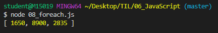

# 0. 사전준비

## 0.1 `Node.js` 설치

- node.js : javascript를 백엔드에서도 활용할 수 있게 만든것
- Node.js 발표와 동시에 JavaScript가 브라우저 종속적인 언어가 아니라 서버 구축까지 가능해지면서 핫한 언어로 급부상
- Express.js(서버), React.js(프론트), Vue.js(프론트) 등 JavaScript 기반의 수많은 프레임워크, 라이브러리들이 현대 웹 개발 트렌드를 주도하고 있음

- [node.js 공식 홈페이지](https://nodejs.org/ko/)

  - **LTS** Version(안정적)
  - **Windows installer(.msi) 64bit**

- 설치 확인

  ```bash
  $ node -v
  v12.13.0
  ```

<br>

<br>

## 0.2 VSCode Python & JavaScript 인덴팅 설정

- 설정에서 바꿔준 설정속성들이 settings파일에 반영됨

- Preference : Open Settings(JSON)

  ```python
  {
      ...
      "editor.tabSize":2,
      "[python]":{
          "editor.tabSize":4,
      },
      ...
  }
  ```


<br>

<br>

## 0.3 Naming convention

- `lowerCamelCase`
  - 단봉낙타 표기법
  - JavaScript의 기본 표기법
- `UpperCamelCase`
  - 쌍봉낙타 표기법
- `snake_case`
- `kebob-case`


<br>

<br>

## 0.4 Extensions(추천)

- `auto close tag` : 태그를 자동으로 닫아줌
- `rainbow brackets` : 괄호의 색을 mapping
- `indent-rainbow` : 들여쓰기를 색으로 표시

<br>

<br>

<br>

## 1. Variable

### 1.0 var

- hoisting 문제때문에 안씀

<br>

<br>

### 1.1 let(변수)

- 값을 재할당 할 수 있는 변수를 선언하는 키워드

- 변수 선언은 한 번만 할 수 있다

  - 하지만. 할당은 여러번 할 수 있다

    ```javascript
    let x = 1
    x = 3   //재할당 가능
    console.log(x)
    
    =>3
    ```

- 블록 유효 범위(`Block Scope`)를 갖는 지역 변수

  - `if` 문만큼의 유효범위

    ```javascript
    let x = 1
    if (x === 1){
      // if문 만큼의 유효범위를 가지고 있다
      // 벗어나면 접근 불가능
      let x = 2
      console.log(x)  //2  
    }   
    console.log(x)    //1
    
    => 2
       1
    ```

    

<br>

<br>

### 1.2 Const

- 값이 변하지 않는 상수를 선언하는 키워드

  - 상수의 값은 재할당을 통해 바뀔 수 없고, 재선언도 불가능하다

  <br>

- let과 동일하게 `Block Scope` 을 가진다

- 웬만하면 모든 선언에서 상수를 써야 한다

  - 일단 상수를 사용하고, 값이 바뀌는게 자연스러운 상황이면 그때 변수(let) 로 바꿔서 사용하는 것을 권장한다.

  <br>

- 선언만하고 초기값을 생략하면 Error

  ```javascript
  const MY_FAV
  
  => SyntaxError: Missing initializer in const declaration
  ```

  <br>

- `MY_FAV` 를 상수로 정의하고 그 값을 7로 함

  ```javascript
  const MY_FAV = 7
  console.log('My Favorite number is...'+MY_FAV)
  
  => My Favorite number is...7
  ```

  <br>

- 상수 **재할당** 불가능

  ```javascript
  const MY_FAV = 7
  
  MY_FAV = 10
  
  => 상수 재할당 에러 : Assignment
  ```

  <br>

- 상수 **재선언** 불가능

  ```javascript
  const MY_FAV = 7
  
  const MY_FAV = 20
  let MY_FAV = 11
  
  => 상수 재선언 에러 : already been declared
  ```

  <br>

- 블록 유효 범위(`Block Scope`)를 갖는 지역 변수

  ```javascript
  const MY_FAV = 7
  
  if (MY_FAV === 7){
    const MY_FAV = 11
    console.log(MY_FAV)
  }
  console.log(MY_FAV)
  
  => 11
  	7
  ```

<br>

<br>

- ### **변수와 상수는 어디에 써야 할까?**

  - 어디에 변수를 쓰고, 어디에는 상수를 쓰고 하는 등의 결정은 프로그래머 몫
  - **파이 근삿값**과 같은 값은 상수가 적절(변할 일이 없는 값

<br>

- ### `var` **vs** `let  ` **vs** `const`

  - `var `: 할당 및 선언 자유, 함수 스코프
  - `let `: 할당 자유, 선언은 한번만, 블록 스코프
  - `const `: 할당 한번만, 선언도 한번만, 블록 스코프

<br>

-  **var는 호이스팅과 같은 문제를 야기하기 때문에, 앞으로 let과 const를 사용해서 개발을 진행하자**

<br>

<br>

<br>

## 2. 조건문

### 2.1 `if`  문

- 파이썬의 if문과 흡사! `elif` 만 `else if` 로 바꾸면 됨

- 입력받은 값 출력할때는 ``` ` 안에 써주고 값은 `${}` 로 감싸서 출력

  ```javascript
  const userName = prompt('니 이름은 뭐니?') 
  let message =''
  if(userName === '수연'){
  	message = '<h1>내 이름은 이수연!<h1>'
  } else if (userName === '선아'){
  	message = '<h1>스나<h1>'
  } else {
  	message = `<h1>${userName}...누구?</h1>`
  }
  document.write(message)
  ```

  <br>

  > -

<br>

<br>

<br>

## 3. 반복문

### 3.1 while

- while 키워드 뒤에 나오는 조건이 true인 경우

  ```javascript
  let i = 0
  while(i < 6){
    console.log(i)
    i++
  }
  ```

  <br>

  > 

<br>

<br>

### 3.2 FOR

- JavaScript의 가장 기본적인 반복문

  for문에서 사용할 변수 하나 정의하고, 그 변수가 특정 조건에 false 값이 될 때까지 반복

  ```javascript
  for(let j = 0; j<6; j++){
    console.log(j)
  }
  ```

  <br>

  > 

  <br>

- `num of` : Python 의 `for in` 문법과 비슷하게 사용 가능

  ```javascript
  const numbers = [1,2,3,4,5]
  for(let number of numbers){
      console.log(number)
  }
  ```

  <br>

  

  <br>

- 직접 리스트 지정

  - `let `: 변수

    <br>

    ```javascript
    for(let number of [1,2,3,4,5]){
        console.log(number)
    }
    ```

    <br>

    > 

    <br>

  - `const` : number가 재할당 필요없으면 상수 사용 가능

    <br>

    ```javascript
    for(const number of [1,2,3,4,5]){
      console.log(number)
    }
    ```

    <br>

    > 

    

<br>

<br>

<br>

## 4. 함수(function)

> 함수 선언식(statement) : 코드가 실행되기 전에 로드됨
>
> 함수 표현식(expression) : 인터프리터가 해당 코드에 도달했을 때 로드됨

<br>

### 4.1 선언식

- 코드가 실행되기 전에 함수가 로드되기 때문에 에러안남

  ```javascript
  console.log(add(3,2))
  function add(num1, num2){
    return num1 + num2
  }
  
  console.log(add(1,2))
  ```

  <br>

  > 

  

<br>

<br>

### 4.2 표현식

- `const` 사용해서 변수에 담아주기

- **함수 로드 전에 접근**하려고 하기 때문에 오류남!

  ```python
  console.log(sub(3,2))
  
  // 표현식(변수에 담는것)
  const sub = function(num1, num2){
    return num1 = num2
  }
  console.log(sub(2,1))
  ```

  <br>

  > 

<br>

### 4.3 선언식 vs 표현식

- 타입만 확인하면 둘 다 **function**으로 동일하다

- **작동 방법만 다를 뿐!**

  ```javascript
  console.log(typeof add)
  console.log(typeof sub)
  ```

  <br>

  > 

<br>

<br>

<br>

## 5. 화살표 함수(Arrow function)

- ES6 이후 등장

- **function 과 중괄호 숫자를 줄이려고 고안된 문법**

  1. function 키워드 생략 가능
  2. 함수에 매개변수 하나 => `( )`생략 가능
  3. 함수 바디에 표현식 하나 => `{ }`, `return` 생략 가능

  <BR>

- 화살표 함수의 경우 function 키워드로 정의한 함수와 100% 동일하지 않다

- 화살표 함수는 항상 **익명함수**

<br>

### 기본 함수

```javascript
const iot1 = function(name){
  return `hello! ${name}!!`
}
console.log(iot1("수연"))
```

<br>

> 

<br>

### 5.1 function 키워드 삭제 

```javascript
const iot1 = (name) => { return `hello! ${name}` }
console.log(iot1("수연"))
```

<br>

<br>

### 5.2 `( )`생략 (함수 매개변수 하나일 경우)

```javascript
const iot1 = name => { return `hello! ${name}` }
console.log(iot1("수연"))
```

<br>

<br>

### 5.3 `{ } `, return 생략 (바디에 표현식 1개일 때)

```javascript
const iot1 = name => `hello! ${name}`
console.log(iot1("수연"))
```

<br>

<br>

### 5.4 `( )`, `_`  로 표시 (인자가 없는경우)

- 원하는 로직있을 때 사용 

  ex) 버튼 클릭시 다른 동작 실행

  ```javascript
  let noArgs = () => 'No args!!'
  noArgs = _ => 'No args!!'
  console.log(noArgs())
  ```

  <br>

  > 

<br>

<br>

### 5.5 Object 리턴

- **return** 을 써줄 때 : **return** 을 명시적으로 적어줌

  ```javascript
  let returnObject = () => { return {key: 'value'} }
  console.log(returnObject)
  console.log(returnObject())
  console.log(typeof returnObject())
  ```

  <br>

  > 

  <br>

  <br>

- **return** 을 안쓸 때 : **`( )`괄호**를 붙여준다

  ```javascript
  let returnObject = () => ({key:'value'})
  console.log(returnObject)
  console.log(returnObject())
  console.log(typeof returnObject())
  ```

  > <br>

<br>

<br>

### 5.6 기본인자 부여하기 (Default Args)

- 인자 개수와 상관없이 반드시 괄호를 붙인다

- 인자 없을 때 (기본인자 사용)

  ```javascript
  const sayHello = (name='수연') => `hi! ${name}`
  console.log(sayHello())
  ```

  <br>

  > 

  <br>

- **인자 있을 때 (넘겨준 인자값 사용)**

  ```javascript
  const sayHello = (name='수연') => `hi! ${name}`
  console.log(sayHello('선아'))
  ```

  <br>

  > 

<br>

<br>

<br>

### [ 실습 ] 3단계에 걸쳐 화살표 함수로 바꿔보기

#### 기본함수

```javascript
let square = function(num){
	return num ** 2
}
console.log(square(2))
```

<br>

> 

<br>

#### 1. function 키워드 생략

```javascript
square = (num) => { return num ** 2 }
```

<br>

#### 2. `( )` 생략 (매개변수 1개)

```javascript
square = num => { return num ** 2 } 
```

<br>

#### 3. `{ }`, return  생략(바디 부분 표현식 1개)

```javascript
square = num => num ** 2
```

<br>

<br>

<br>


## 6. 익명/1회용 함수(Anonymous function)

> JavaScript에서는 1회용으롯 ㅏ용하는 함수는 이름을 짓지 않을 수 있다
>
> 일반적으로는 함수를 정의, 변수에 함수를 저장하는 과정 등을 거쳐서 실행한다. 하지만 `즉시실행함수`는 함수가 선언되자마자 즉시 실행된다
>
> 사용이유?
>
> **초기화**에 사용한다
>
> - 즉시실행함수는 선언되자마자 실행되기 때문에, 같은 함수를 다시 호출할 수는 없다. 그래서 초기화 부분에 주로 사용된다

<br>

```javascript
// JS에서는 1회용으로 사용할 함수는 이름을 짓지 않을 수 있다
// function 키워드를 활용해서 함수를 선언할 때는, 이름을 지정하지 않으면 에러가 난다

function (num) { return num ** 3 }

// 1. 기명함수로 만들기 (변수, 상수에 할당)
const cube = function(name) { return num ** 3 }

// 화살표 함수는 기본적으로 익명 함수지만, 변수 및 상수에 할당해서 기명함수처럼 사용 가능
const squareRoot = num => num ** 0.5

// 2. 익명함수 바로 실행시키기
console.log((function (num) { return num ** 3 })(2))
console.log((num => num ** 0.5)(4))
```

<br>

<br>

<br>

## 7. 배열

```javascript
const numbers = [1,2,3,4,5]
```

<br>

- 양의 정수로만 인덱스 접근 가능

  ```javascript
  numbers[0]    //1
  numbers[-1]   //undefined -> 정확한 양의 정수만 가능
  numbers.length    //5
  ```

  <br>

- `reverse()` : 원본 파괴~!

  ```javascript
  numbers.reverse()   // [5,4,3,2,1]
  numbers             // [5,4,3,2,1]
  numbers.reverse()   // [1,2,3,4,5]
  numbers             // [1,2,3,4,5]
  ```

  <br>

- `push()` : 배열 마지막 요소로 추가. 배열 길이 return

  ```javascript
  numbers.push('a')   // 6
  numbers             // [1,2,3,4,5,'a']
  ```

  <br>

- `pop()` : 배열 가장 마지막 요소 제거 후, 제거 요소 return

  ```javascript
  numbers.pop()       // 'a'
  numbers             // [1,2,3,4,5]
  ```

  <br>

- `unshift()` : 배열 가장 앞에 요소 추가 후 배열길이 return

  ```javascript
  numbers.unshift('a')     // 6 (배열의 새로운 length)
  numbers                  // ['a',1,2,3,4,5]
  ```

  <br>

- `shift()` : 배열 가장 첫번째 요소 제거 후, 제거요소 return

  ```javascript
  numbers.shift()         // 'a'
  numbers                 // [1,2,3,4,5]
  ```

  <br>

- `push('a','b')` 여러개도 가능

  ```javascript
  numbers.push('a','b')
  numbers                 // [1,2,3,4,5,'a','b']
  numbers.unshift('a')    // ['a',1,2,3,4,5,'a','b']
  ```

  <br>

- 중복된 요소가 존재하는 경우 처음 찾은 요소의 index 리턴

  ```javascript
  numbers.indexOf('a')    // 0
  numbers.indexOf('b')    // 8
  numbers.indexOf('c')    // 찾는 요소가 없으면 -1
  ```

  <br>

- `join` : 배열의 요소를 **join 함수 인자** 를 기준으로 묶어서 **문자열** 로 return~!

  - 기본값은 `','`

  ```javascript
  numbers.join()          // "a,1,2,3,4,5,a,b" (기본값은 ',')
  numbers.join('-')       // "a-1-2-3-4-5-a-b"
  numbers.join('')        // "a12345ab"
  ```

<br>

<br>

<br>

## 8. 객체(Object)

- Key가 한 단어일 때

  ```javascript
  name: '수연', 
  ```

  <br>

- Key가 여러 단어 일때 `' '` 안에 Key 입력

  ```javascript
  'phone number': '01055555555',
  ```

  <br>

- Object 작성

  ```javascript
  const me = {
      name: '수연',
      'phone number': '01055555555',
      Products:{
          iphone:'xs',
          watch:'series5',
          macbook:'pro2019'
      }
  }
  ```

  <br>

- Object 요소 접근

  - key값이 여러 단어일 때는 `[ ]` 로 접근

    ```javascript
    me.name       			// "수연"
    me['name']    			// "수연"
    me['phone number']  	// "01055555555"
    me.Products    			// {iphone: "xs", watch: "series5", macbook: "pro2019"}
    me.Products.iphone 		// "xs"
    me.Products['iphone'] 	// "xs"
    ```

    

<br>

<br>

<br>

## 9. Object (객체) - 2

> ES6 이후부터는 객체의 Key와 Value가 똑같으면 마치 배열처럼 한번만 작성해도 된다

<br>

### 9.1 ES6 이전 (ES5까지)

- Key와 Value를 각각 써줘야했다

  ```javascript
  var books = ['자바스크립트 입문', '장고 웹 프로그래밍']
  var comics = {
    'DC' : ['Aquaman', 'Joker'],
    'Marvel' : ['Avengers', 'Spider Man']
  }
  
  var magazines = null
  
  var bookShop = {
    books:books,
    comics:comics,
    magazines:magazines
  }
  
  console.log(bookShop)
  console.log(typeof bookShop)
  console.log(bookShop.books[0])
  ```

  <br>

  > 

<br>

<br>

### 9.2 ES6 이후

- Key와 Value가 같으면 배열처럼 한번만 써줘도 된다

  ```javascript
  let books = ['자바스크립트 입문', '장고 웹 프로그래밍']
  let comics = {
    'DC' : ['Aquaman', 'Joker'],
    'Marvel' : ['Avengers', 'Spider Man']
  }
  
  let magazines = null
  const bookShop = {
    books,
    comics,
    magazines
  }
  
  console.log(bookShop)
  console.log(typeof bookShop)    //object
  console.log(bookShop.books[0])
  ```

  <br>

  

<br>

<br>

<br>

## 10. JSON

> JavaScript Object Notation - **JavaScript 객체 표기법**

<br>

- **웹에서 데이터 주고받을 때 형식**으로 대표적으로 JSON, XML, YAML 등이 있다. **주로 JSON을 사용**한다.
- **Key-Value 형태의 자료구조**를 **JavaScript Object**와 유사한 모습으로 표현하는 표기법
- 하지만 JSON은 모습만 비슷할 뿐이고, 실제로 Object처럼 사용하려면 다른 언어들과 마찬가지로 **Parsing(구문 분석)하는 작업이 필요**하다

<br>

### 10.1 Object =>  String

- `JSON.stringify()`

  ```javascript
  const jsonData = JSON.stringify({     
    수연: '롤롤',
    선아: '스나',
  })
  console.log(jsonData)   //{"수연":"롤롤","선아":"스나"}
  console.log(typeof jsonData) //string
  ```

  <br>

  > 

<br>

<br>

### 10.2 String => Object

- `JSON.parse()`

  ```javascript
  // Object -> String
  const jsonData = JSON.stringify({     // JSON -> String
    수연: '롤롤',
    선아: '스나',
  })
  console.log(jsonData)   //{"수연":"롤롤","선아":"스나"}
  console.log(typeof jsonData) //string
  
  
  // String -> Object
  const parseData = JSON.parse(jsonData)
  console.log(parseData)  //{"수연":"롤롤","선아":"스나"}
  console.log(typeof parseData) //object
  ```

  <br>

  > 

<br>

<br>

### [ Object vs JSON ]

- **Object** : JavaScript의 Key-Value 페어의 자료구조
- **JSON** : 데이터를 표현하기 위한 단순 문자열(string)

<br>

<br>

<br>

## 11. Array Helper Method

> Helper란 자주 사용하는 로직을 재활용할 수 있게 만든 일종의 Library
>
> ES6 부터 본격적으로 사용되기 시작했다

<br>

- 상세한 사용법 -> MDN

### 11.1  `foreach`

- `arr.forEach(callback(element, index, array))`

- 주어진 callback을 배열에 있는 각 요소에 대해 한번씩 실행

- forEach는 기본으로 들어오는 return 값은 없다

  ```javascript
  const IOT1 = ['수연','선아','주현','영선','경희']
  const result = IOT1.forEach(
    student => console.log(student)
  )
  console.log(result)   //undefined
  ```

  <br>

  > 

<br>

<br>

### 11.2 ES5 까지의 for문

```javascript
var iot1 = ['도현','혁진','은애']
for (var i=0; i<iot1.length; i++){
  console.log(iot1[i])
}
```

<br>

> 

<br>

<br>

### 11.3 ES6 이후의 forEach 문

```javascript
const IOT1 = ['수연','선아','주현','영선','경희']
IOT1.forEach(function(student){
  console.log(student)
})
```

<br>

> 

<br>

<br>

### 11.4 forEach 한줄로 리팩토링!

```javascript
const IOT1 = ['수연','선아','주현','영선','경희']
IOT1.forEach(student=>console.log(student))
```

<br>

> 

<br>

<br>

### [ 실습 1 ] for를 forEach로 바꾸기

- #### handleStudents( )함수

  ```javascript
  function handleStudents(){
    const students = [
      { id: 1, name: '이수연', status: '수연'},
      { id: 2, name: '오은애', status: '은애언뉘..'},
      { id: 3, name: '김영선', status: '영서뉘..'},
    ]
  ```

<br>

- #### for문

  ```javascript
    // for
    for (let i=0; i<students.length; i++){
      console.log(students[i])
      console.log(students[i].name)
      console.log(students[i].status)
    }
  ```

  <br>

  > 

<br>

<br>

#### 1. Foreach

```javascript
  // foreach
  students.forEach(function(student) {
    console.log(student)
    console.log(student.name)
    console.log(student.status)
  });

handleStudents()
```

<br>

#### 2. Arrow Function 사용

```javascript
  students.forEach(student => {
    console.log(student)
    console.log(student.name)
    console.log(student.status)
  });

handleStudents()
```

<br>

<br>

### [ 실습 2 ] images 배열 안에 있는 정보를 곱해 넓이를 구하여 areas 배열에 저장

- #### images 배열

  ```javascript
  const images = [
    {height:30, width:55},
    {height:50, width:178},
    {height:81, width:35},
  ]
  
  const areas = []
  ```

<br>

#### 1. ForEach

```javascript
images.forEach(image => {
  areas.push(image.height * image.width)
});

console.log(areas)
```

<br>

> 

