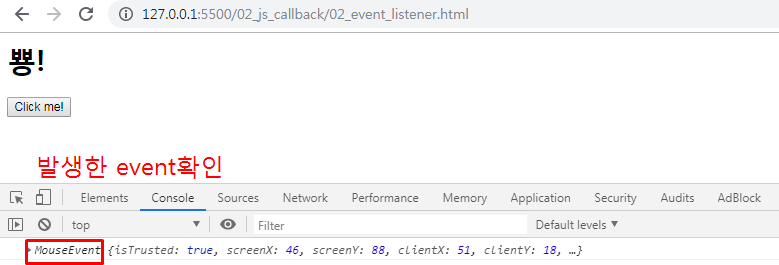
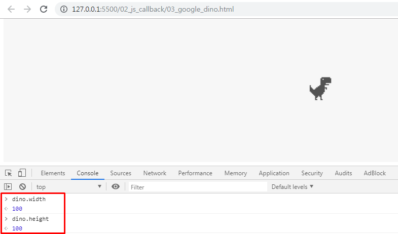
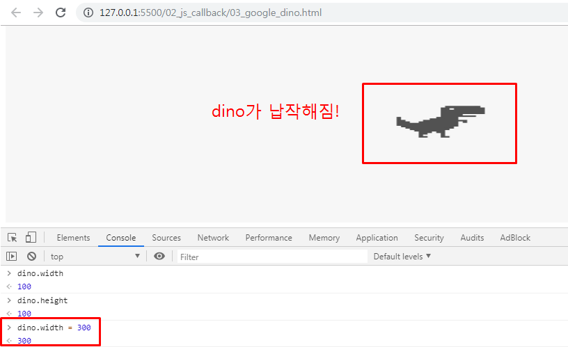
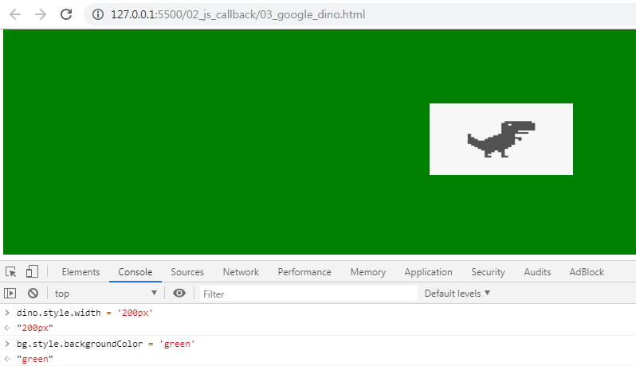
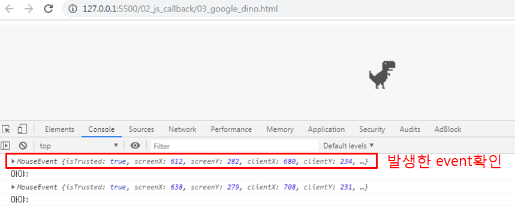
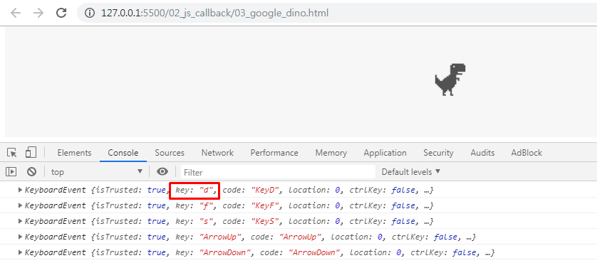
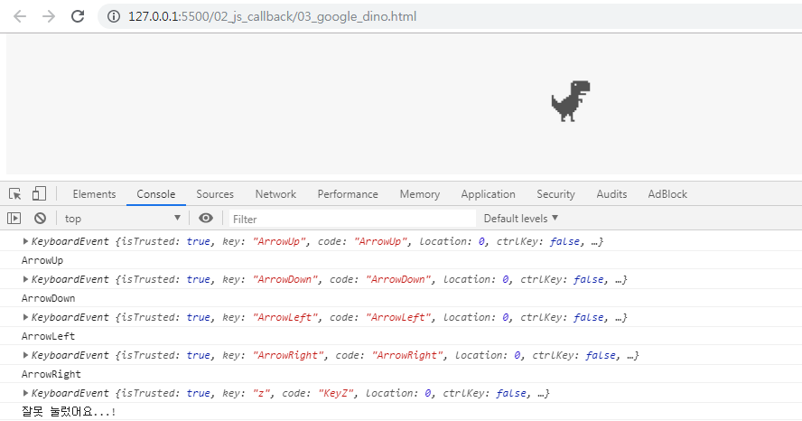
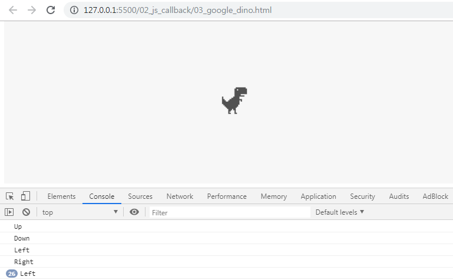

# 공룡만들기

## 1. Callback Function

### 1.1 정의

- **다른 함수에 인수로 넘겨지는 함수**

- 특정 이벤트가 발생했을 때, 시스템에 의해 호출되는 함수

- 조금 이따가 너 실행 끝나면 나 다시 불러줘! => callback

- 자주 사용되는 대표적인 예 : 이벤트 핸들러 처리

  ``` html
  <!-- 02_js_callback/01_callback_intro.html -->
  
  <body>
    <button id="my-button">클릭해주세요</button>
  
    <script>
      const button = document.getElementById('my-button')
      button.addEventListener('click', function (e) {
        console.log('버튼이 클릭됐어요!')
      })
    </script>
  </body>
  ```

<br>

<br>

### 1.2 예시

1. 함수 정의

   ```javascript
   function doSomething(task){
   	alert(`자, 이제 ${task}준비를 시작해볼까?`)
   }
   doSomething('해커톤')
   ```

   <br>

2. **익명 함수인 콜백 함수 추가**

   ```javascript
   function doSomething(task, callback){
   	alert(`자, 이제 ${task}준비를 시작해볼까?`)
   	callback()
   }
   doSomething('해커톤', function(){
   	alert('당장 이번주 금요일부터 시작이야....')
   })
   ```

   <br>

3. **기명 함수인 콜백 함수**로 변경해서 추가

   ```javascript
   function doSomething(task, callback){
   	alert(`자, 이제 ${task}준비를 시작해볼까?`)
   	callback()
   }
   
   // 콜백함수
   function alertStart(){
   	alert(`당장 이번주 금요일부터 시작이야...`)
   }
   doSomething('해커톤', alertStart)
   ```

<br>

<br>

<br>

## 2. EventListener

### 2.1 정의

- 특정한 **이벤트가 발생했을 때 실행되는 함수** 또는 절차

  - 무엇을 -> EventTarget
  - 언제 -> 어떠한 Type의 행위를 했을 때
  - 어떻게 -> (주로)Listener에 구현된 함수를 실행

  <br>

- `addEventListener` 메소드 구성 요소

  > EventTarget.addEventListener(type, listener)
  >
  > - EventTarget : 이벤트 리스너를 등록할 대상 ( => DOM노드)
  >
  > - type : 이벤트 유형을 뜻하는 문자열 (`click`, `mouseover` )
  > - listener : 이벤트가 발생했을 때 처리를 담당하는 콜백 함수
  >   - 인수로 이벤트 객체인 `e` 를 전달받음

<br>

<br>

### 2.2. 예시

1. (무엇을) 특정한 DOM 요소를 -> button을

2. (언제) 어떠한 행동을 했을 때 -> click 했을 때

3. (어떻게) 한다 -> '뿅'한다

   ```html
   <!-- 02_js_callback/02_event_listener.html -->
   
   <html>
     <head></head>
     <body>
       <div id="my"></div>
       <button id="this-button">Click me!</button>
   
       <script>
         // 1. 무엇을 -> 버튼 (EventTarget)
         const button = document.querySelector('#this-button')
         // 2. 언제 -> 'click' 하면 (type:button)
         button.addEventListener('click', function (event) {
           console.log(event)
           const area = document.querySelector('#my')
           // 3. 어떻게 => "뿅" 하고 나온다
           area.innerHTML = '<h1>뿅!</h1>'
         })
       </script>
     </body>
   </html>
   ```
   
   <br>
   
   > 

<br>

<br>

<br>

## 3. Google dino

### 3.1 BOM & DOM

- **BOM(Browser Object Model)**

  - JavaScript가 브라우저와 소통하기 위한 모델

    - 브라우저 제작사마다 세부사항이 다소 다르게 구현되고 한정적임
    - 웹 브라우저의 창, 프레임을 추상화해서 프로그래밍적으로 제어할 수 있도록 수단을 제공
    - 전역 객체인 `window` 의  프로퍼티와 메소드들을 통해서 제어할 수 있음

    <br>

  - `window` 객체는 모든 브라우저로부터 지원받으며, 이는 브라우저 window 자체를 의미

  - **모든 전역 JavaScript 객체, 함수, 변수들은 자동으로 window 객체의 멤버가 된다**

    - **HTML DOM에 있는 document 객체 역시 window 객체의 속성이다**

      ```javascript
      window.print()		// 인쇄창 열기
      window.open()		// 브라우저 탭 열기
      window.confirm()	// 브라우저 대화상자 열기
      window.document		// document 역시 브라우저에 종속 -> window 전역 객체에 포함됨
      ```

  <br>

  <br>

- DOM(Document Object Model)

  - JavaScript로 브라우저를 조작하기 위한 언어. **DOM을 통해서 HTML파일에 작성되는 여러 요소(Element) 들을 조작**할 수 있다
  - DOM이라는 객체를 통해서 **요소를 선택**할 수도 있고, 선택한 **요소의 속성 값을 수정하거나 삭제**할 수도 있다
  - **요소에 이벤트를 등록**해서, 특정 이벤트가 발생할 시 특정 함수를 실행하도록 만들 수도 있다
  - HTML문서에 작성하지 않은 **새로운 요소를 생성**해서 **원하는 위치에 삽입**할 수도 있다

<br>

<br>

### 3.2 사전준비


### 3.3 요소(Element) 선택

- JavaScript를 이용해서 요소를 선택해서 객체로 반환하기
- 브라우저 환경에서 사용하는 JavaScript에는 document 객체가 내장되어 있다. 이 객체를 통해서 HTML 파일을 조작할 수 있다

<br>

#### 3.3.1 요소 선택하여 변수 할당하기

- `document` 의 `querySelector` 혹은 `querySelectAll` 함수를 통해 CSS 선택자로 원하는 요소를 선택할 수 있다

  - `querySelector` : 위에서부터 선택자로 요소를 찾으며 가장 먼저 찾아지는 요소 반환(-> 단수)

    ```javascript
    document.querySelector('.bg')
    ```

    <br>

    

  - `querySelectorAll` : 위에서부터 선택자로 요소를 찾으며 일치하는 요소를 전부 반환(-> 복수)

    ```javascript
    document.querySelectorAll('.bg')
    ```

  <br>

- 변수 할당하기

  ```javascript
  const bg = document.querySelector('.bg')
  ```

  - `.bg` 라는 클래스가 가진 태그, 그 자식태그까지 전부 변수에 담는다

<br>

<br>

### 3.4 속성 추가 및 삭제

#### 3.4.1 요소의 속성 확인

```javascript
const dino = bg.querySelector('#dino')

dino.width
> 100
dino.height
> 100
```

<br>

> 

<br>

<br>

#### 3.4.2 요소의 속성 변경

```javascript
const dino = bg.querySelector('#dino')

dino.width = 300
> 300
```

<br>

> 

<br>

<br>

#### 3.4.3 요소의 스타일 변경

```javascript
dino.style.width = '200px'
> "200px"
bg.style.backgroundColor = 'green'
> "green"
```

<br>

> 

<br>

<br>

### 3.5 요소 추가 및 삭제

#### 3.5.1 요소 삭제

- 요소가 가지고 있는 `remove` 함수를 통해 해당 요소를 삭제할 수 있다

  ```javascript
  const dino = document.querySelector('#dino')
  dino.remove()
  ```

<br>

<br>

#### 3.5.2 대상의 자식 요소 삭제

- 자식을 선택해서 삭제할 수 있다

- `removeChild` 함수를 통해 `querySelector` 로 가져온 태그 내의 특정 자식 요소를 삭제할 수 있다

  ```javascript
  const bg = document.querySelector('.bg')
  const dino = bg.querySelector('#dino')
  
  bg.firstElementChild.remove()		// 첫번째 자식 요소 삭제
  bg.lastElementChild.remove()		// 마지막 자식 요소 삭제
  bg.removeChild(dino)				// 자식 요소 중 특정 요소(dino)를 선택해서 삭제
  ```

<br>

<br>

#### 3.5.3 새로운 요소 생성

- `createElement` 함수를 통해서 새로운 요소를 생성할 수 있다

- 새롭게 생성한 태그는 어떠한 속성이나 값이 없는 상태이기 때문에 일일이 값을 할당해주어야한다.

  ```javascript
  // 새로운 dino 요소 생성
  const newDino = document.createElement('img')
  newDino.src = 'http://pixelartmaker.com/art/a271655feb7ee0f.png'
  newDino.alt = 'dino'
  newDino.id = 'dino'
  newDino.style.width = '100px'
  newDino.style.height = '100px'
  ```

<br>

<br>

#### 3.5.4 대상에 요소 추가하기

- 단순한 태그 생성만으로는 새로운 요소가 DOM에 자동으로 렌더링되지는 않는다

- 삽입하고 싶은 위치에서 부모 요소의 `append` 함수를 통해 **가장 뒤에 추가**해주거나, `insertBefore` 함수를 통해 **자식 요소 중 특정 요소 전에 삽입**할 수 있다 

  ```javascript
  const bg = document.querySelector('.bg')
  
  // div 태그의 자식 태그 중 마지막에 요소를 추가
  bg.append(newDino)
  
  // div 태그의 자식 태그 중 가장 처음에 요소를 추가
  bg.insertBefore(newDino, bg.firstElementChild)
  ```

<br>

<br>

### 3.6 대상에 EventListener 추가

- 요소에 이벤트를 등록하여 해당 이벤트가 발생할 때마다 설정한 함수(callback 함수) 가 실행되도록 한다
- **이벤트(Event)** : 어떤 사건
  - 사용자가 버튼 클릭했을 때, 웹 페이지가 정상적으로 로드되었을 때

- 이벤트가 발생하는 시점 및 순서는 **예측 불가**하므로, 이벤트가 발생하는 순간을 감지하고 그에 대응하는 처리가 필요하다

- **브라우저는 이벤트를 감지할 수 있고, 이벤트가 발생하면 이를 알려준다.** 그래서 웹 페이지는 사용자와 상호작용(Interaction) 이 가능해진다

<br>

#### 3.6.1 이벤트 등록

> ​    사용자가 dino라는 요소를 클릭했을 때, 이 클릭 이벤트가 발생할 때마다 '아야!!'라는 문자열을 출력하는 이벤트 등록

<br>

- `addEventListener` 를 통해 특정 요소에 이벤트를 등록할 수 있다
  - 첫 번째 인수 : 이벤트의 Type
  - 두 번째 인수 : 실행하고자 하는 함수

<br>

- MDN 이벤트 참조

  1. 키보드 이벤트

     - `keydown` : 키를 눌렀을 때
     - `keyup` : 키 누름이 해제될 때

     <br>

  2. 마우스 이벤트

     - `click` : 포인팅 장치 버튼(요소에서 눌렀다가 놓였을 때)

     <br>

  3. 진행 이벤트

     - `error` : 진행 실패했을 때
     - `load` : 진행 성공했을 때

<br>

<br>

#### 3.6.2 이벤트 확인

- `addEventListener` 함수는 이벤트가 발생할 때마다 실행시키는 함수의 인자로 `event` 라는 객체를 넘겨준다. 이 객체를 통해 어떤 이벤트가 발생했는지 확인할 수 있다

  - `event` 객체는 일반적으로 줄여서 `e` 라고 정의한다

    ```javascript
    dino.addEventListener('click', function(e){
        console.log(e)
        console.log('아야!')
    })
    ```

    <br>

    > 

<br>

<br>

### 3.7 문서 전체에 EventListener 추가

> 해당 페이지 전체에 키보드 입력 이벤트를 등록하여 어떤 키가 눌렸는지 확인해보자

<br>

#### 3.7.1 이벤트 등록 및 입력 키 확인하기

- 키보드 입력 이벤트 중 `keydown` 을 사용해서 키보드 이벤트 등록 : 어떤 키 눌렸는지 확인 가능

  ```javascript
  // 브라우저 전체 선택
  // 문서 전체에 키 입력을 확인하는 이벤트 리스너 등록
  document.addEventListener('keydown', function(e){
      console.log(e)
  })
  ```

  <br>

  > 

<br>

<br>

#### 3.7.2 조건문으로 입력값 구분하기

- 키보드 입력 시 눌려진 `keydown code` 로 분기

  ```javascript
  document.addEventListener('keydown', function(e){
      if(e.code === 'ArrowUp'){
          console.log('ArrowUp')
      }else if (e.code === 'ArrowDown'){
          console.log('ArrowDown')
      }else if (e.code === 'ArrowLeft'){
          console.log('ArrowLeft')
      }else if (e.code === 'ArrowRight'){
          console.log('ArrowRight')
      }else if (e.code === 'Space'){
          console.log('Spacebar')
      }else{
          console.log('잘못 눌렀어요...!')
      }
  })
  ```

   <br>

  > 

<br>

<br>

### 3.8 살아 움직이는 공룡

#### 3.8.1 [LEVEL 1] 방향키 입력 시 공룡이 움직이게 만들기

> dino의 style에 margin값을 부여하면..? => `dino.style.marginLeft = '20px'`
> 상하, 좌우 기준을 하나로 정하기 => marginBottom, marginLeft

<br>

```javascript
document.addEventListener('keydown', function(e){
    console.log(e)
    if(e.code === 'ArrowUp'){
        console.log('ArrowUp')
        dino.style.marginBottom = '20px'
    }else if (e.code === 'ArrowDown'){
        console.log('ArrowDown')
        dino.style.marginBottom = '20px'
    }else if (e.code === 'ArrowLeft'){
        console.log('ArrowLeft')
        dino.style.marginLeft = '20px'
    }else if (e.code === 'ArrowRight'){
        console.log('ArrowRight')
        dino.style.marginLeft = '20px'
    }else if (e.code === 'Space'){
        console.log('Spacebar')
        alert('크아아앙')
    }else{
        console.log('잘못 눌렀어요...!')
    }
})
```

#### 문제 : 한 번만 움직이고 더 이상 움직이지 않는다

#### *=> margin 값을 더해주는 것이 아니라, 똑같이 20px이라는 값을 재할당 하고 있기 때문이다!*

<br>

<br>

#### 3.8.2 [LEVEL 2] 방향키 입력 시 공룡이 움직이게 만들기

> x와 y변수에 기본값 0을 할당하고, 방향키가 입력될 때마다 변수에 20씩 더하고 빼서 계속 변하게 만들어주기

<br>

```javascript
let x = 0
let y = 0
document.addEventListener('keydown', function(e){
    //console.log(e)
    if(e.code === 'ArrowUp'){
        console.log('Up')
        y += 20
        dino.style.marginBottom = `${y}px`
    }else if (e.code === 'ArrowDown'){
        console.log('Down')
        y -= 20
        dino.style.marginBottom = `${y}px`
    }else if (e.code === 'ArrowLeft'){
        console.log('Left')
        x -= 20
        dino.style.marginLeft = `${x}px`
    }else if (e.code === 'ArrowRight'){
        console.log('Right')
        x += 20
        dino.style.marginLeft = `${x}px`
    }else if (e.code === 'Space'){
        console.log('Spacebar')
        alert('크아아앙')
    }else{
        alert('방향키와 스페이스바만 이용해 주세요!')
    }
})
```

<br>

> 

<br>

#### => 공룡이 계속 움직이는 거 화긘

<br>

<br>

#### 3.8.3 도망가는 공룡

- `Math.random()` : 0 ~ 1 사이 구간에서 부동소수점 난수 반환
- `window.innerWidth` : 윈도우 창의 너비 (창 너비 조절할때마다 바뀜)
- `window.innerHeight` : 윈도우 창의 높이 (창 높이 조절할때마다 바뀜)

```javascript
// 02_js_callback/03_google.dino.html

// 움직이는 공룡
dino.style.position = 'absolute'
dino.addEventListener('mouseover', function(){
    // [현재 윈도우 너비 * 난수] - [현재 윈도우 너비 / 2]
    const newWidth = window.innerWidth * Math.random() - 
          window.innerWidth / 2
    // 높이
    const newHeight = window.innerHeight * Math.random() - 
          window.innerHeight / 2

    // dino의 마진 값을 새롭게 할당
    dino.style.marginLeft = newWidth + 'px'
    dino.style.marginTop = newHeight + 'px'
})
```

<br>

#### => 공룡이 자꾸 도망가유

<br>

<br>

