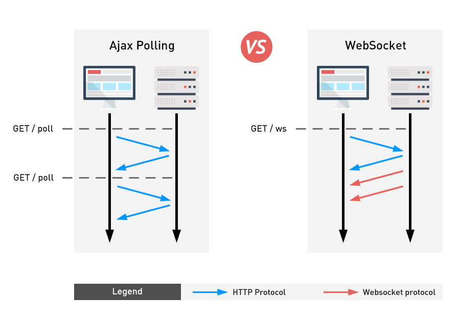

# 비동기 처리

#### HTTP => Ajax(HTTP를 효과적으로 활용) => WebSocket

> 

<br>

### Axios

- 브라우저와 Node.js에서 사용할 수 있는 Promises 기반의 HTTP 클라이언트 라이브러리
  - 비동기 방식으로 HTTP 데이터 요청을 실행한다
  - 내부적으로는 직접적으로 XMLHttpRequest를 다루지 않고 Ajax 호출을 보낼 수 있다

<br>

- Promise (EX6)
  - 비동기 요청을 보내고 응답을 받았을 때, 그 응답 결과를 어떻게 처리하자고 약속(Promise)하는 것
  - `.then` : 응답이 정상적으로 왔을 경우 => 이제 어떻게 처리할지 결정
  - `.catch` : 응답이 잘 안왔을 경우 => 에러 처리

<br>

<br>

### 0. gitignore

- 깃허브올릴때 node ignore 파일을 미리 만들어주자

  ```python
  # 06_JAVASCRIPT/.gitignore
  
  node_modules/
  jspm_packages/
  ```

  <br>

- 안만들면 Node.js 설치시 만들어진 라이브러리 파일들이 모두 들어가 다음과 같은 경고가 뜬다

  - 대충

    > 

  <br>

- 디렉토리를 확인할 수 있는 명령어

  ```bash
  $ ls -al
  ```

<br>

<br>

<br>

## 1. Dog and Cat

### 1.1 설치

- Node.js

  ```bash
  # 06_JAVASCRIPT
  
  $ npm install axios
  ```

  > 


<br>

<br>

### 1.2 jsonplaceholder

>  https://jsonplaceholder.typicode.com/ 

- 가상의 데이터로 통신확인해볼 수 있는 무료 REST API

  ```javascript
  const axios = require('axios')
  
  axios.get('https://jsonplaceholder.typicode.com/posts/1')
    .then(response => {
      console.log(response)
    })
    .catch(error => {
      console.log(error)
    })
  ```

  <br>

  > 

<br>

<br>

### 1.3 Dog API

>  https://dog.ceo/dog-api/ 

<br>

- get요청 URL

  ```javascript
  https://dog.ceo/api/breeds/image/random 
  ```

  <br>

- JSON으로 리턴

  ```json
  {
      "message": "https://images.dog.ceo/breeds/corgi-cardigan/n02113186_377.jpg",
      "status": "success"
  }
  ```

<br>

- 버튼 누를때마다 강아지 추가

  ```javascript
  <!-- 03_js_axios/02_dogs_and_cats -->
  
  <html>
  	<head></head>
  
  <body>
    <h1>강아지들 : )</h1>
    <div class="animals">
    <button id="dog">깁미Dog</button>
    </div>
  
  
    <script src="https://unpkg.com/axios/dist/axios.min.js"></script>
    <script>
      const getDogImage = () => {
        axios.get('https://dog.ceo/api/breeds/image/random')
          .then(response => {
            // 1. img URL을 변수에 담는다
            const imgUrl = response.data.message
            // 2. img 태그를 만든다
            const imgTag = document.createElement('img')
            // 3. src를 추가한다
            imgTag.src = imgUrl
            imgTag.style.width = '200px'
            imgTag.style.height = '200px'
            // 4. HTML 문서에 요소를 위치시킨다
            document.querySelector('.animals').append(imgTag)
          })
          .catch(error => {
            console.log(error)
          })
      }
      // 버튼을 선택하고, 클릭하면 만들어준 콜백함수 실행~
      const dogButton = document.querySelector('#dog')
      dogButton.addEventListener('click', getDogImage)
    </script>
    <body>
  </html>
  ```

  <br>

- return으로 온 random 객체를 열어보면 json형식으로 return한것을 알 수 있다

  - `response.data.message` 또는 `response.data['message']`로 URL 가져오기

    > 

<br>

<br>

### [ 실습 ] CAT API

>  https://docs.thecatapi.com/ 

<br>

- 요청 URL

  ```javascript
  https://api.thecatapi.com/v1/images/search
  ```

  <br>

- JSON Array 로 리턴 (배열의 첫번째 object 사용)

  > 

  <br>

- `고먐미` 버튼 누를때마다 고양이 추가!

  ```javascript
  <html>
  	<head></head>
          <body>
            <h1>강아지들 : )</h1>
            <div class="animals">
            <button id="dog">깁미Dog</button>
            <button id="cat">고먐미</button>
            </div>
  
  
            <script src="https://unpkg.com/axios/dist/axios.min.js"></script>
            <script>
              const getDogImage = () => {
                axios.get('https://dog.ceo/api/breeds/image/random')
                  .then(response => {
                    // 1. img URL을 변수에 담는다
                    const imgUrl = response.data.message
                    // 2. img 태그를 만든다
                    const imgTag = document.createElement('img')
                    // 3. src를 추가한다
                    imgTag.src = imgUrl
                    imgTag.style.width = '200px'
                    imgTag.style.height = '200px'
                    // 4. HTML 문서에 요소를 위치시킨다
                    document.querySelector('.animals').append(imgTag)
                  })
                  .catch(error => {
                    console.log(error)
                  })
              }
  
              const getCatImage = () => {
                axios.get('https://api.thecatapi.com/v1/images/search')
                  .then(response => {
                    const imgUrl = response.data[0].url
                    const imgTag = document.createElement('img')
                    imgTag.src = imgUrl
                    imgTag.style.width = '200px'
                    imgTag.style.height = '200px'
                    document.querySelector('.animals').append(imgTag)
                  })
                  .catch(error => {
                    console.log(error)
                  })
              }
  
  
              // 버튼을 선택하고, 클릭하면 만들어준 콜백함수 실행~
              const dogButton = document.querySelector('#dog')
              dogButton.addEventListener('click', getDogImage)
              const catButton = document.querySelector('#cat')
              catButton.addEventListener('click', getCatImage)
            </script>
       <body>
  </html>
  ```

  <br>

- return 객체 열어보면 JSON Array로 리턴한것을 확인할 수 있다

  - `response.data[0].url` 또는 `response.data[0]['url']` 로 URL 가져오기

    

<br>

<br>

<br>

## 2. Like(GET 요청)

- `AJAX`
  - **Asynchronous JavaScript and XML**
  - 브라우저에서 웹페이지를 요청하거나 링크를 클릭하면 화면갱신(새로고침)이 일어났다. 이는 브라우저와 서버 간의 통신이 일어났다는 이야기다.
  - JavaScript를 활용해서 비동기적으로 서버와 브라우저가 데이터를 교환할 수 있는 통신방식이다.
  - 페이지 전체를 다시 로드하는 것이 아니라, 페이지에서 갱신이 필요한 일부분만 로드함으로써 빠른 퍼포먼스와 부드러운 화면 표시가 가능하다
    - 사용자 경험(UX) 향상 + 서버 자원 이용 절감(필요한 부분만 보내주면 되므로) => 두마리 토끼 잡기!

<br>

- `XHR(XMLHttpRequest)`
  - **브라우저는 XHR 객체를 이용해서 AJAX 요청을 생성하고 전송**한다
  - 서버가 브라우저 요청에 응답 내용을 반환하면, 마찬가지로 XHR 객체가 그 결과를 처리한다