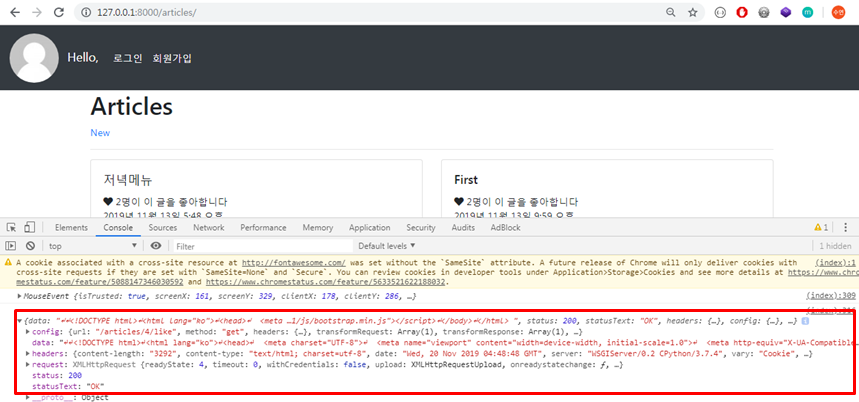

# 비동기 처리

#### HTTP => Ajax(HTTP를 효과적으로 활용) => WebSocket

<br>

<br>

### Ajax Polling과 WebSocket 비교

- 기존 요청-응답 관계에서 벗어난 양방향 자유로운 송수신을 지원한다

  > 

<br>

<br>

### Axios

- **브라우저와 Node.js에서 사용할 수 있는 Promise 기반의 HTTP 클라이언트 라이브러리**
  - 비동기 방식으로 HTTP 데이터 요청을 실행한다
  - 내부적으로는 직접적으로 XMLHttpRequest를 다루지 않고 Ajax 호출을 보낼 수 있다 <=> Ajax는 XMLHttpRequest 객체를 이용해 브라우저에서 Ajax요청을 생성하고 요청함

<br>

- Promise (EX6)
  - 비동기 요청을 보내고 응답을 받았을 때, 그 응답 결과를 어떻게 처리하자고 약속(Promise)하는 것
  - `.then` : 응답이 정상적으로 왔을 경우 => 이제 어떻게 처리할지 결정
  - `.catch` : 응답이 잘 안왔을 경우 => 에러 처리

<br>

<br>

### 0. gitignore

- 깃허브올릴때 node ignore 파일을 미리 만들어주자

  ```python
  # 06_JAVASCRIPT/.gitignore
  
  node_modules/
  jspm_packages/
  ```

  <br>

- 안만들면 Node.js 설치시 만들어진 라이브러리 파일들이 모두 들어가 다음과 같은 경고가 뜬다

  - 대충

    > 

  <br>

- 디렉토리를 확인할 수 있는 명령어

  ```bash
  $ ls -al
  ```

<br>

<br>

<br>

## 1. Dog and Cat

### 1.1 설치

- Node.js

  ```bash
  # 06_JAVASCRIPT
  
  $ npm install axios
  ```

  > 


<br>

<br>

### 1.2 jsonplaceholder

>  https://jsonplaceholder.typicode.com/ 

- 가상의 데이터로 통신확인해볼 수 있는 무료 REST API

  ```javascript
  const axios = require('axios')
  
  axios.get('https://jsonplaceholder.typicode.com/posts/1')
    .then(response => {
      console.log(response)
    })
    .catch(error => {
      console.log(error)
    })
  ```

  <br>

  > 

<br>

<br>

### 1.3 Dog API

>  https://dog.ceo/dog-api/ 

<br>

- get요청 URL

  ```javascript
  https://dog.ceo/api/breeds/image/random 
  ```

  <br>

- JSON으로 리턴

  ```json
  {
      "message": "https://images.dog.ceo/breeds/corgi-cardigan/n02113186_377.jpg",
      "status": "success"
  }
  ```

<br>

- 버튼 누를때마다 강아지 추가

  ```javascript
  <!-- 03_js_axios/02_dogs_and_cats -->
  
  <html>
  	<head></head>
  
  <body>
    <h1>강아지들 : )</h1>
    <div class="animals">
    <button id="dog">깁미Dog</button>
    </div>
  
  
    <script src="https://unpkg.com/axios/dist/axios.min.js"></script>
    <script>
      const getDogImage = () => {
        axios.get('https://dog.ceo/api/breeds/image/random')
          .then(response => {
            // 1. img URL을 변수에 담는다
            const imgUrl = response.data.message
            // 2. img 태그를 만든다
            const imgTag = document.createElement('img')
            // 3. src를 추가한다
            imgTag.src = imgUrl
            imgTag.style.width = '200px'
            imgTag.style.height = '200px'
            // 4. HTML 문서에 요소를 위치시킨다
            document.querySelector('.animals').append(imgTag)
          })
          .catch(error => {
            console.log(error)
          })
      }
      // 버튼을 선택하고, 클릭하면 만들어준 콜백함수 실행~
      const dogButton = document.querySelector('#dog')
      dogButton.addEventListener('click', getDogImage)
    </script>
    <body>
  </html>
  ```

  <br>

- return으로 온 random 객체를 열어보면 json형식으로 return한것을 알 수 있다

  - `response.data.message` 또는 `response.data['message']`로 URL 가져오기

    > 

<br>

<br>

### [ 실습 ] CAT API

>  https://docs.thecatapi.com/ 

<br>

- 요청 URL

  ```javascript
  https://api.thecatapi.com/v1/images/search
  ```

  <br>

- JSON Array 로 리턴 (배열의 첫번째 object 사용)

  > 

  <br>

- `고먐미` 버튼 누를때마다 고양이 추가!

  ```javascript
  <html>
  	<head></head>
          <body>
            <h1>강아지들 : )</h1>
            <div class="animals">
            <button id="dog">깁미Dog</button>
            <button id="cat">고먐미</button>
            </div>
  
  
            <script src="https://unpkg.com/axios/dist/axios.min.js"></script>
            <script>
              const getDogImage = () => {
                axios.get('https://dog.ceo/api/breeds/image/random')
                  .then(response => {
                    // 1. img URL을 변수에 담는다
                    const imgUrl = response.data.message
                    // 2. img 태그를 만든다
                    const imgTag = document.createElement('img')
                    // 3. src를 추가한다
                    imgTag.src = imgUrl
                    imgTag.style.width = '200px'
                    imgTag.style.height = '200px'
                    // 4. HTML 문서에 요소를 위치시킨다
                    document.querySelector('.animals').append(imgTag)
                  })
                  .catch(error => {
                    console.log(error)
                  })
              }
  
              const getCatImage = () => {
                axios.get('https://api.thecatapi.com/v1/images/search')
                  .then(response => {
                    const imgUrl = response.data[0].url
                    const imgTag = document.createElement('img')
                    imgTag.src = imgUrl
                    imgTag.style.width = '200px'
                    imgTag.style.height = '200px'
                    document.querySelector('.animals').append(imgTag)
                  })
                  .catch(error => {
                    console.log(error)
                  })
              }
  
  
              // 버튼을 선택하고, 클릭하면 만들어준 콜백함수 실행~
              const dogButton = document.querySelector('#dog')
              dogButton.addEventListener('click', getDogImage)
              const catButton = document.querySelector('#cat')
              catButton.addEventListener('click', getCatImage)
            </script>
       <body>
  </html>
  ```

  <br>

- return 객체 열어보면 JSON Array로 리턴한것을 확인할 수 있다

  - `response.data[0].url` 또는 `response.data[0]['url']` 로 URL 가져오기

    

<br>

<br>

<br>

## 2. Like(GET 요청)

- `AJAX`
  - **Asynchronous JavaScript and XML**
  - 브라우저에서 웹페이지를 요청하거나 링크를 클릭하면 화면갱신(새로고침)이 일어났다. 이는 브라우저와 서버 간의 통신이 일어났다는 이야기다.
  - JavaScript를 활용해서 비동기적으로 서버와 브라우저가 데이터를 교환할 수 있는 통신방식이다.
  - 페이지 전체를 다시 로드하는 것이 아니라, 페이지에서 갱신이 필요한 일부분만 로드함으로써 빠른 퍼포먼스와 부드러운 화면 표시가 가능하다
    - 사용자 경험(UX) 향상 + 서버 자원 이용 절감(필요한 부분만 보내주면 되므로) => 두마리 토끼 잡기!

<br>

- `XHR(XMLHttpRequest)`
  - **브라우저는 XHR 객체를 이용해서 AJAX 요청을 생성하고 전송**한다
  - 서버가 브라우저 요청에 응답 내용을 반환하면, 마찬가지로 XHR 객체가 그 결과를 처리한다

<br>

<br>

### 2.1 좋아요 버튼을 부드럽게

> 05_DJANGO 로 돌아가서..

- 이전에 우리가 구현해둔 장고 코드에서는 좋아요 버튼을 누르면 페이지 전환(요청)을 통해 좋아요 기능이 이루어진다
- 하지만 `axios` 를 **사용하면 페이지 전환 없이 좋아요 기능을 구현할 수 있다**

<br>

#### 2.1.1 `05_django_form` 프로젝트 복사

- 프로젝트 명은 `05_django_form_axios` 
- 잘 실행되는지 확인
- 가상환경 들어가야 하면 `interpreter` 검색

<br>

<br>

#### 2.1.2. Axios CDN import

```django
<!-- base.html -->

...
<!-- Axios -->
<script src="https://unpkg.com/axios/dist/axios.min.js"></script>
...
```

<br>

<br>

#### 2.1.3 좋아요 버튼이 있는 `_article.html`  수정

- `<a>` 로 링크이동을 안할거기 때문에 `<a>` 는 삭제해준다

- 하트는 앞으로 event있을 떄마다 색만 바꿔줄 것이기 때문에 같은 class를 사용하고 `좋아요` 버튼을 모두 모을 때 구분해주기 위해 `like-button` 을 추가해준다

- `data-id` : JS가 데이터를 처리할 때 해당 요소가 어떤 article의 번호인지 구분하기 위해서 지정!

  ```django
  <div class="col-12 col-md-6 mb-3">
    <div class="card">
      <div class="card-body">
        <h5 class="card-title">{{ article.title }}</h5>
        <p class="card-text">
            <!-- 사용자가 좋아요 안누른 상태 -> 빈 하트 -->
            <!-- data-id: JS가 데이터를 처리할 때 해당 요소가 
    			   어떤 article의 번호인지 구분하기 위해서 지정! -->
            
            <i data-id="{{ article.pk }}" class="like-button fas fa-heart"></i>
            <!-- python list in -->
            <!-- 누른 상태 -> 꽉찬 하트 -->
            
            <i data-id="{{ article.pk }}" class="like-button fas fa-heart"></i>
            
          {{ article.like_users.all|length }}명이 이 글을 좋아합니다 <br>
          {{ article.created_at }}
        </p>
        <a href="" class="btn btn-primary">상세보기</a>
      </div>
    </div>
  </div>
  ```

<br>

<br>

#### 2.1.4 index에서 event처리하는 script코드 추가

- `좋아요` 버튼을 모두 모은다음 `eventListener` 를 추가해준다

  ```django
  <!-- articles/index.html -->
  
  ...
  <script>
    // 1. 모든 좋아요 버튼 가져오기
    const likeButtons = document.querySelectorAll('.like-button')
  
    // 2. forEach 함수 활용 => 각각의 좋아요 버튼 클릭햇을 떄
    likeButtons.forEach(button => {
      button.addEventListener('click', function(event){
        console.log(event)
        // event.target.classList, event.target.dataset.id
        // 1. data-id 에 article.pk가 들어있음 => 동적 라우팅 활용!
        const articleId = event.target.dataset.id
        // 2. 해당 게시글의 좋아요 요청 보내기
        axios.get(`/articles/${articleId}/like`)
          .then(response => {
            console.log(response)
          })
          .catch(error =>  {console.log(error) })
      })
    })
  </script>
  
   
  ```

  <br>

- 실행화면

  - **DATA**에 HTML문서가 통째로 넘어온것을 확인할 수 있다(`console.log(response)`)

    > 

    <br>

  - **MouseEvent**

    > 

<br>

<br>

#### 2.1.5 like 로직 수정

- 좋아요 버튼의 `articleId`를 찾아서 좋아요 요청을 보냈을 때, View 로직에서 보내준 boolean 값에 따라 클래스를 지우거나 추가한다

- redirect 응답에 대한 결과로 `index.html` 을 받는게 아니라, JSON 형태로 응답 결과를 반환받는다

  - 좋아요 취소 -> `liked = False`
  - 좋아요 하면 -> `liked = True`

  <br>

- Django에서 제공해주는 `JsonResponse` 를 이용해서 json형식으로 응답해주겠음!

  - `liked` 변수만들고 context에 담아서 `redirect` 말고 `JsonResponse` 로 응답!

    ```python
    # articles/views.py
    
    from django.http import JsonResponse
    
    @login_required
    def like(request, article_pk):  
      # 좋아요 누를 게시글 가져오기
      article = get_object_or_404(Article, pk=article_pk)
    
      # 현재 접속하고 있는 유저
      user = request.user
    
      # 현재 게시글을 좋아요 누를 사람 목록에 현재 접속한
      # 유저가 있을 경우 => 좋아요 취소
      if user in article.like_users.all():
        article.like_users.remove(user)
        liked = False
      else:
        article.like_users.add(user)
        liked = True
    
      context = {'liked':liked}
    
      #return redirect('articles:index')
      return JsonResponse(context)
    ```

    <br>

    ```django
    <!-- articles/index.html -->
    
    <script>
      // 1. 모든 좋아요 버튼 가져오기
      const likeButtons = document.querySelectorAll('.like-button')
    
      // 2. forEach 함수 활용 => 각각의 좋아요 버튼 클릭햇을 떄
      likeButtons.forEach(button => {
        button.addEventListener('click', function(event){
          console.log(event)
          // event.target.classList, event.target.dataset.id
          // 1. data-id 에 article.pk가 들어있음 => 동적 라우팅 활용!
          const articleId = event.target.dataset.id
          // 2. 해당 게시글의 좋아요 요청 보내기
          axios.get(`/articles/${articleId}/like`)
            .then(response => {
              console.log(response.data.liked)
              if (response.data.liked){
                event.target.style.color = 'crimson'
              }else{
                event.target.style.color = 'black'
              }
            })
            .catch(error =>  {console.log(error) })
        })
      })
    ```

    <br>

    > 

<br>

<br>

<br>

### 2.2 좋아요 누른 사람 수 변경해주기

> `좋아요` 누른 사람의 수도 이벤트가 일어날 때마다 변경해주어야 하기 때문에 사람수도 `<span>`도 감싸고 id를 `like-count-{{ article.pk }}`로 각각 다르게 주어 구분해준다

<br>

- Template

  ```django
  <!-- articles/_article.html -->
  
  <div class="col-12 col-md-6 mb-3">
    <div class="card">
      <div class="card-body">
        <h5 class="card-title">{{ article.title }}</h5>
        <p class="card-text">
          <!-- 하트♡ -->
          ...
          <br>
          <span id="like-count-{{ article.pk }}">
            {{ article.like_users.all|length }}
          </span>
          명이 이 글을 좋아합니다 <br>
          {{ article.created_at }}
        </p>
        <a href="" class="btn btn-primary">상세보기</a>
      </div>
    </div>
  </div>
  ```

  <br>

- View

  - `count` 추가

    ```python
    # articles/views.py
    
    @login_required
    def like(request, article_pk):  
      # 좋아요 누를 게시글 가져오기
      article = get_object_or_404(Article, pk=article_pk)
    
      # 현재 접속하고 있는 유저
      user = request.user
    
      # 현재 게시글을 좋아요 누를 사람 목록에 현재 접속한
      # 유저가 있을 경우 => 좋아요 취소
      if user in article.like_users.all():
        article.like_users.remove(user)
        liked = False
      else:
        article.like_users.add(user)
        liked = True
    
      context = {
        'liked':liked,
        'count':article.like_users.count(),
      }
    
      #return redirect('articles:index')
      return JsonResponse(context)
    ```

    

<br>

<br>

<br>

## 3. Like (POST 요청)

> like 요청은 데이터베이스에 조작을 가하는 로직이기 떄문에 GET요청이 아니라 POST 요청이 적절하다
>
> 장고 axios 공식문서 [Django-AJAX](https://github.com/axios/axios )

<br>

- 다음과 같은 요청에선 Django Form을 통해 CSRF TOKEN을 넘겨줄 수 없으므로`403` forbidden 인증에러

  ```javascript
  // articles.index.html 
  
  // axios.get(`/articles/${articleId}/like`)
  axios.post(`/articles/${articleId}/like/`)
      .then(response => {
      ...
  })
  ```

  <br>

  

<br>

<br>

### 3.1 Cookie에 CSRF TOKEN을 담기

- Cookie에 CSRF TOKEN을 담아서 직접 요청을 진행하자

  ```javascript
  // articles/index.html
  
  likeButtons.forEach(button => {
    button.addEventListener('click', function(event) {
        const articleId = event.target.dataset.id
        axios.defaults.xsrfCookieName = 'csrftoken'
        axios.defaults.xsrfHeaderName = 'X-CSRFToken'
        ...
  ```

<br>

<br>

### 3.2 `is_ajax()` 분기

- View

  - 기존 like 로직을 `request.is_ajax()` if 문 안에 넣어주자

    ```python
    # articles/views.py
    
    from django.http import JsonResponse, HttpResponseBadRequest
    
    @login_required
    def like(request, article_pk):  
      if request.is_ajax():
        # 좋아요 누를 게시글 가져오기
        article = get_object_or_404(Article, pk=article_pk)
    
        # 현재 접속하고 있는 유저
        user = request.user
    
        # 현재 게시글을 좋아요 누를 사람 목록에 현재 접속한
        # 유저가 있을 경우 => 좋아요 취소
        if user in article.like_users.all():
          article.like_users.remove(user)
          liked = False
        else:
          article.like_users.add(user)
          liked = True
    
        context = {
          'liked':liked,
          'count':article.like_users.count(),
        }
        return JsonResponse(context)
      else:
        return HttpResponseBadRequest
    ```

    <br>

 - 실행화면

   

<br>

#### Django가 들어온 요청이 Ajax 요청인지 구분할 수 없어서 500번 에러가 난다

### *=> 요청을 보낼 때 XHR 객체를 담아서 함께 보내주자*

<br>

<br>

### 3.3 XHR 객체에 요청 담기

- Template

  ```javascript
  // articles/index.html
  
  likeButtons.forEach(button => {
      button.addEventListener('click', function(event) {
          const articleId = event.target.dataset.id
          // XHR 객체를 담아서 보내준다.
          axios.defaults.headers.common['X-Requested-With'] = 'XMLHttpRequest'
          axios.defaults.xsrfCookieName = 'csrftoken'
          axios.defaults.xsrfHeaderName = 'X-CSRFToken'
          ...
          console.log(response.data)
  ```

  <br>

- 실행화면

  > 


<br>

<br>

<br>

## 4. 비회원일 경우 좋아요 버튼 막기

- 현재 로그아웃후에도 `좋아요` 버튼이 눌리는 상태

  > 

<br>

<br>

### 4.1 로그인한 사용자만 버튼 누를수 있도록 수정

- `is_authenticated`

  ```javascript
  // articles/index.html
  
  <script>
    // 1. 모든 좋아요 버튼 가져오기
    const likeButtons = document.querySelectorAll('.like-button')
  
    // 2. forEach 함수 활용 => 각각의 좋아요 버튼 클릭햇을 떄
    likeButtons.forEach(button => {
      button.addEventListener('click', function(event){
        console.log(event)
        // event.target.classList, event.target.dataset.id
        // 1. data-id 에 article.pk가 들어있음 => 동적 라우팅 활용!
        const articleId = event.target.dataset.id
  
        // 장고가 Ajax 요청을 구분하게 하기 위해서 XHR 객체를 담아서 보내준다
        axios.defaults.headers.common['X-Requested-With'] = 'XMLHttpRequest'
        axios.defaults.xsrfCookieName = 'csrftoken'
        axios.defaults.xsrfHeaderName = 'X-CSRFToken'
          
        // 2. 해당 게시글의 좋아요 요청 보내기
        
        axios.post(`/articles/${articleId}/like/`)
          .then(response => {
            console.log(response.data)
            // 알맞은 id값을 가지 span 태그를 선택해서, 
            // 사용자가 좋아요 누를 때마다 response.data.count 값으로 갱신시킨다
            document.querySelector(`#like-count-${articleId}`) //span 태그 선택
            .innerText = response.data.count
        
            if (response.data.liked){
              event.target.style.color = 'crimson'
            }else{
              event.target.style.color = 'black'
            }
          })
          .catch(error =>  {console.log(error) })
          
            alert('로그인을 해야 기능을 사용할 수 있습니다')
          
      })
    })
  </script>
  
  ```

  <br>

- 실행화면

  > 