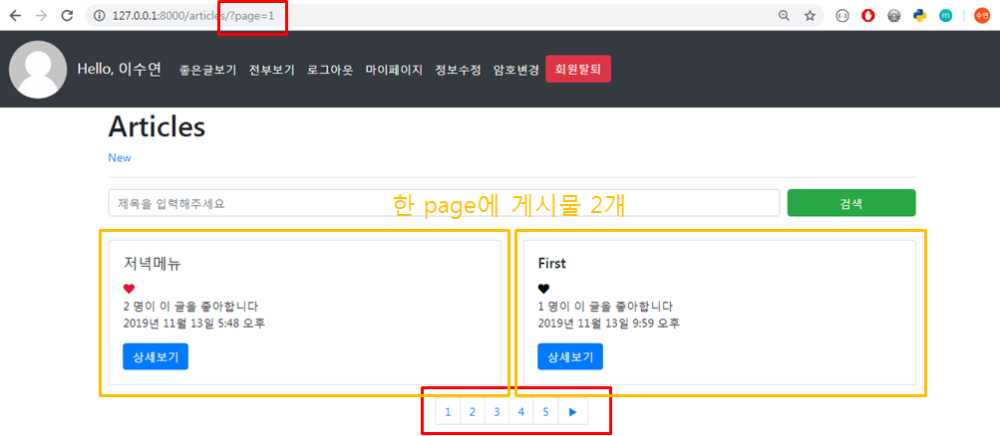
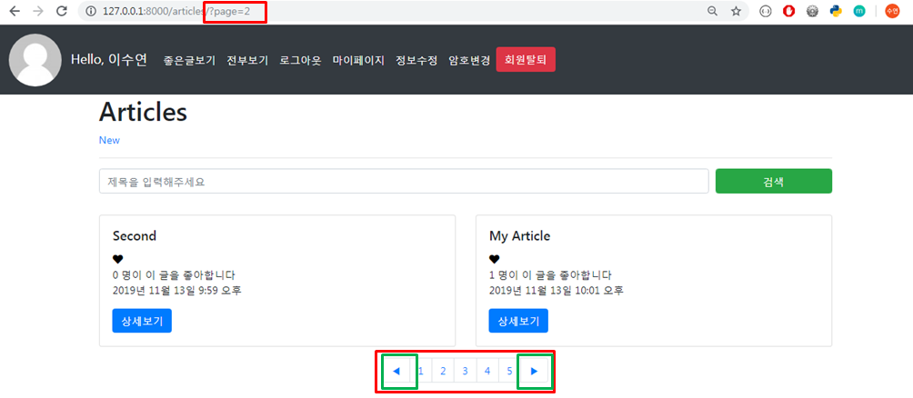
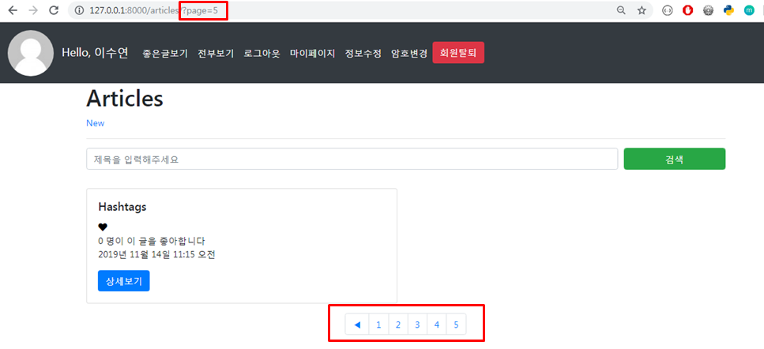
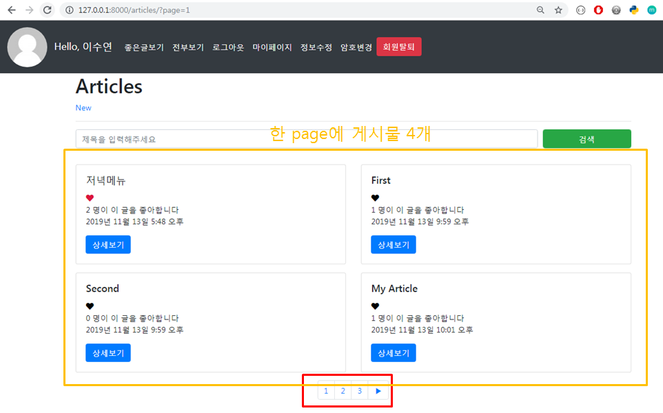
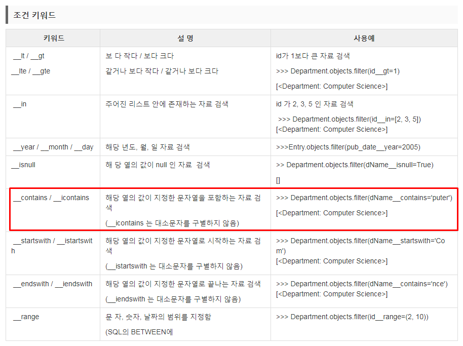
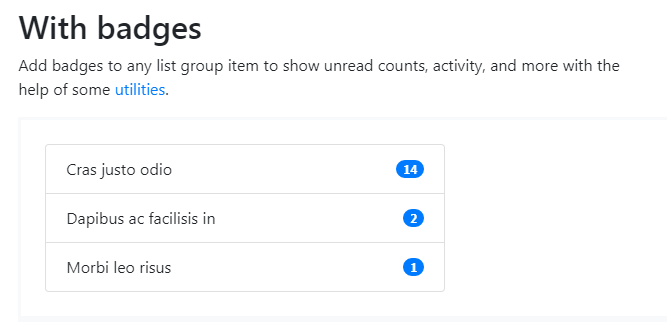
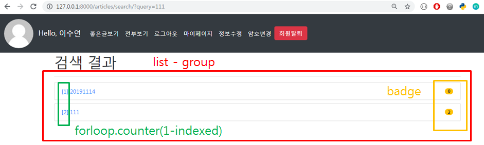
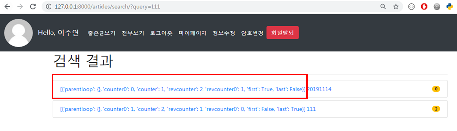

# Pagination & Search

## 1. Pagination

>  https://getbootstrap.com/docs/4.3/components/pagination/ 

<br>

### 1.1. View

- `dir` 로 사용할 수 있는 함수들을 알 수 있다

  > - `dir(articles)`
  >
  >   ['__abstractmethods__', '__class__', '__contains__', '__delattr__', '__dict__', '__dir__', '__doc__', '__eq__', '__format__', '__ge__', '__getattribute__', '__getitem__', '__gt__', '__hash__', '__init__', '__init_subclass__', '__iter__', '__le__', '__len__', '__lt__', '__module__', '__ne__', '__new__', '__reduce__', '__reduce_ex__', '__repr__', '__reversed__', '__setattr__', '__sizeof__', '__slots__', '__str__', '__subclasshook__', '__weakref__', '_abc_impl', 'count', 'end_index', '`has_next`', 'has_other_pages', '`has_previous`', 'index', 'next_page_number', 'number', 'object_list', 'paginator', 'previous_page_number', 'start_index']
  >
  >   
  >
  > - `dir(articles.paginator)`
  >
  >   ['__class__', '__delattr__', '__dict__', '`dir`', '__doc__', '__eq__', '__format__', '__ge__', '__getattribute__', '__gt__', '__hash__', '__init__', '__init_subclass__', '__le__', '__lt__', '__module__', '__ne__', '__new__', '__reduce__', '__reduce_ex__', '__repr__', '__setattr__', '__sizeof__', '__str__', '__subclasshook__', '__weakref__', '_check_object_list_is_ordered', '_`get_page`', 'allow_empty_first_page', 'count', 'get_page',
  >   'num_pages', 'object_list', 'orphans', 'page', '`page_range`', 'per_page', 'validate_number']

<br>

- `Paginator(전체 리스트, 보여줄 갯수)` : 한 페이지에 보여줄 게시물 갯수를 설정

- `paginator.get_page(page) ` : index.html에서 페이지 숫자를 클릭했을 때 , 클릭한 페이지 숫자를 인자로 받고 해당 page에 해당하는 article만 가져온다

  ```python
  # articles/views.py
  
  from django.core.paginator import Paginator
  
  def index(request):
    articles = Article.objects.all()
  
    # 1. articles를 Paginator에 넣기
    # - Paginator(전체 리스트, 보여줄 갯수)
    paginator = Paginator(articles, 2)
    # 2. 사용자가 요청한 page 가져오기
    page = request.GET.get('page')
    # 3. 해당하는 page의 article만 가져오기
    articles = paginator.get_page(page)
      
    print(dir(articles))
    print(dir(articles.paginator))
  
    context = {
      'articles':articles,
    }
    return render(request, 'articles/index.html',context)
  ```

<br>

<br>

### 1.2 Template

> 이전 페이지가 없으면(첫번째 페이지) `◀` 버튼을 안보이게 하고,
>
> 다음 페이지가 없으면(마지막 페이지) `▶` 버튼을 안보이게 설정한다

<br>

- `pagination` 클래스 사용

- `articles.has_previous` : 이전 페이지가 있는지

- `articles.previous_page_number ` : 이전 페이지의 숫자

- `articles.paginator.page_range ` : 페이지들의 범위

  ```django
  <!-- articles/index.html -->
  
  <nav aria-label="Page navigation example">
    <ul class="pagination justify-content-center">
    <!-- 이전 페이지가 있을 경우 -->
      
      <li class="page-item">
        <a class="page-link" href="?page={{ articles.previous_page_number }}" tabindex="-1" aria-disabled="true">◀</a>
      </li>
      
  
      <!-- 페이지 버튼 -->
      
      <li class="page-item">
        <a class="page-link" href="?page={{ num }}">{{ num }}</a>
      </li>
      
      <!-- 다음 페이지 있으면 Next 버튼 출력 -->
      
      <li class="page-item">
        <a class="page-link" href="?page={{ articles.next_page_number }}">▶</a>
      </li>
      
    </ul>
  </nav>
  ```

<br>

- 실행화면2 ( **Paginator(articles,2)** )

  - page : 1

    > 

  <br>

  - page : 2~4

    > 

  <br>

  - page : 5

    > 

  <br>

  <br>

- 실행화면2 ( **Paginator(articles,4)** )

  > 

<br>

<br>

<br>

## 2. Search

> Forms-From Grid :  https://getbootstrap.com/docs/4.3/components/forms/ 

<br>

### 2.1 View

- `__icontains` : 지정한 문자열 포함하는 자료 검색(대소문자 구별 x)하는 키워드

  ```python
  # articles/views.py
  
  def search(request):
    # 1. 사용자가 입력한 검색어 가져오기
    query = request.GET.get('query')
    # 2. DB에서 query가 포함된 제목을 가진 article 가져오기
    # orm의 filter에는 LIKE와 비슷한 두가지 조건 키워드가잇다
    # __contains : 지정한 문자열 포함하는 자료 검색
    # __icontains : 지정한 문자열 포함하는 자료 검색(대소문자 구별 x)
    articles = Article.objects.filter(title__icontains=query)
    # 3. context로 전달
    context = {'articles':articles}
  
    return render(request, 'articles/search.html', context)
  ```

  <br>

- #### Filter

  > Django ORM :  https://brownbears.tistory.com/63 

  - 조건에 맞는 여러행을 출력(없어도 에러 안남 ) <=> get은 단일행만 출력

  - **get**과 **filter**에는 다양한 조건을 걸 수 있는 조건 키워드가 있다

    > 

<br>

<br>

### 2.2 Template

> list group-With badges :   https://getbootstrap.com/docs/4.3/components/list-group/#with-badges
>
> badges 추가 doc :  https://maczniak.github.io/bootstrap/components.html#labels-badges 

<br>

- 다음과 같은 형태로 Search page 구현

  > 

<br>

- `mb-2 ` : margin-bottom 2

- `{{ forloop.counter }} ` : for문에 들어온 data 순서대로 index를 보여준다

- `badge` 에는 댓글수를 보여준다

  ```django
  <!-- articles/search.html -->
  
  
  
  
  <h1>검색 결과</h1>
  <hr>
    <ul class="list-group">
      
        <a href="" class="mb-2">
        <li class="list-group-item d-flex justify-content-between align-items-center">
          [{{ forloop.counter }}] {{ article.title }}
          <span class="badge badge-warning badge-pill">
            {{ article.comment_set.all|length }}
          </span>
        </li>
      </a>
      
    </ul>
  
  ```

  <br>

- 실행화면( `forloop.counter` ) : index 출력

  > 

<br>

- 실행화면( `forloop` ) : forloop가 가지고 있는 정보들 출력

  