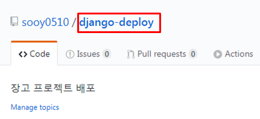
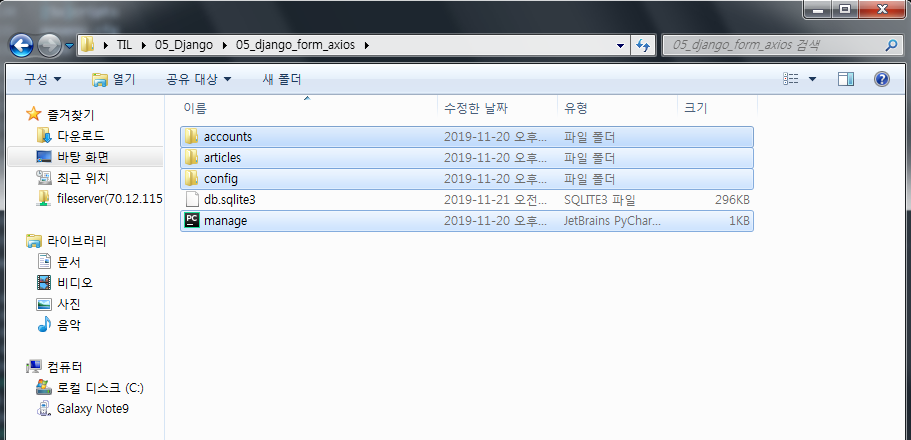
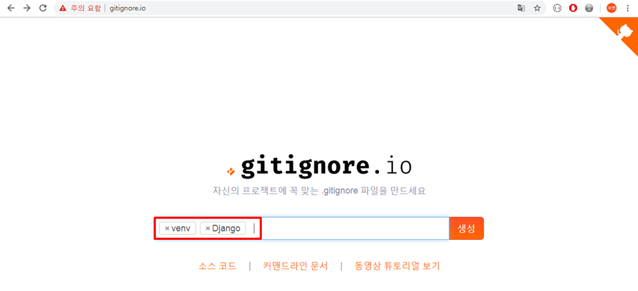
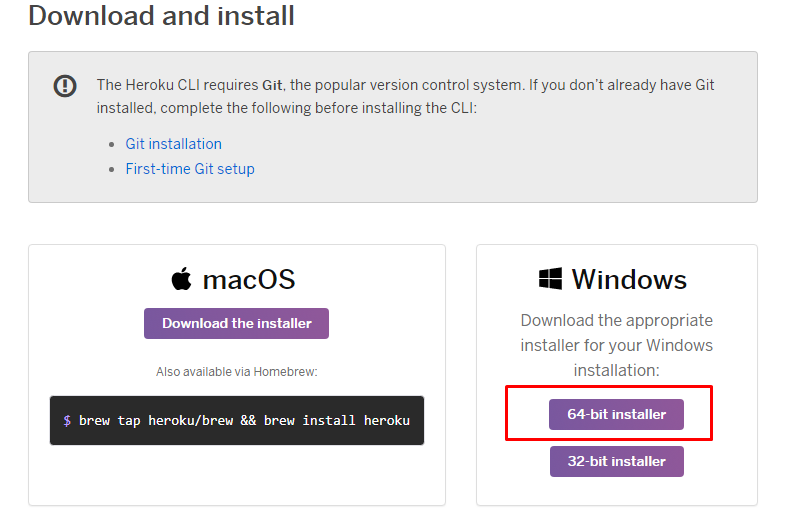
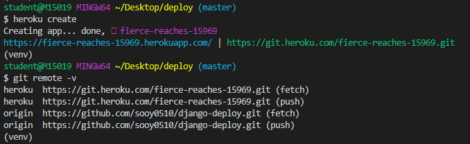
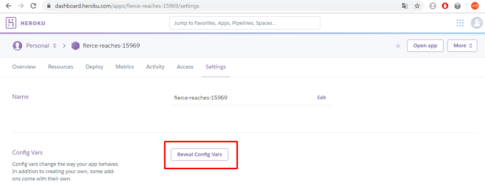
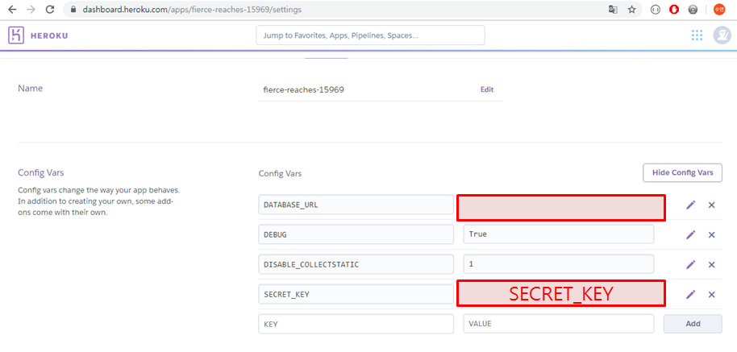
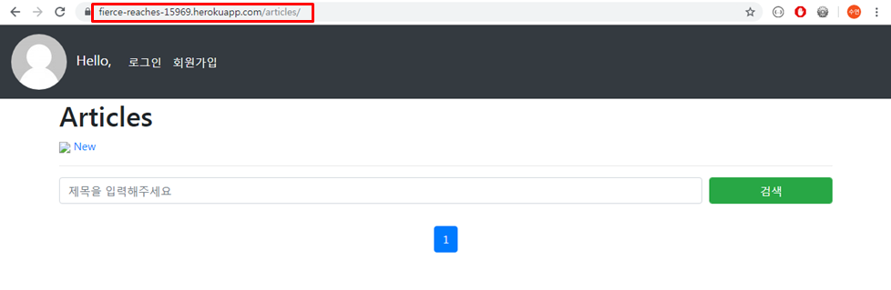

# Heroku 배포

## 1. 사전준비

### 1.1 Github Repo 생성

- repo명 :django-deploy

- description : 장고 프로젝트 배포

  > 

<br>

<br>

#### 1.1.1 Repo 생성

- 배포할 프로젝트 하나만 관리하고 있는 폴더로 진행해야 함

  - 절대 TIL 안에 있는 프로젝트로 진행하면 안됨!

  <br>

- 바탕화면에 `deploy`폴더 만들어줌

- `TIL/05_Django/05_django_form_axios` 에서 다음 파일들 복사해서 `deploy`폴더에 넣어줌

  > 


<br>

<br>

#### 1.1.2 gitignore 등록

- `venv`, `django` 포함해서 만들어주기

  > 

  <br>

- `.gitignore` 파일 마지막에 추가해주기

  ```python
  #deploy/.gitignore
  
  # Text Backup files
  *.bak
  
  # Database
  *.sqlite3
  
  # 환경설정 내용
  .env
  ```

<br>

<br>

#### 1.1.3 기존 프로젝트에서 필요한 install 목록 가져오기

- 현재 상태를 얼림

  ```bash
  # 05_Django/05_django_form_axios
  
  $ pip freeze > requirements.txt
  ```

  <br>

<br>

<br>

#### 1.1.4 가상환경 venv 만들기

```bash
# deploy

$ python -m venv venv
```

- interpreter로 가상환경 선택해주기

<br>

<br>

#### 1.1.5 requirements.txt install

- `requirements.txt` 파일 `deploy` 폴더에 복사

- `deploy`에서 필요한 것들 install

  ```bash
  # deploy
  
  $ pip install -r requirements.txt
  ```

<br>

<br>

#### 1.1.6 decouple 설치

- `settings.py` 에서 노출되면 안되는 `SECRET_KEY` 를 따로 관리하기 위해서 decouple을 설치

  ```bash
  # deploy
  
  $ pip install django-decouple
  ```

<br>

<br>

## 2. 배포 설정

### 2.1 Procfile

- **Procfile** : gunicorn 설정 파일 

  ```python
  # deploy/Procfile
  
  web: gunicorn config.wsgi --log-file - 
  ```

<br>

<br>

### 2.2 .env

- key를 관리할 파일

  ```python
  # deploy/.env
  
  SECRET_KEY='[settings.py에 있는 SECRET_KEY]'
  DEBUG=True
  ```

<br>

<br>

### 2.3 runtime.txt

- `requirements.txt`에 python 설정은 없으므로 `runtime.txt`에 python 버전을 명시해줌

  ```python
  # deploy/runtime.txt
  
  python-3.7.4
  ```

<br>

<br>

### 2.4 heroku & guicorn 설치

```bash
# deploy

$ pip install django-heroku
$ pip install gunicorn
```

<br>

<br>

### 2.5 settings에 heroku 설정

```python
# deploy/settings.py

from decouple import config

...
# heroku settings
import django_heroku
django_heroku.settings(locals())
```

<br>

<br>

## 3. heroku 설치

>  https://devcenter.heroku.com/articles/heroku-cli 

<br>

### 3.1 64bit 설치

> 

<br>

<br>

### 3.2 settings.py에서 HOST 열어주기

- `settings.py`

  ```python
  # deploy/settings.py
  
  ALLOWED_HOSTS = ['secure-reef-12340.herokuapp.com']
  ```

<br>

<br>

### 3.3 Heroku 앱 생성 & push

- heroku 실행

  ```bash
  $ heroku
  ```

<br>

- heroku 로그인

  ```bash
  $ heroku login
  ```

<br>

- heroku 앱 생성 : 자동으로 앱 하나를 만들어준다

  ```bash
  $ heroku  create
  ```

<br>

- heroku에 push : 앞으로는 heroku git에다 push 한다

  ```bash
  $ git remote -v
  ```

  <br>

  > 

<br>

<br>

### 3.4 heroku config 세팅

- heroku에 `SECRET_KEY`와 `DEBUG` 를 셋팅한다

  ```bash
  $ heroku config:set SECRET_KEY='[SECRET_KEY]'
  $ heroku config:set DEBUG=True
  ```

  <br>

  - `SECRET_KEY` 설정에서 에러나면 직접 heroku 웹페이지 들어가서 바꿔준다

    1. Personal 메뉴에서 APP찾기

       > 

    <br>

    2. `settings`클릭

       > 

    <br>

    3. `Reveal Config Vars` 클릭

       > 

    <br>

    4. `SECRET_KEY`직접 수정

       > 


<br>

<br>

### 3.5 migration 해주기

- heroku에 migration

  ```bash
  $ heroku run python manage.py makemigrations
  ```

  <br>

  - 에러나면 heroku 웹 > `MORE > Run Console` 에서 실행

    ```bash
    $ python manage.py migrate
    ```

<br>

<br>

### 3.5  settings.py 에서 `SECRET_KEY` & `DEBUG` 설정 수정

- 이제 heroku에 키랑 debug 설정 해주었으니 감춰도 된다

- heroku에서 알아서 `ALLOWED_HOSTS` 잡아줌

  ```python
  # settings.py
  
  SECRET_KEY = config('SECRET_KEY')
  DEBUG = config('DEBUG')
  
  ALLOWED_HOSTS = []
  ```

  

### 3.6 git에 push 해보기

- 가상환경에 있는지 확인할 것

  ```bash
  $ git add .
  $ git status
  $ git commit -m "환경설정 추가 및 수정"
  $ git push heroku master
  ```

<br>

<Br>

## 4. 서버 확인

- 다음 주소로 들어가서 확인

  > 

<br>

<br>

- 소셜 로그인 수정